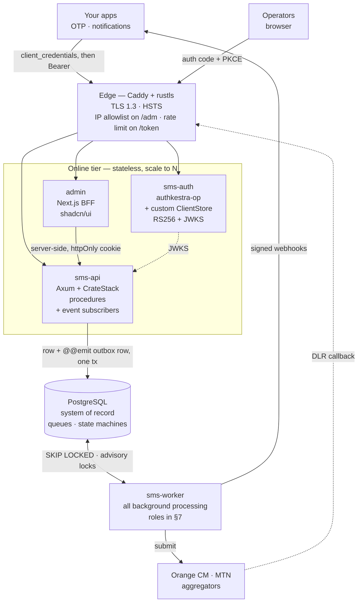
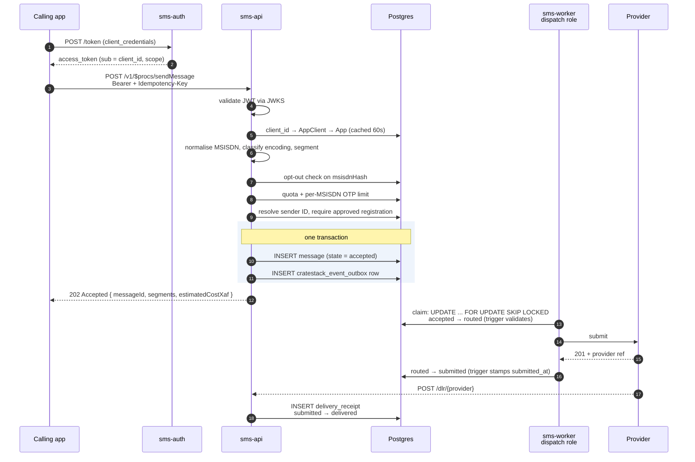
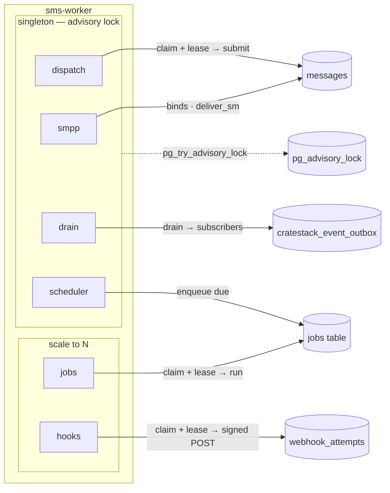
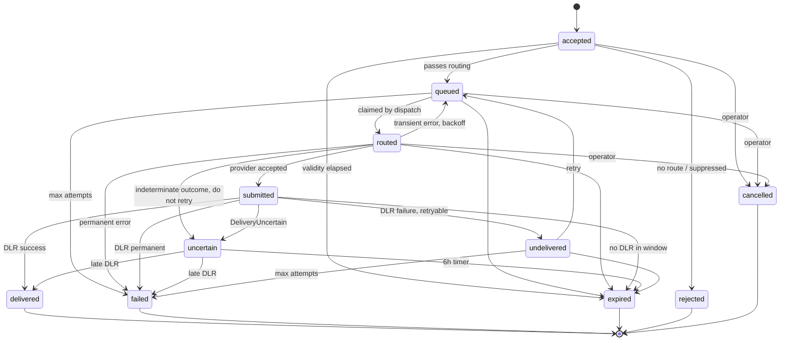
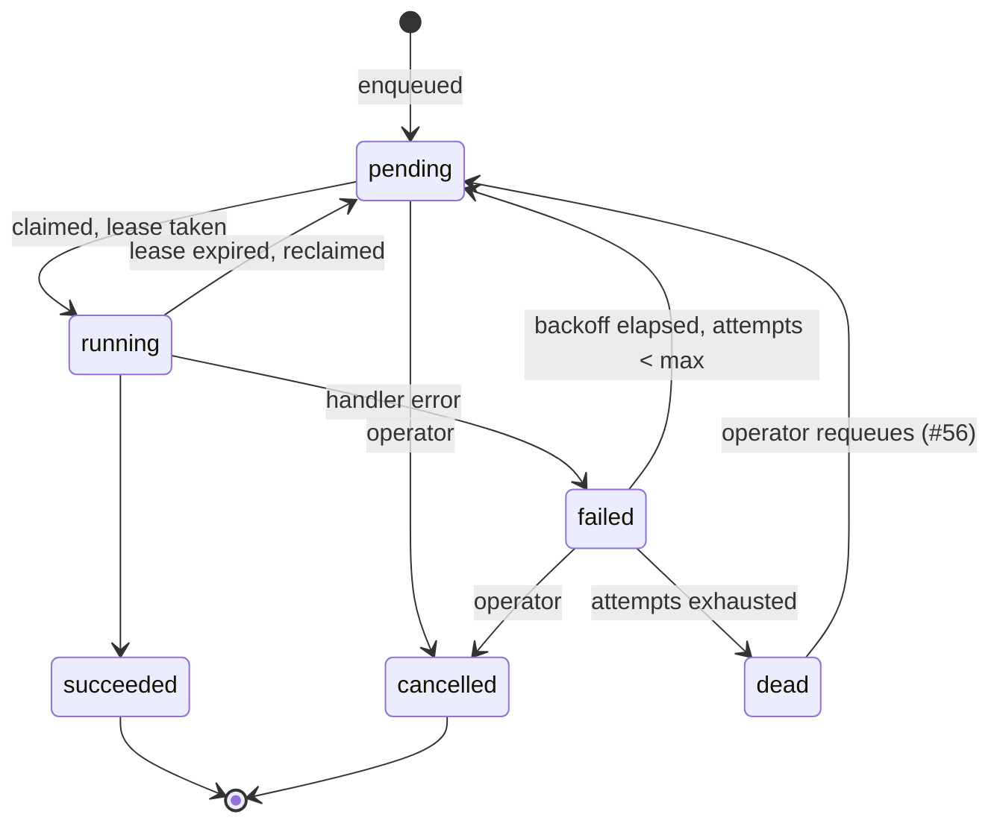
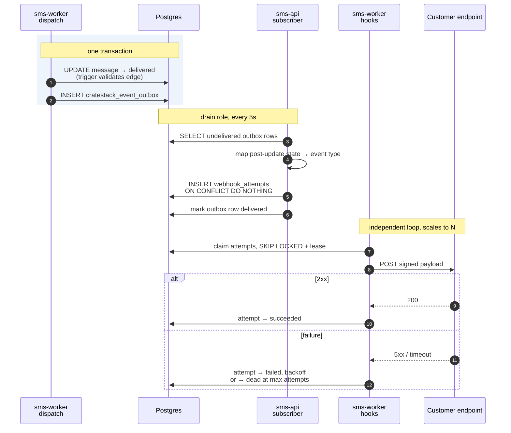
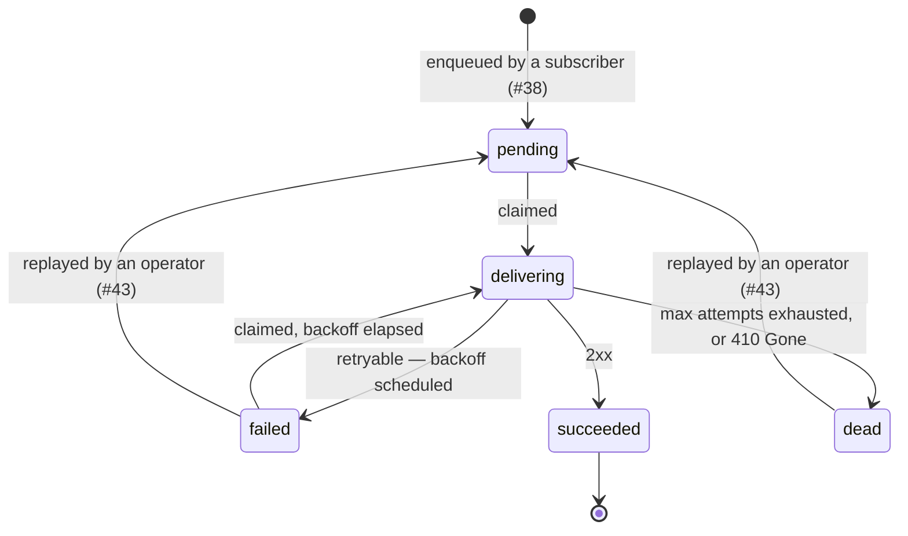
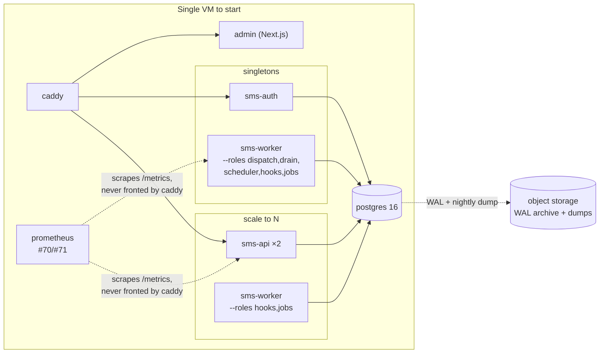

# SMS Gateway — Architecture Design

**Scope:** a self-hosted A2P SMS gateway for Cameroon (MTN + Orange), serving OTP and notification traffic for one organisation's own applications, with a Next.js admin console.

**Stack (as chosen):** Rust + TypeScript · CrateStack (`.cstack` schema-first) · Authkestra OP (OIDC Provider) · full RBAC through JWT claims · single OIDC client for humans, one OAuth service account per calling app.

**Decisions locked in this revision**

| Question | Answer |
|---|---|
| Tenancy | Single org, multiple apps. No `tenantId` in the core model. |
| Operator path | Provider abstraction over both HTTP and SMPP; ship HTTP first. |
| Admin UI | Hand-built Next.js + shadcn/ui over the generated TypeScript client. |
| Transport | `transport rest` (CrateStack default). gRPC is a later, optional addition. |
| Machine auth | OAuth2 `client_credentials` service accounts. No API keys, no HMAC request signing. |
| Identifiers | `Cuid` for every model id and FK. |
| Eventing | CrateStack `@@emit` + `events::Subscriptions`. No hand-rolled outbox table. |
| **Background work** | **One `sms-worker` node, role-selectable, singletons elected by Postgres advisory lock.** |
| **State machines** | **Enforced in Postgres by transition tables + `BEFORE UPDATE` triggers, not only in Rust.** |

The schema in §2 was assembled into a single file and run through the real `cratestack-parser` 0.4.16 and the real Postgres migration emitter; the policy and `@authorize` rules — which live in `cratestack-macros`, not the parser — were proven by compiling a real `include_server_schema!` expansion. Rust and Authkestra APIs were checked against published crate sources. Every Mermaid diagram here was rendered with `mmdc` to confirm it parses. The validated schema ships alongside this document as `schema.cstack`.

---

## 0. Four corrections to the brief

**1. CrateStack does not consume `.proto`.** The schema language is `.cstack` — Prisma-shaped. Protobuf runs the other direction: `cratestack generate-proto` *emits* a `.proto` plus a committed `.pb.lock` field-number lockfile, and `transport grpc` swaps the REST binding for a tonic service. That path is real but currently **model CRUD only** — procedures aren't wired into the generated gRPC service, and `where`/`or` predicates aren't wired into either generator. Since the send path is a *procedure*, REST is the only viable binding today.

**2. "Authkestra with OP" means `authkestra-op`**, not `authkestra-oidc` (the relying-party side). The OP crate serves `/authorize`, `/token`, `/userinfo`, `/jwks.json`, `/.well-known/openid-configuration`, device flow and token exchange. Its shipped examples use `TokenManager::new(secret, issuer)` → **HS256**, which makes `public_jwk()` return `None` and your JWKS serve `{"keys":[]}`. Use `new_asymmetric(pem, Some(issuer), Some(kid))` and keep the `TokenManager` issuer string identical to `OpConfig.issuer`.

**3. Authkestra has no RBAC.** `Identity` is `{provider_id, external_id, email, username, attributes}`; `Claims` gives `scope: Option<String>` and `extra: HashMap<String, Value>`. RBAC is yours to build — which your "one app, permissions ↔ claims" constraint makes tractable. See §5.

**4. ⚠️ `authkestra-op` 0.2.3 cannot serve `client_credentials` from a persisted client store.** A blocking bug that lands squarely on your design, so it leads §4. `GrantType` is `#[serde(untagged)]` over unit variants, so every unit variant serialises to JSON `null`, and `null` always deserialises back to the first variant, `AuthorizationCode`. A client registered with `grant_types: [ClientCredentials]` and written to Postgres or Redis comes back as `[AuthorizationCode]`; `allows_grant_type(ClientCredentials)` returns `false` and `/token` answers `400 unauthorized_client`. There is **no JSON value that deserialises to `ClientCredentials`**. Only the non-serialising `MemoryStore` escapes — which is why the crate's own tests pass. The fix is thirty lines, in §4.2.

---

## R. Engineering rules

Three rules that constrain every other decision in this document. They are stated here rather than scattered through it because each is a *default with named exceptions*, and the exceptions are the interesting part.

### R1 — All data access goes through CrateStack delegates. Never raw `sqlx`.

The generated `Cratestack` runtime is the only way application code touches the database. `db.message().find_many()…`, `db.message().update(id).set(…).if_match(v)`, `db.job().create(…)`, `.run(&ctx)` or `.run_in_tx(&mut tx, &ctx)`. No `sqlx::query!`, no `query_as`, no `query_scalar`, no `raw_sql`.

This is not stylistic. Going through the delegates is what keeps four guarantees switched on, all of which raw SQL silently bypasses:

- **Row-level policy.** `@@allow` compiles to SQL predicates appended to your `WHERE`. A raw query is unscoped — it sees every tenant's rows, every soft-deleted tombstone, every message belonging to another app.
- **Audit.** `@@audit` rows are written inside the mutation's transaction. A raw `UPDATE` produces no audit entry, so the trail silently develops holes exactly where someone worked around the framework.
- **Events.** `@@emit` writes the outbox row in the same transaction. A raw `UPDATE` that moves a message to `delivered` fires no `message.delivered` webhook. The customer is never told.
- **Optimistic locking and soft delete.** `@version` bumping and `deleted_at IS NULL` scoping are applied by the delegate layer, not by the database.

A raw query that touches `messages` is therefore not "the same query, written by hand" — it's a different query with four safety properties removed.

**The named exceptions.** Raw SQL is permitted in exactly these places, and nowhere else:

| Exception | Where | Why the delegates can't do it |
|---|---|---|
| **DDL and migrations** | `schema/migrations/**` | Triggers, partial indexes, foreign keys, column defaults, transition tables. Not data access at all — the emitter produces none of these (§2.10). |
| **Advisory locks** | `crates/sms-worker/src/lease.rs` | `pg_try_advisory_lock` / `pg_advisory_unlock`. No delegate expression exists; it isn't a table. |
| **`LISTEN` / `NOTIFY`** | `crates/sms-worker/src/notify.rs`, `crates/sms-api/src/cache.rs` | Cache-invalidation fan-out (§8.3). No delegate expression exists. |

That is the complete list. Two things people reach for that are *not* on it:

- **Transactions.** Every delegate builder has `.run_in_tx(&mut tx, &ctx)` — 26 of them across `cratestack-sqlx`. You never need raw SQL for transactional work, and delegates inside a caller-managed transaction still write their audit rows and outbox rows into that same transaction. `cratestack::run_in_isolated_tx(pool, isolation, closure)` handles `SERIALIZABLE` with 40001 retries.
- **Row locking.** `.for_update()` exists on `find_many` and `find_unique`, and appends a real `FOR UPDATE`.

The one genuine gap is **`SKIP LOCKED`, which the framework cannot express** — a workspace-wide grep finds zero occurrences, and `skip_locked()` / `nowait()` / `lock_mode()` are compile errors. §7.3 explains why the queue design doesn't need it, and what to do if profiling ever says otherwise.

Enforced in CI:

```bash
# no raw sqlx outside the three named exceptions
! grep -rn --include='*.rs' -E 'sqlx::(query|query_as|query_scalar|raw_sql)\b' crates/ \
    | grep -vE 'sms-worker/src/(lease|notify)\.rs|sms-api/src/cache\.rs'
```

`db.pool()` is the escape hatch that makes raw SQL *possible*; the lint is what makes it *deliberate*. Adding a row to the exceptions table should feel like a design decision, because it is one.

### R2 — State transitions are proposed by Rust and decided by Postgres.

Legal edges live in `message_state_transitions` / `job_state_transitions`; `BEFORE UPDATE` triggers reject the rest with SQLSTATE `SM001`. Application code never assumes a transition is valid because it checked first. §2.10 and §7.4.

### R3 — Nothing that must be written can be `@server_only`.

`@server_only` excludes a field from **both** create and update inputs, so under R1 such a field can never be populated at all. It is for columns the database owns, not for secrets. Field secrecy comes from model-level `@@allow` and from keeping secrets out of the gateway database entirely. §2.0 has the full attribute matrix.

---

## 1. System topology



Three tiers and one database. The online tier is stateless and scales freely; everything with a schedule, a lease, or a long-lived connection lives in `sms-worker`; Postgres is the only coordination mechanism in the system — no broker, no Redis, no consensus library.

### Why these process boundaries

| Node | Crate | Why it's separate |
|---|---|---|
| `sms-api` | `cratestack-pg` + Axum | Stateless, scale to N. Holds the CrateStack router, the procedures, and the event subscribers. |
| `sms-auth` | `authkestra-op` + `authkestra-axum` + your `ClientStore` | Different blast radius and release cadence. Isolating it behind JWKS is what makes swapping in Keycloak/ZITADEL a config change. |
| `sms-worker` | plain tokio | **All background processing, one binary.** Roles are selected at startup; singleton roles self-elect. §7. |
| `admin` | Next.js 15+ App Router | — |

One worker binary rather than three services is a deliberate simplification over the previous revision. The roles have genuinely different concurrency requirements — `dispatch` must be a singleton because of Orange's per-contract TPS cap, `hooks` wants to scale — but they share configuration, database pool, tracing setup, provider registry and deployment lifecycle. Splitting them into separate images buys isolation you don't need yet and costs you three deploy pipelines. Roles are already the unit of scaling, so when you *do* need `hooks` on its own node, you run the same image with `--roles hooks` and change nothing else.

---

## 2. Data model (`schema.cstack`)

### 2.0 Grammar and emitter constraints

Mechanical properties of the toolchain, each verified by running it — most against 0.4.16, two rows below marked 0.5.0 where the emitter's behaviour changed under us mid-project. None are obvious from the docs and each costs an afternoon if you find it the hard way.

| Constraint | Consequence |
|---|---|
| **Exactly one whitespace character between field name and type.** `parse_field` splits on *each* whitespace char. | No column alignment, ever. `id  Cuid` fails with `invalid type reference: `. |
| **The parser is line-based.** | An `@@allow` cannot wrap. A wrapped continuation is parsed as a field and errors on the type. |
| **`enum` and `type` bodies need one declaration per line**, header ending in `{`. | No single-line `enum Foo { a b }`. |
| **`@use(Mixin)` is single-`@`.** `@@use(...)` parses, is retained as an unknown model attribute, and **silently does not expand the mixin**. | Never write `@@use`. There is no error. |
| **Unknown attributes are silently ignored.** | A typo'd attribute is a no-op, not an error. |
| **A misspelled `@@allow` action is silently dropped.** With deny-by-default, the model becomes unreachable. | Assert the generated policy set in a test. |
| **`@default` contents are not validated**; the value is spliced verbatim into DDL. | Enum and string defaults must be single-quoted: `@default('accepted')`. Double quotes are a PG *identifier*. A typo'd variant reaches the DDL and fails at `psql`. |
| **`@default(cuid())` is not real.** It parses, emits `DEFAULT cuid()` (no such PG function), *and* silently removes the field from the create input. | Verified: `no field 'id' on type CreateAppInput`. Use `@default(dbgenerated())` + a real SQL default. |
| **`@default(dbgenerated())` emits no `DEFAULT` clause** — it only marks the field server-generated and drops it from create input. | Hand-write `ALTER COLUMN … SET DEFAULT …`. §2.10. |
| **Relation scalars must match the referenced field's type by *name*.** | Verified: `Cuid` ↔ `Cuid` passes; `String` FK → `Cuid` PK is a hard parse error. |
| **Policy comparisons against `auth().x` also require type-name equality**, including through relation traversal. | Verified by compile: `auth Principal { appId Cuid }` vs `WebhookEndpoint.appId Cuid` passes; a `String` auth field is a compile error. |
| **`@authorize(M, action, args.x)` requires name *and* arity match** with `M`'s PK. | `CancelInput.messageId` must be `Cuid`. |
| **A `Cuid` field cannot be compared to a *literal* in a policy** — only to `auth().x`. | We never do this. |
| **`Cuid` is format-guarded only on REST query-string filters** — `[a-z0-9]{2,32}`. Not on create, update, or DB decode. | Ids must be lowercase alphanumeric with **no prefix separator**, or `GET /messages?id=…` returns 400. |
| **There is no `@@index`.** Only `@unique` emits an index. | Every non-unique index is hand-written. §2.10. |
| **Foreign keys are never emitted.** No `REFERENCES` codepath exists in `cratestack-migrate` 0.4.16. | Hand-written too. |
| **No triggers, no CHECK without `@db_enforce`, no partial indexes.** | **The state machines in §2.10 are entirely hand-written SQL.** The schema declares the states; Postgres enforces the edges. |
| **`@db_enforce` promotes `@length`/`@range` into a real `CHECK` — and is a silent no-op on `@regex`.** Verified with an isolated two-field probe schema: identical `@db_enforce` on a `@length` field emits `ADD CONSTRAINT … CHECK (length(...) BETWEEN …)`; on a `@regex` field it emits nothing, no error. | Pattern constraints need a hand-written `CHECK (col ~ '...')` in §2.10. `@regex` alone is application-layer validation only. |
| **0.5.0: enum-typed columns emit as `TEXT NOT NULL` + `CHECK (col IN (...))`, not a native `CREATE TYPE ... AS ENUM`.** 0.4.16 emitted real enum types; nothing announced the change. | Anything referencing an enum type name directly in hand-written SQL — our `message_state`/`job_state` transition-table columns — breaks silently at `psql` time (`type "message_state" does not exist`) on the next full regeneration. Now `TEXT` with a matching hand-written `CHECK`. |
| **Scalar list fields (`String[]`, `Int[]`) PANIC `include_server_schema!`** — `proc macro panicked: unsupported SQLx value type for this slice`. The parser accepts them and the migration emitter happily writes `TEXT[]`; only the server macro fails. | **No model may declare a list field.** Multi-values are delimited `String` columns (see below). Lists inside `type` blocks are fine — they never touch SQLx. |
| **`@version` emits `BIGINT NOT NULL` with no default.** | Seeds and raw SQL fail without a hand-added default. |
| **ANY `@default(...)` excludes the field from `CreateXInput`** — literals included, not just `dbgenerated()`. `is_generated_on_create` is a bare `starts_with("@default")`. | Verified: `CreateMessageInput has no field named 'priority'` for `priority Int @default(100)`. **A `@default` on a caller-settable field is a bug.** Keep it only where being unsettable is the point. |
| **But defaulted fields ARE settable on `UpdateXInput`.** | So `@default(auth().x)` protects *creation* only; a `PATCH` can still overwrite it. That's the real footgun, not create. |
| **`@server_only` excludes a field from create *and* update inputs.** | It is write-never through the framework. See R3 — secrets you must write cannot use it. |
| **`@server_only` fields ARE readable server-side.** The struct keeps them, `FromRow` reads them, `SELECT` includes them; only serde output and the `fields=` allowlist strip them (`#[serde(skip_serializing, default)]`). | Worker and procedure code reads them through delegates normally. |
| **`@readonly` and `@server_only` are identical for inputs** and mutually exclusive (parser error if both). Neither may sit on `@id`. | `@readonly` still serializes to responses; `@server_only` doesn't. |
| **`@pii` / `@sensitive` redact audit snapshots ONLY.** They do not strip from HTTP responses, traces or errors. | A field marked `@sensitive` is still returned by `GET /messages/{id}`. Verified: `hush still in json: true`. |
| **`?sort=<server_only column>` is not rejected** — `allowed_sorts` has no `@server_only` filter, unlike `allowed_fields`. | An ordering oracle over a column the caller can't read. Low impact here, but don't expose list routes on a model whose `@server_only` column is a real secret. |
| **`upsert` does not exist when the `@id` has a `@default`.** | `db.webhook_attempt().upsert(...)` is a compile error. Dedupe is `create` + catching SQLSTATE `23505` (§8.3). |
| **`SKIP LOCKED` / `NOWAIT` are not expressible.** `.for_update()` is. | §7.3 — the claim loops use optimistic CAS instead. |
| **`update_many` / `delete_many` refuse to run with zero filters**, and `update_many` has no `if_match`. | Guard rail, not a limitation. |
| **Nothing auto-touches `updatedAt`.** | A `set_updated_at` trigger in migration SQL (§2.10), not a field you remember to set. |
| **No field-level read masking.** Model-level access only. | Field secrecy = model-level `@@allow`, or a separate model. |
| **`pluralize()` is naive** (`ends_with('s') ? +"es" : +"s"`), and there is no `@@map`. | Every model name here pluralises cleanly. `WebhookDelivery` would have become `webhook_deliverys` — it's `WebhookAttempt` for that reason alone. |

### 2.1 Header, enums, principal

```cstack
datasource db {
  provider = "postgresql"
  url = env("DATABASE_URL")
}

enum MessageClass {
  otp
  transactional
  notification
  marketing
}

enum MessageState {
  accepted
  queued
  routed
  submitted
  delivered
  uncertain
  undelivered
  failed
  expired
  rejected
  cancelled
}

enum JobState {
  pending
  running
  succeeded
  failed
  dead
  cancelled
}

enum Encoding {
  gsm7
  ucs2
}

enum OperatorCode {
  mtn
  orange
  camtel
  nexttel
  unknown
}

enum ProviderKind {
  orange_cm_http
  mtn_http
  aggregator_http
  smpp
}

enum ProviderState {
  active
  degraded
  disabled
  draining
}

enum DeliveryOutcome {
  delivered
  uncertain
  failed
  expired
  rejected
  unknown
}

enum AttemptState {
  pending
  delivering
  succeeded
  failed
  dead
}

enum OptOutSource {
  inbound_stop
  admin
  import
  operator
}

mixin Timestamps {
  createdAt DateTime @default(dbgenerated())
  updatedAt DateTime @default(dbgenerated())
}

auth Principal {
  sub String
  kind String
  role String
  appId Cuid
}
```

**The single `auth` block is the load-bearing design decision.** CrateStack allows exactly one, and both humans and service accounts must fit it. `kind` discriminates: `"user"` principals carry a meaningful `role` and an empty `appId`; `"app"` principals carry `role = "app"` and a real `appId`. That one field gives per-app row scoping *in SQL* rather than in handler code:

```cstack
@@allow("list", auth().kind == "user" || appId == auth().appId)
```

`appId` is `Cuid`, not `String`, because the type-name equality rule applies to policy comparisons as well as relations — and `WebhookAttempt`'s policy traverses a relation to reach it (`endpoint.appId == auth().appId`), the form that enforces the check. A `String` auth field against a `Cuid` model field is a compile error, verified. `sub` stays `String`: it holds an OIDC subject or an OAuth `client_id`, neither of which is a model id.

`hasRole('x')` and `inTenant('x')` are the only two policy functions; anything else is a generation error. Both quote styles work.

**`role` carries `"system"` for the internal principal.** `hasRole('system')` reads the `role` claim, never `kind` — so the system context must set `role = "system"` or every `@@allow("create", hasRole('system'))` denies at runtime and nothing can write a message. Nothing in the toolchain checks this; it's a runtime failure that reads like a policy bug. Cover it with an integration test on the first send.

### 2.2 Applications and service accounts

There is no `ApiKey` model. Every machine caller is an OAuth service account registered with the OP; the gateway learns *which app is calling* by mapping the token's `sub` (the `client_id`) back to an `App`. That mapping lives here rather than in the token because **`authkestra-op` cannot inject per-client claims into a standard `client_credentials` token** — `issue_client_token_with_extra` is never called on that path, and the handler isn't even passed the store. §4.2 has the evidence.

```cstack
model App {
  @use(Timestamps)

  id Cuid @id @default(dbgenerated())
  name String @length(min: 2, max: 64)
  slug String @unique @regex("^[a-z0-9][a-z0-9-]{1,38}[a-z0-9]$")
  description String?
  defaultSenderIdId Cuid?
  defaultSender SenderId? @relation(fields: [defaultSenderIdId], references: [id])
  monthlyQuota Int
  ipAllowlist String
  transliterateToGsm7 Boolean
  active Boolean @default(true)
  deletedAt DateTime?

  clients AppClient[] @relation(fields: [id], references: [appId])
  messages Message[] @relation(fields: [id], references: [appId])

  @@soft_delete
  @@audit
  @@paged
  @@allow("read", hasRole('owner') || hasRole('admin') || hasRole('operator') || hasRole('auditor') || hasRole('developer'))
  @@allow("create", hasRole('owner') || hasRole('admin'))
  @@allow("update", hasRole('owner') || hasRole('admin'))
  @@allow("delete", hasRole('owner'))
  @@emit(created, updated, deleted)
}

model AppClient {
  @use(Timestamps)

  id Cuid @id @default(dbgenerated())
  appId Cuid
  app App @relation(fields: [appId], references: [id])
  clientId String @unique @length(min: 8, max: 64)
  label String @length(min: 1, max: 64)
  scopes String
  active Boolean @default(true)
  lastUsedAt DateTime?
  retiredAt DateTime?

  @@audit
  @@paged
  @@allow("read", hasRole('owner') || hasRole('admin') || hasRole('developer'))
  @@allow("update", hasRole('owner') || hasRole('admin'))
  @@allow("delete", hasRole('owner') || hasRole('admin'))
  @@emit(created, updated, deleted)
}

model OauthClient {
  @use(Timestamps)

  id Cuid @id @default(dbgenerated())
  clientId String @unique @length(min: 8, max: 64)
  appClientId Cuid?
  appClient AppClient? @relation(fields: [appClientId], references: [id])
  tokenEndpointAuthMethod ClientAuthMethod
  jwks String?
  grantTypes String
  scopes String
  redirectUris String
  requirePkce Boolean
  active Boolean @default(true)

  @@audit
  @@allow("read", hasRole('system'))
  @@allow("create", hasRole('system'))
  @@allow("update", hasRole('system'))
}

model OauthSigningKey {
  @use(Timestamps)

  id Cuid @id @default(dbgenerated())
  privateKeyPem String @sensitive
  active Boolean @default(true)
  expiresAt DateTime?

  @@audit
  @@allow("read", hasRole('system'))
  @@allow("create", hasRole('system'))
  @@allow("update", hasRole('system'))
}

model ClientAssertion {
  @use(Timestamps)

  id Cuid @id @default(dbgenerated())
  jti String @unique @length(min: 1, max: 255)
  expiresAt DateTime

  @@allow("read", hasRole('system'))
  @@allow("create", hasRole('system'))
  @@allow("delete", hasRole('system'))
}
```

`OauthClient` is the OP's client registry, living in the gateway schema so `sms-auth` reads it through delegates rather than raw SQL (R1). Its policy is `hasRole('system')` on every action — **no HTTP principal can read this model at all**. `grantTypes` is a plain delimited `String`, which is also the wire format OAuth uses.

**There is no `secretHash`, and no column that could hold one.** Machine callers authenticate with `private_key_jwt`; the admin console is a public client protected by PKCE (§4.2). The database stores only public keys, so there is no shared secret in this system to leak, hash, rotate, or accidentally log. `tokenEndpointAuthMethod` is `NOT NULL` with **no `@default`** on purpose: a `@default` would drop it from `CreateOauthClientInput` (§2.0), leaving it unsettable, and a *missing* method is how authkestra spells "registration predates the field" — a state that accepts a secret from either transport and refuses assertions outright. Every row naming its method makes that branch unreachable. Two hand-written `CHECK`s in §2.10 finish the job: `private_key_jwt` must carry a `jwks` holding **at least one key** — `{"keys":[]}` is not null and is still keyless — and `none` must require PKCE.

`OauthSigningKey` holds the OP's RS256 keys, with `id` doubling as the JWKS `kid`. Note what `@sensitive` does **not** do: it redacts audit snapshots only and adds no serde attribute (§2.0), so the model's `hasRole('system')` read policy is the whole confidentiality control over `privateKeyPem`. `system` is a synthetic internal role that no issued token may ever carry — an `AuthProvider` that mints `system` for HTTP callers hands them the key that signs every token in the system, through generated CRUD, with no other mistake required.

`ClientAssertion` records spent `private_key_jwt` assertion `jti`s so a captured assertion is single-use rather than a bearer credential good for its whole lifetime. It is insert-only, and the write is `create` + catching SQLSTATE `23505` on the `@unique` index — authkestra requires `record_jti` to be atomic, and a read-then-write across two statements is precisely the TOCTOU race the table exists to prevent, where two concurrent replays both observe "not yet seen". No `@@audit`: one row per token request, and the audit row would carry nothing the row itself doesn't.

**On delimited strings.** No model here declares a list field, because `String[]` and `Int[]` panic the server macro outright — the parser accepts them and the migration emitter writes `TEXT[]`, but `include_server_schema!` dies with `unsupported SQLx value type for this slice`. So every multi-value column is a space-delimited `String`, stored **with leading and trailing separators**: `" sms:send sms:read "`, not `"sms:send sms:read"`.

The sentinel spaces are what make membership queries safe. `.contains("sms:send")` would also match a hypothetical `sms:sendall`; `.contains(" sms:send ")` cannot. `sms-core` owns `pack(&[&str]) -> String` and `unpack(&str) -> Vec<&str>` so no call site invents its own convention. For `scopes` and `grantTypes` this is barely a workaround — OAuth transmits both as space-delimited strings anyway, so the column and the wire format finally agree.

`AppClient` exists so a caller's *identity* is separable from its credential. Under `private_key_jwt` the inline `jwks` is a JWK **Set**, so key rotation no longer needs a second identity — publish both keys, cut the caller over, drop the old one. Rotating by identity (provision `otp-svc-v2` alongside `otp-svc-v1`, both mapped to the same `App`) stays available for the cases that want a clean audit boundary rather than a key swap.

Note what is deliberately **absent**: no secret and no hash — anywhere, for anyone. The only credential material in the database is the *public* half of a caller's keypair, in `OauthClient.jwks`, plus the OP's own signing key in `OauthSigningKey`. Nothing here is a bearer credential that leaks by being read.

### 2.3 Sender IDs

Registration is **per-channel**, not national: Orange whitelists via a support form, MTN requires pre-registration through your aggregator, Africa's Talking wants a "Cameroon Local Fiche KYC". Every channel checked caps at **11 characters**. So sender ID status is per-(sender, provider).

```cstack
model SenderId {
  @use(Timestamps)

  id Cuid @id @default(dbgenerated())
  value String @unique @length(min: 3, max: 11) @db_enforce
  kind String
  notes String?
  active Boolean @default(false)

  registrations SenderIdRegistration[] @relation(fields: [id], references: [senderIdId])

  @@audit
  @@allow("read", auth().kind == "user" || auth().kind == "app")
  @@allow("create", hasRole('owner') || hasRole('admin') || hasRole('operator'))
  @@allow("update", hasRole('owner') || hasRole('admin') || hasRole('operator'))
  @@emit(created, updated)
}

model SenderIdRegistration {
  @use(Timestamps)

  id Cuid @id @default(dbgenerated())
  senderIdId Cuid
  senderId SenderId @relation(fields: [senderIdId], references: [id])
  providerId Cuid
  provider Provider @relation(fields: [providerId], references: [id])
  status String
  submittedAt DateTime?
  approvedAt DateTime?
  reference String?
  rejectionReason String?

  @@audit
  @@allow("read", auth().kind == "user")
  @@allow("create", hasRole('owner') || hasRole('admin') || hasRole('operator'))
  @@allow("update", hasRole('owner') || hasRole('admin') || hasRole('operator'))
}
```

`@db_enforce` promotes the `@length` into a real SQL `CHECK`. It's the one field where an out-of-band write putting a 40-character value in the table costs real money.

The router refuses to submit a message whose sender ID has no `approved` registration on the chosen provider — the check that stops you burning credit on messages the operator silently drops.

### 2.4 Providers and routing

```cstack
model Provider {
  @use(Timestamps)

  id Cuid @id @default(dbgenerated())
  key String @unique @regex("^[a-z][a-z0-9_]{2,31}$")
  displayName String @length(min: 2, max: 64)
  kind ProviderKind
  state ProviderState @default('disabled')
  config String
  credentialRef String
  maxTps Float
  maxDailySubmissions Int
  supportsDlr Boolean
  supportsAlphaSender Boolean
  supportsUcs2 Boolean
  supportsConcat Boolean
  costPerSegmentXaf Decimal
  healthCheckedAt DateTime?
  healthy Boolean @default(false)
  // #63: the provider-side circuit breaker — same two-column shape as
  // WebhookEndpoint's own.
  consecutiveFailures Int @default(0)
  circuitOpenUntil DateTime?
  // #59.
  version Int @version

  routes Route[] @relation(fields: [id], references: [providerId])

  @@audit
  @@allow("read", hasRole('owner') || hasRole('admin') || hasRole('operator') || hasRole('auditor') || hasRole('system'))
  @@allow("create", hasRole('owner') || hasRole('admin'))
  @@allow("update", hasRole('owner') || hasRole('admin') || hasRole('operator') || hasRole('system'))
  @@allow("delete", hasRole('owner'))
  @@emit(created, updated, deleted)
}

model Route {
  @use(Timestamps)

  id Cuid @id @default(dbgenerated())
  name String @length(min: 2, max: 64)
  priority Int @range(min: 0, max: 1000)
  weight Int @range(min: 0, max: 1000)
  enabled Boolean
  matchOperator OperatorCode?
  matchClass MessageClass?
  matchAppId Cuid?
  matchPrefix String?
  providerId Cuid
  provider Provider @relation(fields: [providerId], references: [id])
  failoverRouteId Cuid?

  @@audit
  @@allow("read", hasRole('owner') || hasRole('admin') || hasRole('operator') || hasRole('auditor'))
  @@allow("create", hasRole('owner') || hasRole('admin'))
  @@allow("update", hasRole('owner') || hasRole('admin'))
  @@allow("delete", hasRole('owner') || hasRole('admin'))
  @@emit(created, updated, deleted)
}
```

`config` and `credentialRef` are plain columns, not `@server_only`, because an admin creating a provider has to write them and R3 rules that out. They're safe as plain fields for one reason: **neither holds a secret.** `credentialRef` is a *pointer* — `vault://sms/providers/orange_cm`, or an age-encrypted file key — which the worker resolves at startup and on SIGHUP. `config` holds non-secret settings. Provider credentials never enter this database at all, so no policy mistake can leak them.

That's the general shape of R3 in practice: when the framework won't let you hide a field, arrange for the field not to be worth hiding.

### 2.5 Message — the core

```cstack
model Message {
  @use(Timestamps)

  id Cuid @id @default(dbgenerated())
  appId Cuid
  app App @relation(fields: [appId], references: [id])

  clientRef String?
  idempotencyKey String?

  msisdn String @pii @length(min: 12, max: 15)
  msisdnHash String
  operator OperatorCode

  senderIdValue String @length(min: 3, max: 11)
  class MessageClass
  priority Int @range(min: 0, max: 1000)

  body String? @sensitive
  bodyHash String
  bodyLength Int
  encoding Encoding
  segments Int @range(min: 1, max: 10)

  state MessageState @default('accepted')
  stateReason String?
  routeId Cuid?
  providerId Cuid?
  providerMessageRef String?
  providerMessageRefAlt String?

  attempts Int @default(0)
  maxAttempts Int
  leaseOwner String?
  leaseUntil DateTime?
  scheduledAt DateTime?
  expiresAt DateTime
  submittedAt DateTime?
  finalizedAt DateTime?

  // #67: stamped once, by purge_retention, past the 90-day retention
  // window below — see that job's own module doc for why an explicit
  // marker beats inferring "purged" from "body happens to be null".
  purgedAt DateTime?

  costXaf Decimal @default(0)
  version Int @version

  parts MessagePart[] @relation(fields: [id], references: [messageId])
  receipts DeliveryReceipt[] @relation(fields: [id], references: [messageId])

  @@audit
  @@paged
  @@retain(days: 90)
  @@allow("list", auth().kind == "user" || appId == auth().appId || hasRole('system'))
  @@allow("detail", auth().kind == "user" || appId == auth().appId || hasRole('system'))
  @@allow("create", hasRole('system'))
  @@allow("update", hasRole('system'))
  @@emit(created, updated)
}
```

Eight things worth defending:

**`body` is `@sensitive`, and is stored in plaintext for every class, OTP included.** `@sensitive` redacts it in *audit snapshots only* — verified: it adds no serde attribute, so `GET /messages/{id}` still returns the body to a principal that passes the `detail` policy. So `@sensitive` is not a confidentiality control, and there is no second control behind it: the body is retained for the model's full `@@retain(days: 90)` window.

An earlier revision of this paragraph claimed that for `class = otp` the send procedure set `body = null`, keeping only `bodyHash`/`bodyLength`/`segments`, justified as *"an OTP gateway that stores OTP plaintext for 90 days is a credential database."* **That was never implemented, and — as written — is not implementable** (#165). `sms-api` and `sms-worker` are separate OS processes coordinating through nothing but the `Message` row (no broker, no Redis; see §1). `crates/sms-worker/src/dispatch.rs` reads `message.body` off the row `claim.rs`'s `candidates()` fetched, and fails the message outright when it is `NULL`. Nulling at creation would therefore fail *every* OTP send, and break `undelivered -> queued` retries (§7.4, #122). Anyone reimplementing that paragraph as it stood reproduces that outage.

Redacting later — at a terminal state, once nothing can need the value again — was built and rejected on the merits (#183, closed). Two reasons. The credential argument does not survive contact with the validity window: OTP validity defaults to 15 minutes (§7.4's `default_validity`), so a code is dead long before retention is relevant; it is not a credential by the time it is retained. And the linkage argument is already lost elsewhere in the same row — `senderIdValue` and `appId` sit beside a plaintext `msisdn`, so *"this number has an account with this brand"* is present whether or not `body` is. What redaction removed was a spent code and some template wording, against a real cost in support visibility on exactly the messages subscribers complain about.

What genuinely remains is **data minimisation** under Law No. 2024/017 — holding content with no remaining purpose, independent of whether anyone could exploit it. That is a legal question, not an engineering one, and it is already before counsel in [`docs/legal/retention-briefing.md`](legal/retention-briefing.md). If the answer is that OTP content retention changes their conclusions, the fix at that point is uniform, shorter body retention (§10, #67, #5) rather than an OTP-only special case — non-OTP bodies sit for the same 90 days regardless.

**`state MessageState @default('accepted')` keeps its default on purpose.** Everywhere else a `@default` on a caller-settable field is a bug (§2.0), but here being unsettable *is* the control: because any `@default` excludes the field from `CreateMessageInput`, no caller can create a message that is already `submitted` or `delivered`. `attempts` and `costXaf` keep their defaults for the same reason. `operator`, `class`, `priority` and `maxAttempts` lost theirs, because the send procedure computes all four per message and a default would have made them unwritable.

**`msisdn` is `@pii`** and `msisdnHash` is HMAC-SHA256 of the E.164 form under a server-held pepper (`SMS_HASH_PEPPER`, `sms_api::pepper`, #134 — until then this was a plain unkeyed `SHA-256`, reversible in seconds over Cameroon's ~10^7-candidate mobile numbering space, which is exactly why `msisdnHash` needed to be *keyed*, not just hashed). Stored as `hmac-sha256-v1:<hex>` — the scheme tag distinguishes it from the pre-#134 unkeyed `sha256:` values and from any future pepper-rotation scheme (`hmac-sha256-v2:`). `bodyHash` is peppered under the same scheme and the same pepper, for the same reason: a templated OTP body is exactly as low-entropy and enumerable as an MSISDN, and nothing in this system or the admin console ever reads `bodyHash` back to cross-compare it against a value computed elsewhere, so there is no external contract keying it could break. Analytics, dedupe, rate limiting and opt-out matching all go through `msisdnHash`. Under Law No. 2024/017 that's the difference between a purge being one `UPDATE` and a forensic exercise — but only once the hash is genuinely unkeyed-reversal-proof, which unkeyed `SHA-256` never was. Rotating the pepper invalidates every hash computed under the old one; see `sms_api::pepper`'s module doc for the consequence (no rehash job exists yet, and a row whose `msisdn` has already been purged can never be rehashed at all).

**`version Int @version` gives optimistic locking**, and it isn't optional — the worker, the DLR receiver and an admin cancel all race the same row. You get `ETag` on GET, a **required** `If-Match` on PATCH/DELETE, `412` on stale or missing, and `version = version + 1` folded into the same statement. It rejects a missing `If-Match` *before* SQL runs, so the admin must thread the ETag through every edit form.

**`leaseOwner` + `leaseUntil` make the claim recoverable.** A worker that dies mid-submit leaves a row in `routed` with an expired lease; the next claim cycle reclaims it. Without a lease, a crash strands the message until a human notices.

**`uncertain` is a first-class state, not a synonym for failure.** Orange returns `DeliveryUncertain` specifically on multi-network handoff — precisely the Orange→MTN case you care about. Treating it as failure makes OTP retry logic double-send. `uncertain` resolves on a later DLR, or ages out to `expired`.

**`providerMessageRef` has an `Alt` twin** for the SMPP hex/decimal trap in §6.2.

**No `@@allow` for `delete`** — messages are never deleted through the API. `@@retain(days: 90)` declares intent; the purge is a job.

**`@@allow("create", hasRole('system'))`** closes generic REST creation. Only `sendMessage` creates messages, through a delegate bound to a system context. That's what protects `appId` from the `@default(auth().x)` override footgun.

The `state` column is declared here but its *transitions* are enforced in Postgres — see §2.10 and §7.4.

```cstack
model MessagePart {
  @use(Timestamps)

  id Cuid @id @default(dbgenerated())
  messageId Cuid
  message Message @relation(fields: [messageId], references: [id])
  partIndex Int @range(min: 0, max: 9)
  udhRef Int?
  providerPartRef String?
  state MessageState @default('queued')
  submittedAt DateTime?
  deliveredAt DateTime?

  @@paged
  @@allow("list", auth().kind == "user")
  @@allow("detail", auth().kind == "user")
  @@allow("create", hasRole('system'))
  @@allow("update", hasRole('system'))
}

model DeliveryReceipt {
  id Cuid @id @default(dbgenerated())
  messageId Cuid
  message Message @relation(fields: [messageId], references: [id])
  providerId Cuid
  providerMessageRef String
  outcome DeliveryOutcome
  rawStatus String
  errorCode String?
  networkCode OperatorCode
  receivedAt DateTime @default(dbgenerated())
  occurredAt DateTime?
  rawPayload String

  @@audit
  @@paged
  @@retain(days: 90)
  @@allow("list", auth().kind == "user" || hasRole('system'))
  @@allow("detail", auth().kind == "user" || hasRole('system'))
  @@allow("create", hasRole('system'))
  // #67: purge_retention deletes a receipt past its own 90-day @@retain
  // window — the first thing that ever removes one. Independent of
  // Message's own retention: eligibility is the receipt's own receivedAt.
  @@allow("delete", hasRole('system'))
}
```

Receipts were append-only until #67: `rawPayload` is a plain column rather than `@server_only` — the DLR handler has to write it (R3) — and read access is confined by the model policy, which admits only `kind == "user"` principals and, as of #67, a system context for the purge job. When a provider changes its DLR format without telling you, and they do, the raw payloads are the only way to reconstruct what happened — for 90 days; `purge_retention` is what ends that window rather than leaving the table to grow forever.

### 2.6 The job queue

The worker's generic background queue. Everything that isn't message dispatch or webhook delivery runs through here: retention purges, balance polls, health probes, audit anchoring, client reconciliation, secret cleanup.

```cstack
model Job {
  @use(Timestamps)

  id Cuid @id @default(dbgenerated())
  kind String @length(min: 2, max: 64)
  dedupeKey String?
  payload String
  state JobState @default('pending')
  priority Int @range(min: 0, max: 1000)
  runAt DateTime
  leaseOwner String?
  leaseUntil DateTime?
  attempts Int @default(0)
  maxAttempts Int
  lastError String?
  startedAt DateTime?
  finishedAt DateTime?
  version Int @version

  @@paged
  @@retain(days: 14)
  @@allow("list", hasRole('owner') || hasRole('admin') || hasRole('operator'))
  @@allow("detail", hasRole('owner') || hasRole('admin') || hasRole('operator'))
  @@allow("create", hasRole('owner') || hasRole('admin') || hasRole('system'))
  @@allow("update", hasRole('system'))
}
```

`dedupeKey` with a partial unique index on non-terminal states is what makes "enqueue the nightly purge" idempotent — the scheduler can fire twice without producing two purges. Admins get read access so the queue is visible in the console, and `create` so an operator can hand-enqueue a re-run, but `update` is `system`-only: nobody drives a job's state from the API.

`runAt`, `priority` and `maxAttempts` carry no `@default` precisely because the scheduler sets them — a `@default(dbgenerated())` on `runAt` would have made scheduling a job for *later* impossible, since the field would be absent from `CreateJobInput`. `state` keeps its default so nothing can be enqueued already `running`.

Like `Message`, the transitions are enforced by a Postgres trigger, not by the schema.

### 2.7 Suppression and webhooks

```cstack
model OptOut {
  @use(Timestamps)

  id Cuid @id @default(dbgenerated())
  msisdnHash String @unique
  msisdn String @pii
  source OptOutSource
  scope String
  reason String?
  optedOutAt DateTime

  @@audit
  @@paged
  @@allow("read", auth().kind == "user" || auth().kind == "app")
  @@allow("create", hasRole('owner') || hasRole('admin') || hasRole('operator') || hasRole('system'))
  @@allow("delete", hasRole('owner') || hasRole('admin'))
  @@emit(created, deleted)
}

model WebhookEndpoint {
  @use(Timestamps)

  id Cuid @id @default(dbgenerated())
  appId Cuid
  app App @relation(fields: [appId], references: [id])
  url String @uri
  eventTypes String
  secret String
  prevSecret String?
  secretRotatedAt DateTime?
  maskRecipient Boolean
  active Boolean @default(true)
  maxAttempts Int
  circuitOpenUntil DateTime?
  consecutiveFailures Int @default(0)

  attempts WebhookAttempt[] @relation(fields: [id], references: [endpointId])

  @@audit
  @@allow("read", hasRole('owner') || hasRole('admin') || hasRole('developer') || hasRole('system'))
  @@allow("create", hasRole('owner') || hasRole('admin') || hasRole('developer'))
  @@allow("update", hasRole('owner') || hasRole('admin') || hasRole('developer') || hasRole('system'))
  @@allow("delete", hasRole('owner') || hasRole('admin'))
  @@emit(created, updated, deleted)
}

model WebhookAttempt {
  id Cuid @id @default(dbgenerated())
  endpointId Cuid
  endpoint WebhookEndpoint @relation(fields: [endpointId], references: [id])
  sourceEventId Uuid
  aggregateId Cuid
  eventType String
  payload String
  state AttemptState @default('pending')
  attempts Int @default(0)
  leaseOwner String?
  leaseUntil DateTime?
  nextAttemptAt DateTime?
  lastStatusCode Int?
  lastError String?
  lastAttemptAt DateTime?
  deliveredAt DateTime?
  version Int @version

  @@paged
  @@retain(days: 30)
  @@allow("list", auth().kind == "user" || endpoint.appId == auth().appId || hasRole('system'))
  @@allow("detail", auth().kind == "user" || endpoint.appId == auth().appId || hasRole('system'))
  @@allow("create", hasRole('system'))
  @@allow("update", hasRole('system'))
}
```

**There is no `OutboxEvent` model.** `@@emit` makes it redundant: CrateStack writes to `cratestack_event_outbox` *inside the mutation's transaction* (§8). `WebhookAttempt` is what a subscriber creates from that event, and it's the durable unit the `hooks` role retries against.

Two fields exist purely for correctness under the framework's delivery semantics, and §8.3 explains why both are mandatory:

- **`sourceEventId Uuid`** is CrateStack's `event_id`, carried for tracing and duplicate diagnosis.
- **`aggregateId` + `eventType`** form the real dedupe key, with a unique index on `(endpoint_id, aggregate_id, event_type)`. Not `sourceEventId` — a `Message.updated` event fires on *every* update, including ones that don't change state, each with a fresh `event_id`. Keying on aggregate + derived type makes `message.delivered` fire exactly once per message per endpoint, no matter how many times the row is touched or how many workers drain concurrently.

The model is `WebhookAttempt`, not `WebhookDelivery`, solely because `pluralize()` would have produced `webhook_deliverys` and there is no `@@map`.

**`WebhookEndpoint` is readable by humans only** — the `appId == auth().appId` clause is gone. That's a direct consequence of R3: `secret` and `prevSecret` must be writable by `rotateWebhookSecret`, so they can't be `@server_only`, so they'd be returned to any principal that can read the model. Rather than hand an app an endpoint object with a live signing secret in it, endpoints are configured by your developers in the admin console and apps never read them over the API. Apps still see their own `WebhookAttempt` rows, because that policy reaches `appId` through a relation traversal that never materialises the endpoint row.

**#187: `read` is scoped to `owner`/`admin`/`developer` (plus `system`), not every human role.** The clause above used to be `auth().kind == "user"` — any authenticated human, including `auditor`/`operator`/`support`, none of which hold any webhook permission (§5.2's own table). `@sensitive` never mitigated this: it redacts audit snapshots only and adds no serde attribute, so the field is still returned by the API either way. Narrowed to match who can already write, on the reasoning that an auditor's oversight need is served by seeing *that* a secret exists, was rotated, and when — every other field on this model, still fully readable — not by seeing the secret's own value: a signing secret is a credential, not a record. This is a reversible product call, not a forced one; the named alternative was deciding secrets shouldn't live on a model humans read at all. Latent as of this writing either way: `GatewayAuth` never mints a human-role token today (§4's own M1 scope cut, #97/#98), so nothing can currently reach this clause from either side.

### 2.8 RBAC tables

```cstack
model User {
  @use(Timestamps)

  id Cuid @id @default(dbgenerated())
  subject String @unique
  email String @unique @email
  displayName String @length(min: 1, max: 128)
  roleKey String
  role Role @relation(fields: [roleKey], references: [key])
  active Boolean @default(true)
  lastLoginAt DateTime?
  mfaEnrolled Boolean @default(false)
  deletedAt DateTime?

  @@soft_delete
  @@audit
  @@paged
  @@allow("read", hasRole('owner') || hasRole('admin') || hasRole('auditor'))
  @@allow("create", hasRole('owner') || hasRole('admin'))
  @@allow("update", hasRole('owner') || hasRole('admin'))
  @@allow("delete", hasRole('owner'))
  @@emit(created, updated, deleted)
}

model Role {
  @use(Timestamps)

  id Cuid @id @default(dbgenerated())
  key String @unique @regex("^[a-z][a-z0-9_]{2,31}$")
  label String @length(min: 2, max: 64)
  description String?
  builtin Boolean @default(false)
  permissions String

  @@audit
  @@allow("read", auth().kind == "user")
  @@allow("create", hasRole('owner'))
  @@allow("update", hasRole('owner'))
  @@allow("delete", hasRole('owner'))
  @@emit(created, updated, deleted)
}
```

`User.role` references `Role.key`, not `Role.id` — both `String`, so the type rule holds, and it keeps the JWT-facing identifier readable in the database. `Role.permissions` is a delimited `String` rather than a join table: the set is small, it's read on every token issuance, and `unpack()` produces exactly the array that goes into the `perms` claim. A join table would cost a query on the login hot path and buy nothing.

### 2.9 Procedures

```cstack
type SendMessageInput {
  to String
  body String
  senderId String?
  class MessageClass?
  clientRef String?
  scheduledAt DateTime?
  validityMinutes Int?
}

type SendMessageResult {
  messageId Cuid
  state MessageState
  encoding Encoding
  segments Int
  operator OperatorCode
  estimatedCostXaf Decimal
}

type PreviewInput {
  body String
  to String?
}

type PreviewResult {
  encoding Encoding
  segments Int
  length Int
  perSegment Int
  offending String[]
  suggestion String?
  operator OperatorCode
  normalizedTo String?
}

type ProvisionClientInput {
  appId Cuid
  label String
  scopes String[]
}

type ProvisionClientResult {
  clientId String
  clientSecret String
}

type CancelInput {
  messageId Cuid
  reason String?
}

type EndpointInput {
  endpointId Cuid
}

type ReplayWebhookAttemptInput {
  attemptId Cuid
}

type EnqueueJobInput {
  kind String
  payload String
  dedupeKey String?
  runAt DateTime?
}

mutation procedure sendMessage(args: SendMessageInput): SendMessageResult
  @allow(auth().kind == "app" || hasRole('owner') || hasRole('admin') || hasRole('operator'))
  @isolation("read_committed")

procedure previewMessage(args: PreviewInput): PreviewResult
  @allow(auth() != null)

procedure listMessagesPage(appId: Cuid?, state: MessageState?, limit: Int?, offset: Int?): Page<Message>
  @allow(auth() != null)

mutation procedure cancelMessage(args: CancelInput): Message
  @allow(hasRole('owner') || hasRole('admin') || hasRole('operator'))
  @authorize(Message, detail, args.messageId)
  @isolation("serializable")

mutation procedure enqueueJob(args: EnqueueJobInput): Job
  @allow(hasRole('owner') || hasRole('admin'))
  @isolation("read_committed")

mutation procedure provisionAppClient(args: ProvisionClientInput): ProvisionClientResult
  @allow(hasRole('owner') || hasRole('admin'))
  @isolation("serializable")

mutation procedure rotateWebhookSecret(args: EndpointInput): WebhookEndpoint
  @allow(hasRole('owner') || hasRole('admin') || hasRole('developer'))
  @isolation("serializable")

// #43: re-fire a stuck WebhookAttempt from the admin surface. See §8.5's
// own "Implementation, #43" note for the full design — the state-machine
// edges it needs, why `succeeded` stays out of reach, and the circuit-
// breaker decision.
mutation procedure replayWebhookAttempt(args: ReplayWebhookAttemptInput): WebhookAttempt
  @allow(hasRole('owner') || hasRole('admin') || hasRole('developer'))
  @authorize(WebhookAttempt, detail, args.attemptId)
  @isolation("serializable")
```

`@authorize(Message, detail, args.messageId)` requires the arg-path type to match `Message.id` in name *and* arity — `Cuid`/required on both sides, verified by compile. `@allow`, `@authorize` and `@isolation` can all sit on one procedure; order is unconstrained.

`@isolation("serializable")` on `cancelMessage` matters: cancel races the worker's claim of the same row. `serializable` plus `@version` plus the transition trigger turns that race into a clean retry rather than a message that gets cancelled *and* submitted. `cratestack-sqlx` wraps it in `run_in_isolated_tx_with_retries`.

`provisionAppClient` is the only path that writes a credential. It generates a secret from a **restricted alphabet** (§4.2), Argon2id-hashes it into the OP's client table, writes the `AppClient` row, and returns the plaintext once. Because it spans two stores it is `serializable` and must tolerate partial failure — write the OP row first, `AppClient` second, and reconcile orphans in a job.

Implement these on the generated `ProcedureRegistry`:

```rust
fn send_message(
    &self,
    db: &super::Cratestack,
    ctx: &::cratestack::CoolContext,
    args: send_message::Args,
) -> impl ::core::future::Future<Output = Result<send_message::Output, ::cratestack::CoolError>> + Send;
```

### 2.10 Hand-written SQL: defaults, indexes, and the state machines

The emitter produces no non-unique indexes, no foreign keys, no triggers, and — because of `dbgenerated()` — no column defaults. It also, as of `cratestack-migrate` 0.5.0, produces **no native Postgres `ENUM` types**: every enum-typed field emits as `TEXT NOT NULL` plus a `CHECK (col IN (...))` constraint instead of `CREATE TYPE ... AS ENUM` plus a typed column. Earlier versions did emit real enum types, which is why the transition tables below are `TEXT`, matched with their own `CHECK` constraints, rather than `message_state`/`job_state` columns — those types no longer exist to reference. Generate the base migration:

```bash
cratestack migrate diff --schema schema/schema.cstack \
  --out-dir schema/migrations --backend postgres --name init
```

then append the following. Without it, every insert fails and the state machines don't exist.

**Defaults and identifiers.**

```sql
CREATE EXTENSION IF NOT EXISTS pgcrypto;

-- `Cuid` is format-guarded on REST query filters as [a-z0-9]{2,32}, so ids must
-- carry NO prefix separator or `GET /messages?id=...` returns 400.
CREATE OR REPLACE FUNCTION cs_cuid() RETURNS TEXT AS $$
  SELECT 'c' || encode(gen_random_bytes(11), 'hex');   -- 23 chars, [a-z0-9]
$$ LANGUAGE SQL VOLATILE;

ALTER TABLE apps                    ALTER COLUMN id SET DEFAULT cs_cuid();
ALTER TABLE app_clients             ALTER COLUMN id SET DEFAULT cs_cuid();
ALTER TABLE oauth_clients           ALTER COLUMN id SET DEFAULT cs_cuid();
ALTER TABLE oauth_signing_keys      ALTER COLUMN id SET DEFAULT cs_cuid();
ALTER TABLE client_assertions       ALTER COLUMN id SET DEFAULT cs_cuid();
ALTER TABLE messages                ALTER COLUMN id SET DEFAULT cs_cuid();
ALTER TABLE message_parts           ALTER COLUMN id SET DEFAULT cs_cuid();
ALTER TABLE delivery_receipts       ALTER COLUMN id SET DEFAULT cs_cuid();
ALTER TABLE jobs                    ALTER COLUMN id SET DEFAULT cs_cuid();
ALTER TABLE providers               ALTER COLUMN id SET DEFAULT cs_cuid();
ALTER TABLE routes                  ALTER COLUMN id SET DEFAULT cs_cuid();
ALTER TABLE sender_ids              ALTER COLUMN id SET DEFAULT cs_cuid();
ALTER TABLE sender_id_registrations ALTER COLUMN id SET DEFAULT cs_cuid();
ALTER TABLE opt_outs                ALTER COLUMN id SET DEFAULT cs_cuid();
ALTER TABLE operator_prefix_rules   ALTER COLUMN id SET DEFAULT cs_cuid();
ALTER TABLE webhook_endpoints       ALTER COLUMN id SET DEFAULT cs_cuid();
ALTER TABLE webhook_attempts        ALTER COLUMN id SET DEFAULT cs_cuid();
ALTER TABLE users                   ALTER COLUMN id SET DEFAULT cs_cuid();
ALTER TABLE roles                   ALTER COLUMN id SET DEFAULT cs_cuid();
ALTER TABLE user_credentials        ALTER COLUMN id SET DEFAULT cs_cuid();

-- Timestamps mixin, and other dbgenerated() columns.
ALTER TABLE apps ALTER COLUMN created_at SET DEFAULT now(),
                 ALTER COLUMN updated_at SET DEFAULT now();
-- ... repeat for every table using @use(Timestamps)
ALTER TABLE delivery_receipts ALTER COLUMN received_at SET DEFAULT now();

-- Nothing in the framework touches updated_at on write, and remembering to set
-- it in every call site is the kind of thing that works until it doesn't.
-- clock_timestamp(), not now(): now() is the transaction timestamp, so two
-- updates to the same row inside one transaction would carry an identical
-- updated_at, and updated_at would equal created_at on a row created and
-- updated in the same transaction.
CREATE OR REPLACE FUNCTION touch_updated_at() RETURNS trigger
LANGUAGE plpgsql AS $$
BEGIN
    NEW.updated_at := clock_timestamp();
    RETURN NEW;
END $$;

CREATE TRIGGER apps_touch BEFORE UPDATE ON apps
    FOR EACH ROW EXECUTE FUNCTION touch_updated_at();
-- ... repeat for every table using @use(Timestamps)

-- Multi-value columns are space-delimited TEXT with sentinel separators (§2.2),
-- because scalar list fields panic the server macro. Empty is a single space.
ALTER TABLE app_clients       ALTER COLUMN scopes SET DEFAULT ' ';
ALTER TABLE oauth_clients     ALTER COLUMN scopes SET DEFAULT ' ',
                              ALTER COLUMN grant_types SET DEFAULT ' ',
                              ALTER COLUMN redirect_uris SET DEFAULT ' ';
ALTER TABLE apps              ALTER COLUMN ip_allowlist SET DEFAULT ' ';
ALTER TABLE roles             ALTER COLUMN permissions SET DEFAULT ' ';
ALTER TABLE webhook_endpoints ALTER COLUMN event_types SET DEFAULT ' ';

-- @version emits BIGINT NOT NULL with no default.
ALTER TABLE messages         ALTER COLUMN version SET DEFAULT 0;
ALTER TABLE webhook_attempts ALTER COLUMN version SET DEFAULT 0;
ALTER TABLE jobs             ALTER COLUMN version SET DEFAULT 0;
```

**The message state machine, in Postgres.**

```sql
CREATE TABLE message_state_transitions (
    from_state TEXT NOT NULL,
    to_state   TEXT NOT NULL,
    PRIMARY KEY (from_state, to_state),
    -- The native `message_state` enum type is gone as of cratestack-migrate
    -- 0.5.0 (see above); these CHECKs are what used to be free with the type.
    CONSTRAINT message_state_transitions_from_check
        CHECK (from_state IN ('accepted', 'queued', 'routed', 'submitted', 'delivered', 'uncertain', 'undelivered', 'failed', 'expired', 'rejected', 'cancelled')),
    CONSTRAINT message_state_transitions_to_check
        CHECK (to_state IN ('accepted', 'queued', 'routed', 'submitted', 'delivered', 'uncertain', 'undelivered', 'failed', 'expired', 'rejected', 'cancelled'))
);

INSERT INTO message_state_transitions (from_state, to_state) VALUES
    ('accepted','queued'),      ('accepted','rejected'),    ('accepted','cancelled'),
    ('accepted','expired'),
    ('queued','routed'),        ('queued','cancelled'),     ('queued','expired'),
    ('queued','failed'),
    ('routed','submitted'),     ('routed','queued'),        ('routed','failed'),
    ('routed','expired'),       ('routed','cancelled'),     ('routed','uncertain'),
    ('submitted','delivered'),  ('submitted','uncertain'),  ('submitted','undelivered'),
    ('submitted','failed'),     ('submitted','expired'),
    ('uncertain','delivered'),  ('uncertain','failed'),     ('uncertain','expired'),
    ('undelivered','queued'),   ('undelivered','failed'),   ('undelivered','expired');
-- delivered, failed, expired, rejected, cancelled have NO outgoing rows.
-- Terminality is therefore data, not code: nothing leaves them.

CREATE OR REPLACE FUNCTION messages_guard_transition() RETURNS trigger
LANGUAGE plpgsql AS $$
BEGIN
    IF NEW.state IS NOT DISTINCT FROM OLD.state THEN
        RETURN NEW;
    END IF;

    IF NOT EXISTS (
        SELECT 1 FROM message_state_transitions
        WHERE from_state = OLD.state AND to_state = NEW.state
    ) THEN
        RAISE EXCEPTION
            'illegal message transition % -> % on %', OLD.state, NEW.state, OLD.id
            USING ERRCODE = 'SM001';
    END IF;

    IF NEW.state IN ('delivered','failed','expired','rejected','cancelled')
       AND NEW.finalized_at IS NULL THEN
        NEW.finalized_at := now();
    END IF;

    IF NEW.state = 'submitted' AND NEW.submitted_at IS NULL THEN
        NEW.submitted_at := now();
    END IF;

    RETURN NEW;
END $$;

CREATE TRIGGER messages_state_guard
    BEFORE UPDATE ON messages
    FOR EACH ROW EXECUTE FUNCTION messages_guard_transition();
```

**The job state machine**, same shape:

```sql
CREATE TABLE job_state_transitions (
    from_state TEXT NOT NULL,
    to_state   TEXT NOT NULL,
    PRIMARY KEY (from_state, to_state),
    CONSTRAINT job_state_transitions_from_check
        CHECK (from_state IN ('pending', 'running', 'succeeded', 'failed', 'dead', 'cancelled')),
    CONSTRAINT job_state_transitions_to_check
        CHECK (to_state IN ('pending', 'running', 'succeeded', 'failed', 'dead', 'cancelled'))
);

INSERT INTO job_state_transitions (from_state, to_state) VALUES
    ('pending','running'),  ('pending','cancelled'),
    ('running','succeeded'),('running','failed'),   ('running','pending'),
    ('failed','pending'),   ('failed','dead'),      ('failed','cancelled'),
    ('dead','pending');
-- succeeded, cancelled are terminal. `dead -> pending` (#56): the one
-- caller is `requeueJob` (crates/sms-api/src/procedures.rs) — an operator's
-- explicit "try this again" action from the admin Jobs screen, never
-- proposed by the automatic pipeline (`crates/sms-worker/src/jobs.rs`'s own
-- `apply_failure` only ever writes `failed -> {pending, dead}`, never reads
-- a `dead` row again). Same shape as `attempt_state_transitions`'
-- `dead -> pending` (#43) two sections below, added for the identical
-- reason: a `dead` job is otherwise a true dead end, and this is the one
-- sanctioned way back from it.

CREATE OR REPLACE FUNCTION jobs_guard_transition() RETURNS trigger
LANGUAGE plpgsql AS $$
BEGIN
    IF NEW.state IS NOT DISTINCT FROM OLD.state THEN
        RETURN NEW;
    END IF;
    IF NOT EXISTS (
        SELECT 1 FROM job_state_transitions
        WHERE from_state = OLD.state AND to_state = NEW.state
    ) THEN
        RAISE EXCEPTION 'illegal job transition % -> % on %', OLD.state, NEW.state, OLD.id
            USING ERRCODE = 'SM001';
    END IF;
    IF NEW.state = 'running'   AND NEW.started_at  IS NULL THEN NEW.started_at  := now(); END IF;
    IF NEW.state IN ('succeeded','dead','cancelled') AND NEW.finished_at IS NULL THEN
        NEW.finished_at := now();
    END IF;
    RETURN NEW;
END $$;

CREATE TRIGGER jobs_state_guard
    BEFORE UPDATE ON jobs
    FOR EACH ROW EXECUTE FUNCTION jobs_guard_transition();
```

**The webhook attempt state machine.** `AttemptState` shipped with #38/#39 (subscribers, `drain`) but no transition table or trigger — nothing yet drove it, so R2's "proposed by Rust, decided by Postgres" had nothing to decide against. #40 (the `hooks` role, `crates/sms-worker/src/hooks.rs`) is the first code to actually write `WebhookAttempt.state`, so it inherits the open question #38/#39's own PR left explicit. Resolved here in favour of the same discipline `messages`/`jobs` already get, not an exception: a table plus a `BEFORE UPDATE` trigger, same shape as the two above.

Two states are "waiting" (`pending` — never yet attempted; `failed` — attempted at least once, waiting out its backoff) and both are covered by `webhook_due_idx` below. One is "in flight" (`delivering`). `succeeded` is genuinely terminal — no row below ever has it as a `from_state`. `dead` is not, as of #43: an operator's explicit replay (`replayWebhookAttempt`) is the one caller allowed to move a `dead` (or `failed`) row back to `pending` with a fresh counter; nothing in the automatic pipeline (`hooks.rs`) ever proposes either edge, only this procedure does. A crash-abandoned `delivering` lease is reclaimed the same way `Message`'s own `routed` state is (§7.3's `claim.rs`): a same-state write that renews the lease without incrementing `attempts` — resuming the same in-flight attempt rather than asserting the customer endpoint never received it. Same-state writes bypass the transition-table check entirely (the trigger's own early return), so that reclaim needs no row in the table below, exactly like `routed`'s reclaim needs none in `message_state_transitions`.

```sql
CREATE TABLE attempt_state_transitions (
    from_state TEXT NOT NULL,
    to_state   TEXT NOT NULL,
    PRIMARY KEY (from_state, to_state),
    CONSTRAINT attempt_state_transitions_from_check
        CHECK (from_state IN ('pending', 'delivering', 'succeeded', 'failed', 'dead')),
    CONSTRAINT attempt_state_transitions_to_check
        CHECK (to_state IN ('pending', 'delivering', 'succeeded', 'failed', 'dead'))
);

INSERT INTO attempt_state_transitions (from_state, to_state) VALUES
    ('pending','delivering'),    ('failed','delivering'),
    ('delivering','succeeded'),  ('delivering','failed'),  ('delivering','dead'),
    ('failed','pending'),        ('dead','pending');
-- succeeded is the only true terminal state. `delivering -> dead` covers
-- both reasons §8.5 stops retrying outright: `maxAttempts` exhausted, and
-- an immediate 410 Gone (which also deactivates the endpoint — hooks.rs,
-- not this trigger). `failed -> dead` does not exist: the exhausted-
-- attempts check happens once, at the delivering -> {failed | dead}
-- decision the hooks role's own write makes, not as a second hop through
-- failed.
--
-- `failed -> pending` and `dead -> pending` (#43): the replay edges.
-- `replayWebhookAttempt` (crates/sms-api/src/procedures.rs) is the only
-- caller of either — an operator's explicit "re-fire this after fixing the
-- receiving end" action, never proposed by the automatic pipeline. No
-- `succeeded -> pending` edge exists, on purpose: re-firing a webhook the
-- receiver already processed successfully is a materially more dangerous
-- operation than re-firing one that never got through, and this story
-- (#43) is about the latter. `delivering -> pending` also does not exist,
-- so a replay can never race a lease a worker currently holds — the
-- procedure's own read happens outside any lease the claim loop takes, and
-- `if_match(version)` on its write turns a race against a concurrent claim
-- into a `PreconditionFailed`, not a corrupted attempt.

CREATE OR REPLACE FUNCTION attempts_guard_transition() RETURNS trigger
LANGUAGE plpgsql AS $$
BEGIN
    IF NEW.state IS NOT DISTINCT FROM OLD.state THEN
        RETURN NEW;
    END IF;
    IF NOT EXISTS (
        SELECT 1 FROM attempt_state_transitions
        WHERE from_state = OLD.state AND to_state = NEW.state
    ) THEN
        RAISE EXCEPTION 'illegal webhook attempt transition % -> % on %', OLD.state, NEW.state, OLD.id
            USING ERRCODE = 'SM001';
    END IF;
    IF NEW.state = 'succeeded' AND NEW.delivered_at IS NULL THEN
        NEW.delivered_at := now();
    END IF;
    RETURN NEW;
END $$;

CREATE TRIGGER attempts_state_guard
    BEFORE UPDATE ON webhook_attempts
    FOR EACH ROW EXECUTE FUNCTION attempts_guard_transition();
```

**Indexes.**

```sql
-- The dispatch claim path.
CREATE INDEX messages_dispatch_idx
    ON messages (priority DESC, created_at)
    WHERE state IN ('accepted','queued') AND lease_until IS NULL;

CREATE INDEX messages_lease_reclaim_idx
    ON messages (lease_until)
    WHERE lease_until IS NOT NULL AND state IN ('queued','routed','undelivered');

CREATE INDEX messages_app_created_idx   ON messages (app_id, created_at DESC);
CREATE INDEX messages_state_created_idx ON messages (state, created_at DESC);
CREATE INDEX messages_msisdn_hash_idx   ON messages (msisdn_hash, created_at DESC);

-- #67's purge_retention candidate query — a terminal message, not yet
-- purged, past its own createdAt cutoff. Partial and narrow, same style as
-- messages_dispatch_idx/messages_lease_reclaim_idx above, rather than
-- leaning on messages_state_created_idx alone: that index still has to
-- scan every non-purged row of five different states before this job's
-- own extra purged_at filter narrows it.
CREATE INDEX messages_purge_idx ON messages (created_at)
    WHERE purged_at IS NULL
      AND state IN ('delivered','failed','expired','rejected','cancelled');
CREATE INDEX messages_provider_ref_idx  ON messages (provider_id, provider_message_ref)
    WHERE provider_message_ref IS NOT NULL;
CREATE INDEX messages_provider_ref_alt_idx ON messages (provider_id, provider_message_ref_alt)
    WHERE provider_message_ref_alt IS NOT NULL;

CREATE UNIQUE INDEX messages_app_idem_key
    ON messages (app_id, idempotency_key)
    WHERE idempotency_key IS NOT NULL;

-- The job claim path, plus dedupe on non-terminal jobs only.
CREATE INDEX jobs_claim_idx
    ON jobs (priority DESC, run_at)
    WHERE state = 'pending';

CREATE INDEX jobs_lease_reclaim_idx
    ON jobs (lease_until)
    WHERE state = 'running';

CREATE UNIQUE INDEX jobs_dedupe_idx
    ON jobs (kind, dedupe_key)
    WHERE dedupe_key IS NOT NULL AND state IN ('pending','running','failed');

-- THE webhook dedupe key. Not optional: see §8.3.
CREATE UNIQUE INDEX webhook_attempts_dedupe
    ON webhook_attempts (endpoint_id, aggregate_id, event_type);

CREATE INDEX webhook_due_idx ON webhook_attempts (next_attempt_at)
    WHERE state IN ('pending','failed');

-- The hooks role's crash-reclaim query (a stale `delivering` lease) — same
-- role `messages_lease_reclaim_idx`/`jobs_lease_reclaim_idx` play for their
-- own claim loops.
CREATE INDEX webhook_attempts_lease_reclaim_idx ON webhook_attempts (lease_until)
    WHERE state = 'delivering';

CREATE INDEX receipts_lookup_idx  ON delivery_receipts (provider_id, provider_message_ref);
CREATE INDEX receipts_message_idx ON delivery_receipts (message_id);
-- #67's purge_retention delete query — receipts age off their own
-- received_at, independent of their parent message's age (see §2.5).
CREATE INDEX receipts_received_at_idx ON delivery_receipts (received_at);
CREATE INDEX app_clients_app_idx  ON app_clients (app_id);
CREATE INDEX routes_match_idx     ON routes (enabled, priority DESC);

-- The OP reads exactly one row at startup: the newest active signing key.
CREATE INDEX oauth_signing_keys_active_idx ON oauth_signing_keys (created_at DESC)
    WHERE active;

-- Reaping spent client assertions. A `jti` need only be remembered until its
-- own `exp`; after that the assertion is refused on `exp` regardless, so
-- keeping the row would only grow the table.
CREATE INDEX client_assertions_expiry_idx ON client_assertions (expires_at);

-- The framework's own outbox. `ensure_event_outbox_table` creates this lazily
-- on the first emitting write, which is too late to index it here: applying
-- the migration to a fresh database fails with
--   ERROR: relation "cratestack_event_outbox" does not exist
-- Create it ourselves, with the framework's exact shape, so the index has
-- something to attach to. The framework's IF NOT EXISTS then no-ops.
CREATE TABLE IF NOT EXISTS cratestack_event_outbox (
    event_id UUID PRIMARY KEY,
    model TEXT NOT NULL,
    operation TEXT NOT NULL,
    occurred_at TIMESTAMPTZ NOT NULL,
    payload JSONB NOT NULL,
    delivered_at TIMESTAMPTZ,
    attempts BIGINT NOT NULL DEFAULT 0,
    last_error TEXT
);

CREATE INDEX cratestack_event_outbox_undelivered_idx
    ON cratestack_event_outbox (occurred_at, event_id)
    WHERE delivered_at IS NULL;
```

**Referential integrity.** At `=0.6.7`, `cratestack migrate diff` emitted none of this — every FK below was hand-written for that reason. As of the `=0.7.8` bump, the emitter itself now writes a plain (`ON DELETE NO ACTION`) `FOREIGN KEY` into `0001_init` for every `@relation(fields:[...], references:[...])` in the schema — all twelve of them, covering every relation below. Most of those are exactly what we want and need no help from here any more.

Three are not: `message_parts`, `delivery_receipts`, and `webhook_attempts` need `ON DELETE CASCADE` so a purged parent takes its children with it, and the framework's emitted default doesn't provide that. Two `FOREIGN KEY` constraints on the same column enforce independently — leaving the emitted `NO ACTION` constraint in place alongside a hand-written `CASCADE` one does not "win" toward the more permissive behaviour, it silently reintroduces the block: Postgres checks both, and the `NO ACTION` one raises `violates foreign key constraint` before the `CASCADE` one ever runs. Confirmed live: deleting a `messages` row with a `message_parts` child against that combination fails instead of cascading. So for those three, the migration drops the emitted constraint by name and replaces it with the cascading one, rather than adding a second constraint beside it.

The other five relations (`messages`, `app_clients`, `oauth_clients`, `routes`, `users`) get exactly the emitted default already, so nothing further is written here for them — a hand-written duplicate would be redundant, not additive, and this section only earns its keep by doing what the framework can't.

```sql
ALTER TABLE message_parts DROP CONSTRAINT message_parts_message_id_fkey;
ALTER TABLE message_parts ADD CONSTRAINT parts_message_fk
    FOREIGN KEY (message_id) REFERENCES messages(id) ON DELETE CASCADE;
ALTER TABLE delivery_receipts DROP CONSTRAINT delivery_receipts_message_id_fkey;
ALTER TABLE delivery_receipts ADD CONSTRAINT receipts_message_fk
    FOREIGN KEY (message_id) REFERENCES messages(id) ON DELETE CASCADE;
ALTER TABLE webhook_attempts DROP CONSTRAINT webhook_attempts_endpoint_id_fkey;
ALTER TABLE webhook_attempts ADD CONSTRAINT wha_endpoint_fk
    FOREIGN KEY (endpoint_id) REFERENCES webhook_endpoints(id) ON DELETE CASCADE;
```

**Format constraints `@db_enforce` cannot express.** It backs `@length`/`@range` with a real `CHECK` — confirmed against `SenderId.value`, the schema's one other `@db_enforce` field — but is a silent no-op on `@regex`: no `CHECK`, no error, no warning. Verified with an isolated two-field probe schema (§2.0). Anything pattern-shaped needs its `CHECK` written by hand:

```sql
ALTER TABLE operator_prefix_rules ADD CONSTRAINT operator_prefix_rules_prefix_format_check
    CHECK (prefix ~ '^[0-9]{1,4}$');
```

**Reserved `Role.key` values (#194).** `Role.key`'s own `@regex` (`^[a-z][a-z0-9_]{2,31}$`) has no way to exclude specific literals, and `@db_enforce` is a silent no-op on `@regex` fields regardless (the same gap the `operator_prefix_rules` format check above exists to close) — so nothing in the schema stops an `owner` from creating a `Role` keyed exactly `"system"` through ordinary generated CRUD (`Role.create`'s own `@@allow` is `hasRole('owner')`) and assigning a human `User` to it. `hasRole('system')` matches on `Role.key` verbatim, with no other check in Layer 1 — `system` is supposed to be synthetic, constructible only inside a process (§5.2), never a real database row a human account can reach. A `Role` named `"system"` would let a human read `OauthSigningKey.privateKeyPem` (the key that signs every token this system issues) and every `UserCredential.passwordHash` through generated CRUD, both `hasRole('system')`-gated. `"app"` is reserved alongside it, defensively — `GatewayAuth`'s own machine-caller sentinel `role: "app"` matches no `hasRole(...)` clause today (see `OauthSigningKey`'s own schema comment), so a human `Role` keyed `"app"` is confusing rather than exploitable, but reserving it costs nothing and keeps that true rather than assumed. This is one of two independent guards — `crates/sms-api/src/auth.rs`'s `load_human_principal` refuses a `"system"`/`"app"` role_key at the point of use regardless of what the database allows; see that function's own doc for why both exist rather than just one:

```sql
ALTER TABLE roles ADD CONSTRAINT roles_key_not_reserved_check
    CHECK (key NOT IN ('system', 'app'));
```

**Client-registration invariants.** The schema can say a client names one auth method; it cannot say that the method and the rest of the row agree. Both of these are the difference between a misconfigured client failing at `INSERT` and failing at `/token`, where the symptom is an authentication error nobody can explain:

```sql
-- private_key_jwt without a key is a client that can never authenticate;
-- `none` *with* a key is a public client someone believed was confidential.
--
-- "Without a key" has to mean an empty key set too, not just a NULL column:
-- `{"keys":[]}` is not null and is still keyless. The predicate is written to
-- be *total* — it returns true or false for every JSON shape, never NULL —
-- because a NULL in a CHECK passes. `jsonb_typeof(...) = 'array'` alone is
-- NULL when `keys` is absent, and `jsonb_array_length` raises when `keys` is
-- an object, so neither is usable on its own. Verified against Postgres 16
-- for `{"keys":[{...}]}` (pass) and each of `{"keys":[]}`, `{}`,
-- `{"keys":null}`, `{"keys":{}}`, `{"keys":"abc"}`, `null`, `[]` (all fail).
--
-- What this does NOT do is validate the keys themselves — `{"keys":[{}]}`
-- passes. Structural JWK validation needs to parse each key and belongs in
-- `provisionAppClient`, which parses them anyway. This constraint exists to
-- catch the registration that is empty or malformed at the top level, which
-- is the mistake people actually make.
--
-- A `jwks` that is not JSON at all fails on the `::jsonb` cast with a json
-- syntax error rather than a constraint violation. Still rejected, just with
-- a less obvious message.
ALTER TABLE oauth_clients ADD CONSTRAINT oauth_clients_auth_method_jwks_check
    CHECK ((token_endpoint_auth_method = 'private_key_jwt'
              AND COALESCE(jsonb_typeof(jwks::jsonb -> 'keys'), '') = 'array'
              AND jsonb_path_exists(jwks::jsonb, '$.keys[0]'))
        OR (token_endpoint_auth_method = 'none' AND jwks IS NULL));

-- A client that presents no credential at all has only PKCE standing between
-- it and anyone who can reach /token. `none` without require_pkce is an open
-- token endpoint, so the database refuses to store one.
ALTER TABLE oauth_clients ADD CONSTRAINT oauth_clients_public_requires_pkce_check
    CHECK (token_endpoint_auth_method <> 'none' OR require_pkce);
```

**Seed data: operator prefix rules**, current best evidence per §3.4. `650`–`659` is fully partitioned between MTN and Orange, so no separate `65` row is needed; `66`, `640`–`642` and everything else are deliberately left unseeded rather than guessed — a gap here resolves to `OperatorCode::unknown` at lookup, which is honest, where a fabricated row would not be. `source` defaults to `'seed'`. `version` is `0` on every row (#59): this `INSERT` bypasses the CrateStack ORM entirely, so it has to supply the same initial value `create_record_with_executor` seeds server-side for every other row — the column is `NOT NULL` with no SQL `DEFAULT` (§2.0: `@version` is deliberately excluded from any caller-settable default), and omitting it here fails migration application with `null value in column "version" ... violates not-null constraint`, caught applying this migration for real against a scratch Postgres, not by `cratestack check`:

```sql
INSERT INTO operator_prefix_rules (prefix, operator, confidence, notes, version) VALUES
    ('62',  'camtel', 'unverified', 'Camtel; unverified per architecture.md §3.4', 0),
    ('67',  'mtn',    'likely',     'MTN 67x per architecture.md §3.4', 0),
    ('68',  'unknown','contested',  'Contested between sources per architecture.md §3.4 — do not treat as reliable', 0),
    ('69',  'orange', 'likely',     'Orange 69x per architecture.md §3.4', 0),
    ('650', 'mtn',    'likely',     'MTN 650-654 per architecture.md §3.4', 0),
    ('651', 'mtn',    'likely',     'MTN 650-654 per architecture.md §3.4', 0),
    ('652', 'mtn',    'likely',     'MTN 650-654 per architecture.md §3.4', 0),
    ('653', 'mtn',    'likely',     'MTN 650-654 per architecture.md §3.4', 0),
    ('654', 'mtn',    'likely',     'MTN 650-654 per architecture.md §3.4', 0),
    ('655', 'orange', 'likely',     'Orange 655-659 per architecture.md §3.4', 0),
    ('656', 'orange', 'likely',     'Orange 655-659 per architecture.md §3.4', 0),
    ('657', 'orange', 'likely',     'Orange 655-659 per architecture.md §3.4', 0),
    ('658', 'orange', 'likely',     'Orange 655-659 per architecture.md §3.4', 0),
    ('659', 'orange', 'likely',     'Orange 655-659 per architecture.md §3.4', 0);
```

**Three notes on the triggers.**

`SM001` is a user-defined SQLSTATE. CrateStack's `CoolError::DatabaseTyped` carries `DbErrorInfo { detail, sqlstate, constraint }`, so you branch on it exactly rather than substring-matching an error message:

```rust
match err {
    CoolError::DatabaseTyped(info) if info.sqlstate.as_deref() == Some("SM001") =>
        CoolError::Conflict("message is no longer in a state that allows this".into()),
    other => other,
}
```

Without that mapping an illegal transition surfaces as a `500 DATABASE_ERROR`, which is both wrong and unhelpful — it's a `409`.

The trigger is `BEFORE UPDATE` on the whole row, not `BEFORE UPDATE OF state`, with an early return when the state is unchanged. `UPDATE OF` fires on the column appearing in the `SET` list, which is *almost* the same thing but depends on how the ORM builds its statement; the unconditional form plus the early return is airtight and costs one comparison.

And this migration reports **`has_blocking = true`**. The single blocking operation is the `@db_enforce` CHECK on `SenderId.value` — harmless against an empty table, but it takes an `ACCESS EXCLUSIVE` lock and full-scans a populated one. If you ever add a `@db_enforce` constraint to a live table, split it by hand into `ADD CONSTRAINT … NOT VALID` then a separate `VALIDATE CONSTRAINT`, which takes only `SHARE UPDATE EXCLUSIVE`. The emitter won't do that for you — zero-downtime migration generation is an explicit non-goal.

`cratestack migrate diff` has **no dry-run or `--check` mode** — its flags are `--schema`, `--out-dir`, `--backend`, `--name`, `--allow-destructive`, and `migrate` has no other subcommand. CI drift gates are `cratestack diff <old> <new>` and `generate-typescript --check`.

---

## 3. The send path

### 3.1 API surface

```
POST /v1/$procs/sendMessage      # the send API
POST /v1/$procs/previewMessage   # encoding + cost dry-run, free
GET  /v1/messages/{id}           # generated CRUD, app-scoped by policy
GET  /v1/messages?limit&offset&sort=-createdAt&where=...
POST /v1/$procs/cancelMessage
GET  /v1/webhook-endpoints  ·  POST  ·  PATCH  ·  DELETE
POST /dlr/{providerKey}          # provider callbacks, NOT CrateStack-routed
GET  /healthz  ·  /readyz  ·  /metrics
```

Everything under `/adm/*` is the same generated router with an IP allowlist at the edge and a `kind == "user"` gate.

List envelope:

```json
{ "items": [], "totalCount": 1284,
  "pageInfo": { "limit": 20, "offset": 40, "hasNextPage": true, "hasPreviousPage": true } }
```

Errors are `{"code": "VALIDATION_ERROR", "message": "...", "details": {...}}` with SCREAMING_SNAKE codes on REST. (Under `transport rpc` or `grpc` they become lowercase `not_found` — error handling is binding-specific. One more reason to stay on REST.)

### 3.2 What `sendMessage` does



Steps 1 to 9 are all pre-persistence. A message that reaches the database is one you have already decided you can send — the worker's job is delivery, not validation.

The `client_id → App` lookup is where the absence of API keys shows up. The token carries no `appId`, because the OP can't inject one on the standard `client_credentials` path (§4.2), so the gateway derives it. That's on the hot path, so cache it — 60 seconds is short enough that retiring a client takes effect promptly and long enough that the lookup never matters.

Return `202 Accepted`, never `200`. You have not sent anything yet, and an API that implies otherwise produces callers that don't handle DLRs.

### 3.3 Encoding — write this crate first

The highest-return component in the project, and the conventional wisdom about it is wrong.

**`é`, `è`, `à`, `ù`, `ì`, `ò` are all in the GSM 03.38 default alphabet.** One character each. The widespread belief that French accents force UCS-2 is false.

**`ç` is not.** Lowercase c-cedilla is absent from GSM-7; only uppercase `Ç` (0x09) is encodable. So *"Votre code a été reçu"* silently drops from 160 characters to 70, doubling segments and cost. Same for `ê â î ô û ë ï ÿ œ È À Ù Ê` and — the sneaky one — the typographic apostrophe `’` (U+2019), which arrives constantly via copy-paste from Word and Google Docs.

`€ [ ] { } \ | ^ ~` are in the extension table and cost **two** characters each.

```rust
pub enum SmsEncoding { Gsm7, Ucs2 }

pub struct EncodingReport {
    pub encoding: SmsEncoding,
    pub length: usize,                 // encoding units, escapes counted as 2
    pub segments: u8,
    pub per_segment: usize,            // 160/153 gsm7, 70/67 ucs2
    pub offending: Vec<OffendingChar>, // char, byte offset, suggested replacement
    pub suggestion: Option<String>,    // transliterated body
}

pub fn analyse(body: &str) -> EncodingReport;
pub fn normalise(body: &str) -> String;  // ’→' “”→" –—→- NBSP→space, NFC
pub fn transliterate_to_gsm7(body: &str) -> (String, Vec<Replacement>);
```

`normalise` runs on every message unconditionally — replacing `’` with `'` changes nothing a recipient can perceive and can halve your bill. `transliterate_to_gsm7` (`ç`→`c`, `ê`→`e`) is opt-in per app via `App.transliterateToGsm7`, because for a notification it's fine and for a name field it's corruption. Surface both in `previewMessage` and in the admin composer, with offending characters highlighted.

Some SMSCs transliterate `ç` themselves, some don't, and the behaviour is route-dependent and undocumented. Don't rely on it. Test per route with a real handset.

Segment sizes: GSM-7 = 160 single / **153** concatenated; UCS-2 = 70 single / **67** concatenated. The concatenated numbers are lower because of the 6-byte UDH.

### 3.4 MSISDN normalisation

Cameroon is a closed 9-digit plan since November 2014. E.164 is `+237` + 9 digits.

```
mobile     (?:24[23]|6(?:[25-9]\d|4[0-2]))\d{6}
fixedLine  2(?:22|33)\d{6}
general    [26]\d{8}|88\d{6,7}
```

Valid mobile leading pairs: **62, 65, 66, 67, 68, 69**, plus **640–642 only**. `63x` and `643`–`649` are not valid. Reject fixed-line and toll-free at the API boundary — a Twilio-style `21614` failure three seconds later is a worse experience than a synchronous `422`.

Operator inference is a **hint in a database table, never a hardcoded match**. Best current evidence: MTN = `67x`, `650–654`; Orange = `69x`, `655–659`. `68x` is genuinely contested between sources. Camtel = `62x` is unverified. Number portability is legally live (since Sept 2017) but commercially near-dead, and sources contradict each other on whether it works at all — so prefix routing is right almost always and must never be load-bearing. Record the delivering network from DLRs where reported, and let observed data correct the table.

---

## 4. Security

### 4.1 Transport

TLS 1.3 preferred, 1.2 floor, at a Caddy or nginx edge with automatic Let's Encrypt. Rust services listen on loopback or a private network only. HSTS with a one-year max-age once you're confident. `crypto-aws-lc-rs` is available as a CrateStack Cargo feature if you ever need FIPS-validated TLS.

One hard external constraint: **Orange will only call a DLR webhook on HTTPS port 443 with a CA-signed certificate.** Self-signed is rejected outright. Your `/dlr/*` endpoint must be publicly reachable on 443 with a real cert before Orange will even whitelist it — and whitelisting is a manual support ticket, not self-service. Budget a week.

Internal traffic (worker ↔ smpp role, if ever split) uses mTLS with a private CA, or a Unix socket if co-located.

### 4.2 Machine callers: OAuth2 service accounts

Every calling app uses the `client_credentials` grant and presents a Bearer token. It **authenticates with `private_key_jwt`** — a short-lived JWT assertion signed by the caller's own private key (RFC 7523 §2.2, OIDC Core §9). One realm, one validation path, no API keys, no HMAC request signing, and no shared client secret anywhere in the system.

Those are two different things and it is worth keeping them apart: `client_credentials` is the *grant*, `private_key_jwt` is the *client-authentication method* at `/token`. Swapping the method does not change the grant.

**On dropping request signing.** An earlier revision had HMAC-over-body, which exists because a long-lived API key needs replay protection. A 15-minute access token doesn't have the same exposure: the window is bounded, the credential never travels on the request, and `Idempotency-Key` handles duplicate submission. `private_key_jwt` removes the shared secret from the picture entirely — the OP stores only the public half, so there is no credential in the database that is worth stealing. What it does *not* give you is proof-of-possession for the access token itself: a leaked bearer token remains usable by whoever holds it until it expires. That still wants mTLS-bound or DPoP-style tokens, which remains an open item. Compensate meanwhile with `App.ipAllowlist` at the edge.

**The `GrantType` serde bug is fixed as of `authkestra-op` 0.3.2.** Recording it because the workaround shaped this design and the schema still carries its fingerprints. In 0.2.3, `GrantType` was `#[serde(untagged)]` over unit variants, so every unit variant serialised to JSON `null` and `null` deserialised back to the first variant — a persisted `client_credentials` client silently became `authorization_code`, losing its own grant and gaining one it never registered for. 0.3.2 replaced that with hand-written `Serialize`/`Deserialize` impls over the real OAuth strings. Re-verified by round-tripping every variant against the published crate:

```
ClientCredentials -> "client_credentials" -> ClientCredentials     OK
AuthorizationCode -> "authorization_code" -> AuthorizationCode     OK
DeviceCode        -> "urn:ietf:params:oauth:grant-type:device_code" -> DeviceCode  OK
Custom("urn:example:custom") -> "urn:example:custom" -> Custom(..)  OK
```

We still implement `ClientStore` ourselves, but now for the ordinary reason — clients live in `oauth_clients` and R1 says that read goes through a delegate, not raw SQL. `grantTypes` stays a delimited `String` column mapped in Rust, which is both what OAuth puts on the wire and one less thing depending on a serde impl staying correct:

```rust
use cratestack::{CoolContext, FilterExpr};
use cratestack_schema::oauth_client;

pub struct SmsClientStore { db: Arc<Cratestack>, sys: CoolContext }

#[async_trait]
impl ClientStore for SmsClientStore {
    async fn find_client(&self, client_id: &str) -> Result<Option<ClientRegistration>, OpError> {
        let found = self.db.oauth_client()
            .find_many()
            .where_expr(
                FilterExpr::from(oauth_client::clientId().eq(client_id))
                    .and(oauth_client::active().is_true()),
            )
            .limit(1)
            .run(&self.sys)
            .await
            .map_err(to_op_error)?;

        Ok(found.into_iter().next().map(|c| ClientRegistration {
            client_id: c.clientId,
            // No column can hold one. See sharp edge 1 below for what a
            // `None` hash means when the auth method is also absent — the
            // reason `token_endpoint_auth_method` is NOT NULL in §2.2.
            client_secret_hash: None,
            // Naming the method is what makes the assertion path reachable
            // at all: authkestra refuses assertions for any registration
            // that leaves this `None`.
            token_endpoint_auth_method: Some(match c.tokenEndpointAuthMethod {
                ClientAuthMethod::private_key_jwt => TokenEndpointAuthMethod::PrivateKeyJwt,
                ClientAuthMethod::none            => TokenEndpointAuthMethod::NoAuth,
            }),
            // Inline JWK Set — the public half of the caller's keypair.
            // authkestra deliberately has no `jwks_uri`, so the OP never
            // becomes an HTTP client and there is no URL to point at.
            jwks: c.jwks.as_deref().map(serde_json::from_str).transpose()?,
            redirect_uris: unpack(&c.redirectUris),
            // Built in Rust from a delimited column. serde never touches
            // GrantType, so the untagged bug cannot bite.
            grant_types: unpack(&c.grantTypes).iter().map(|g| match *g {
                "client_credentials" => GrantType::ClientCredentials,
                "authorization_code" => GrantType::AuthorizationCode,
                "refresh_token"      => GrantType::RefreshToken,
                other                => GrantType::Custom(other.to_owned()),
            }).collect(),
            scopes: unpack(&c.scopes),
            require_pkce: c.requirePkce,
            allowed_audiences: vec![],
        }))
    }
}
```

The `sys` context is a `system`-role principal, which is the only thing `OauthClient`'s policy admits.

`sms-auth` therefore also links `cratestack-pg` and expands the same schema; it mounts no router and uses delegates only.

**`private_key_jwt` is opt-in in three separate places, and missing any one of them refuses every assertion — silently, with a generic authentication error:**

1. `token_endpoint_auth_method: Some(PrivateKeyJwt)` and a `jwks` on the registration, as above. A registration that leaves the method `None` is treated as predating the field and refuses assertions outright.
2. `CompositeOpStore::with_client_assertion_store(…)`. The fifth store slot defaults to `NoClientAssertionStore`, which refuses `private_key_jwt` rather than accepting an assertion it cannot replay-protect. The bundled `MemoryClientAssertionStore` is single-node only — an unshared map means one accepted replay per node — so ours is `ClientAssertion` (§2.2) behind a delegate, `create` catching `23505`.
3. `OidcDiscovery::with_private_key_jwt()`. Discovery is deliberately quiet about the method otherwise, so clients relying on metadata would never attempt it.

**Sharp edges, re-verified against 0.3.2 rather than carried over:**

1. **`client_secret_hash: None` *with* `token_endpoint_auth_method: None` disables authentication entirely** — that pair reaches `(None, Cred::NoCredential) => Ok(())`, so the client gets a token from anyone who knows the `client_id`. This is why §2.2 makes `tokenEndpointAuthMethod` `NOT NULL` with no `@default`: with a method always named, that arm is unreachable and a mismatched credential falls to `(Some(_), _) => Err(AuthMethodNotPermitted)`.
2. **Basic credentials are still not URL-decoded** (a raw `split_once(':')`, no form-decoding per RFC 6749 §2.3.1), and Basic silently overrides POST parameters on conflict. Moot for us — we present no secret over either transport — but it would bite immediately if anyone reintroduced one.
3. **Scopes are rejected, not filtered** — one unregistered scope fails the whole request with `invalid_scope`. If `scope` is omitted the token is issued with **`scope: None`**; registered scopes are *not* applied as a default. Callers must always send an explicit `scope`, and the `sms:send` check must treat a missing scope as denial.
4. **`aud == sub == client_id`.** `handle_client_credentials` calls `issue_client_token(&client_id, …, Some(client_id.clone()))` — the audience is hardcoded to the client's own id. `TokenRequest.audience` and `ClientRegistration.allowed_audiences` apply only to token exchange. **Validate `iss`, signature, expiry and `sub`-exists; disable audience validation.** (Assertion `aud` is separate and correct: 0.3.2 accepts either the token endpoint URL or the issuer identifier.)
5. **Token TTL is global** — `OpConfig.access_token_ttl_secs`, no per-client override.

**Rate limiting `/token` was originally scoped as an infrastructure concern, not a `sms-auth` one — #22, and that reasoning still holds for what it decided.** `authkestra-op` has no rate limiting, lockout, failed-attempt counter or `429`, and it is not going to grow one for us. The original urgency was Argon2id at 19 MiB turning every failed attempt into memory-hard work an unauthenticated caller could trigger; with `private_key_jwt` there is no password hashing at the token endpoint at all, and assertion verification is an RSA/ECDSA signature check. What remains is ordinary endpoint abuse, which belongs at the reverse proxy alongside every other rate limit, keyed on **client_id *and* source IP** — client_id alone lets an attacker lock out a legitimate service account. #156 built that reverse-proxy layer (`deploy/Caddyfile`'s `rate_limit` block).

**#168 narrowed that scope, for a reason #22 couldn't have anticipated: the edge #156 built cannot express the composite key this section already required.** `client_id` arrives only in `/token`'s form-urlencoded POST body — never a header, never the URL — and every way `deploy/Caddyfile` could read one field out of that body was checked and rejected (an inefficient core-Caddy placeholder that risks not leaving `reverse_proxy` an intact body to forward; a third-party module that doesn't parse form bodies; the one that does, an unstarred single-contributor repository — see that file's own `#168` comment for the receipts). So the edge keys `/token` on source IP alone (`token_per_ip`/`token_global`), which is real flood protection but not the composite this section asks for. `app/sms-gateway/src/token_rate_limit.rs` supplies the missing `client_id` dimension as a second, defense-in-depth limiter mounted on `/token` itself (wired in `app/sms-gateway/src/op.rs`, which already owns route assembly for that path) — not inside `authkestra-op` or `sms-auth`, and not a first-party Caddy module (weighed and set aside as materially more work for the same outcome). This is not a silent reversal of #22's own "infrastructure concern" framing: the edge still does what #22 asked of it (flood protection ahead of any signature verification); this layer adds the one dimension the edge structurally cannot reach.

### 4.3 Human callers

Authorization code + PKCE against `sms-auth`, single OIDC client (`sms-console`). Tokens in httpOnly cookies via Next.js route handlers acting as a BFF — never `localStorage`, never an access token in a client component.

Both realms land in the same `CoolContext`. `AuthProvider` is an RPITIT trait (not `#[async_trait]`) requiring `Clone + Send + Sync + 'static`:

```rust
#[derive(Clone)]
struct GatewayAuth { jwks: JwksCache, apps: AppCache, denylist: SubjectDenylist }

impl AuthProvider for GatewayAuth {
    type Error = CoolError;

    async fn authenticate(&self, req: &RequestContext<'_>) -> Result<CoolContext, CoolError> {
        let bearer = req.headers.get("authorization")
            .ok_or_else(|| CoolError::Unauthorized("no credentials".into()))?;
        let claims = self.jwks.validate(bearer).await?;      // iss, exp, sig, kid
        if self.denylist.contains(&claims.sub) {
            return Err(CoolError::Unauthorized("revoked".into()));
        }
        match claims.extra.get("kind").and_then(|v| v.as_str()) {
            Some("user") => Ok(user_context(claims)),
            _ => {
                let app = self.apps.by_client_id(&claims.sub).await?
                    .ok_or_else(|| CoolError::Unauthorized("unknown client".into()))?;
                Ok(app_context(&claims, &app))               // kind "app", appId, role "app"
            }
        }
    }
}
```

The discriminator is worth noting: a client_credentials token has `identity: None` and no `kind` claim at all, because the OP can't add one. A human token gets `kind: "user"` from `issue_user_token_with_extra`, reachable on the authorization-code path. So "no `kind` claim" reliably means "service account".

**#194 built this, and two things above turned out not to match the real, vendored `authkestra-op` 0.3.3 library** — recorded here rather than silently editing the prose above into agreement, per this file's own standing practice of naming a divergence rather than erasing it:

- **`handle_authorization_code` never calls `issue_user_token_with_extra`.** It calls plain `issue_user_token`, which stamps no `extra` claims at all — so a human access token carries no `kind`, `role`, or `perms` claim, only the standard OIDC set plus `identity`. The discriminator above still holds (`claims.identity.is_some()` reliably means "human"), but role/perms cannot be read off the token. `sms_api::auth::GatewayAuth`'s real human path resolves them with a per-request, TTL-cached `User`/`Role` lookup instead (`crates/sms-api/src/auth.rs`'s `authenticate_human`) — a deliberate, documented departure from "baked in at issuance," not an oversight, and arguably better: a role change or deactivation now takes effect within one cache TTL (60s) rather than the access token's full 15-minute lifetime.
- **A human token's `aud` is real** (`Some(client_id)`, i.e. `sms-console`) **and must be validated** — unlike a service-account token's self-referential `aud == sub == client_id`, which is why §4.2's own "disable audience validation" guidance exists. `GatewayAuth`'s single shared `jsonwebtoken::Validation` still carries `validate_aud = false` (it decodes both realms), so the human-only audience check is a manual, post-decode comparison in `authenticate_human` against a fixed `human_client_id` — not the library's own validation path.

`sms_auth::login` (`crates/sms-auth/src/login.rs`) is the piece this section never specified: what actually authenticates a human before `handle_authorize` can run. §4.3's own prose was silent on the mechanism; #194 settled it as local Argon2id password authentication against a new `UserCredential` model (deliberately *not* a field on `User` — see that model's own `schema.cstack` comment for why: §2.0's "no field-level read masking" means a password hash living on `User` would come back verbatim from `GET /users/{id}`), not a federated external IdP. See `sms_auth::login`'s own module doc for the full weighing of that decision, and the PR that landed #194 for the Risk Assessment this new password-storage surface deserves.

### 4.4 Outbound webhook signing

The one place symmetric secrets remain, because here you're the sender and your customers verify:

```
POST /your/webhook
X-Sms-Event:     message.delivered
X-Sms-Event-Id:  c8f2a1...
X-Sms-Timestamp: 1753699200
X-Sms-Signature: v1=<hex>,v1=<hex during rotation>

signing string = v1 \n {timestamp} \n {eventId} \n {sha256(body)}
key = WebhookEndpoint.secret
```

Two `v1=` values during rotation, oldest last; receivers accept if any verifies, which makes rotation a non-event for them. `rotateWebhookSecret` moves `secret` → `prevSecret`, generates a new one, stamps `secretRotatedAt`; a job clears `prevSecret` after 24 hours.

Send `X-Sms-Event-Id` and mean it — delivery is at-least-once and receivers need a dedupe key.

### 4.5 Idempotency

**Mounted as of #153** — `crates/sms-api/src/router.rs`'s `router()` builds both layers below; nothing here is aspirational any more. `SqlxIdempotencyStore` is the **only shipped implementation** — no Redis or in-memory variant — which makes it correct for multi-replica by default. The real import paths, verified against the pinned `cratestack =0.7.8`, are one level shallower than an earlier revision of this section claimed: `sms-api` depends only on the `cratestack` (née `cratestack-pg`) facade crate, not on `cratestack-axum` directly, and the facade's own `pub use cratestack_axum::*;` re-exports `idempotency`/`ratelimit` as submodules of `cratestack` itself:

```rust
use cratestack::idempotency::{IdempotencyLayer, IdempotencyStore};
use cratestack::ratelimit::{InMemoryRateLimitStore, RateLimitConfig, RateLimitLayer, RateLimitStore};
use cratestack::SqlxIdempotencyStore;
use cratestack_codec_json::JsonCodec;   // separate crate — add to Cargo.toml

let idempotency_store: Arc<dyn IdempotencyStore> =
    Arc::new(SqlxIdempotencyStore::new(db.pool().clone()));
let rate_limit_store: Arc<dyn RateLimitStore> = Arc::new(InMemoryRateLimitStore::new());
// #163: a second, independent store for the coarser, source-keyed layer
// below — never shared with the per-principal one, even though their key
// namespaces already can't collide.
let source_rate_limit_store: Arc<dyn RateLimitStore> = Arc::new(InMemoryRateLimitStore::new());

// `.layer()` composes outside-in: the *last* call is what a request meets
// *first*. The two RateLimitLayers sit outermost — source_fingerprint's
// coarser one first, then client_id_fingerprint's per-principal one — a
// cheap 429 before any body is buffered, any signature verified, or the
// idempotency store touched — then `verify_idempotency_principal` (only
// for Idempotency-Key-bearing mutations — see below), then
// IdempotencyLayer, then the RBAC layer and the generated router
// underneath both.
let router = cratestack_schema::axum::router(db, procedures, JsonCodec, auth)
    .layer(from_fn_with_state(rbac_state, enforce_route_permission))
    .layer(IdempotencyLayer::new(idempotency_store, idempotency_ttl)
        .with_principal_fingerprint(verified_idempotency_fingerprint))
    .layer(from_fn_with_state(idempotency_auth_state, verify_idempotency_principal))
    .layer(RateLimitLayer::new(rate_limit_store, rate_limit_config)
        .with_key_fn(client_id_fingerprint))
    .layer(RateLimitLayer::new(source_rate_limit_store, source_rate_limit_config)
        .with_key_fn(source_fingerprint));
```

Fresh key reserves and runs; repeat returns the cached response with `Idempotency-Replayed: true`; concurrent repeat gets `409` + `Retry-After: 1`; **same key with a different body gets `422 idempotency_key_conflict`**. The request hash covers method, full path *including query string*, content-type and body.

**Neither layer uses the upstream default fingerprint (a raw `Authorization`-header hash), and the two use *different* replacements — this split was itself a bug fix, found live in this PR's own review, not by inspection.** Both layers sit *outside* the generated router, including outside its own `GatewayAuth` extractor, so by the time either layer's fingerprint function runs, no signature has been checked yet. `cratestack-axum`'s `buffer_and_persist_response` (`src/idempotency/complete.rs`) caches a handler's response under **any** status code — no success check. Combine an unverified `sub` read with that fact and the attack is: send `Authorization: Bearer <unsigned JWT, sub = victim_client_id>` plus an `Idempotency-Key` the victim will predictably reuse (`clientRef`-shaped keys like `rust-example-1` are exactly the guessable kind integrators use) — `GatewayAuth` rejects the forged token with `401` deep in the router, but the layer has already reserved, and then caches, that `401` under the victim's own identity and that key. The victim's later, correctly signed request with the same key replays the cached `401` instead of ever running `sendMessage`: a targeted denial of service requiring no valid credential at all, worse than the duplicate-send bug this section exists to prevent.

The fix, verified live (see below): `IdempotencyLayer` uses `verified_idempotency_fingerprint`, backed by a small middleware (`verify_idempotency_principal`) that re-runs `GatewayAuth::authenticate` — real, JWKS-backed signature verification, the same call `rbac::enforce_route_permission` already makes as its own established precedent for "a Tower layer re-authenticating ahead of the generated router" — and stamps the **verified** `sub` into a request extension only on success. A request that fails verification (or carries none) gets bucketed into a single shared `"unverified"` partition instead, never into a specific `client_id`'s own bucket. `RateLimitLayer` keeps the cheaper `client_id_fingerprint` (an *unverified* `sub` read) — its own failure mode from a forged `sub` is bounded to self-throttling evasion, never poisoning another caller's cache, so the stronger (and costlier) guarantee isn't needed there. That asymmetry is deliberate, not an oversight: `RateLimitLayer`'s per-principal budget is bypassable by anyone willing to forge a fresh `sub` per request — distinct from `#156`, the unauthenticated `/token` edge, and **closed by #163**, not merely tracked: see below.

**#163: a second, coarser `RateLimitLayer` bounds the aggregate a flood of forged `sub`s can reach — `client_id_fingerprint` itself is unchanged.** `source_fingerprint` (`crates/sms-api/src/router.rs`) keys on `ConnectInfo<SocketAddr>` — the real TCP peer, populated because `app/sms-gateway/src/main.rs` now serves this router through `into_make_service_with_connect_info::<SocketAddr>()` — rather than anything a forger controls. Deliberately **not** `X-Forwarded-For`: `deploy/docker-compose.yml` has two internal callers of this router, not one (Caddy, fronting every external caller, and `admin`, which talks to `sms-gateway` directly, bypassing Caddy, for its own server-side API calls), so a blanket "trust the header" config can't tell them apart, and Docker Compose assigns container IPs dynamically with no static-allowlist infrastructure to pin a single trusted hop against — trusting an unpinned header here would be **worse than not using IP at all**, the same failure mode `deploy/Caddyfile`'s own zones deliberately avoid (see that file's own comment on why it keys `token_per_ip` on `remote.host`, never a client-supplied header). In this deployment's real topology that makes the coarse bucket collapse to one shared budget per internal peer — not per external client — which is coarse but **bounded**: however many forged `sub`s an attacker mints, every one of those requests still arrives over the same accepted connection from the same peer, so they all draw from the same bucket, capping the aggregate at a fixed number instead of an unbounded supply of fresh ones. Sized wider than the per-principal budget for exactly that reason (`sms_api::default_source_rate_limit_config`, burst 1200 / 10 tok/s vs. 120 / 2 tok/s) — it has to cover every legitimate client sharing that peer at once, not one. The fix adds a layer rather than replacing the bypassable one, so honest per-principal throughput is untouched — proven live in `crates/sms-api/src/router.rs`'s own test suite: a flood of five requests, each with a different forged `sub`, against a 3-token source bucket gets `404, 404, 404, 429, 429` (the generated router's own 404 fallback for the first three — proof they cleared both layers, not proof of routing; the last two throttled despite carrying brand-new `sub`s no per-`sub` bucket had ever seen), while ten requests from one honest client at default production budgets never see a `429`.

Verification only runs for requests that both qualify by HTTP method (`cratestack_axum::idempotency::is_idempotent_target_method` — POST/PATCH/PUT/DELETE, reused directly so the gate can't drift) and actually carry an `Idempotency-Key` header — `IdempotencyService::call` never reads the fingerprint closure otherwise. **Measured live, not assumed**: 30 real `POST /$procs/sendMessage` calls with a valid token and no `Idempotency-Key` averaged **9.75ms**; 30 more, identical except a fresh `Idempotency-Key` each time, averaged **13.54ms** — a **~3.8ms** delta against a warm JWKS/`AppClient` cache, consistent with one extra RS256 verify plus a cached lookup, not a network round trip. On the one `PROVIDER_WRITE_ROUTES` route that also carries Layer 2 (§5.1), an `Idempotency-Key`-bearing request now pays a *third* `authenticate` call — an already-accepted double-verification made triple, narrow and rare enough (one route, one header) to accept rather than optimise away.

**Proven against a real gateway, not merely reasoned about**: a forged token claiming `sub = <victim's real client_id>` plus a predictable `Idempotency-Key` got `401`, cached under principal `unverified`; the victim's own later, correctly signed request with the identical key still ran `sendMessage` for real (a genuinely new `Message` row, not a replayed `401`); a second replay of the victim's own request, from a separate process with a freshly minted token, correctly returned `Idempotency-Replayed: true` with no third row created.

**A missing `Idempotency-Key` bypasses the layer entirely** — document loudly that OTP callers must send one, because a retried OTP send without a key is a second SMS and a second charge. Cluster-wide idempotency replication is explicitly not implemented; the SQL store is shared state, which is what makes multiple replicas safe, but don't assume more.

The `messages_app_idem_key` unique index (driven by `sendMessage`'s `clientRef`, §3's own procedure walkthrough) is a second, independent line of defence at the data layer — independent in the literal sense that it runs regardless of whether a caller ever sends `Idempotency-Key` at all, not a fallback for when the HTTP layer is absent.

**`SqlxIdempotencyStore::ensure_schema()` is never called by `sms-gateway` itself.** The `cratestack_idempotency` table it writes is library bookkeeping, not part of `schema/schema.cstack`, but the deploy path's own rule against runtime DDL applies to it anyway: `schema/migrations/postgres/0003_idempotency_table/up.sql` is the one committed, drift-tested copy of `IDEMPOTENCY_TABLE_DDL`'s exact text — living in the same directory, same directory-per-migration shape as `0001_init`/`0002_bootstrap` even though `cratestack migrate diff` never generated it — and every path that needs the table applies that same file rather than each keeping its own copy: `app/sms-migrate`'s advisory-lock-guarded one-shot migrate job (discovers and embeds every `schema/migrations/postgres/*/up.sql` via a build script and applies each with `cratestack::sqlx::raw_sql`, tracked in that binary's own `schema_migrations` bookkeeping table under the migration's own directory name, `0003_idempotency_table`, so the serving process needs no `CREATE TABLE` privilege and two replicas starting together never race a DDL statement), `ci/apply-migrations.sh` (the CI/scratch-database path), and `crates/sms-test-support` (the live-suite harness's own per-binary template database) — all three now discover it by the same directory walk, with no special case for this file. `crates/sms-api/tests/idempotency_table_ddl_matches_cratestack.rs` asserts the copy hasn't drifted from the pinned library's constant.

`idempotency_ttl`/`rate_limit_config` above are `sms-gateway serve`'s `--idempotency-ttl-secs`/`--rate-limit-burst`/`--rate-limit-refill-per-second` (`SMS_IDEMPOTENCY_TTL_SECS`/`SMS_RATE_LIMIT_BURST`/`SMS_RATE_LIMIT_REFILL_PER_SECOND`), defaulting to this section's own figures (24h / burst 120 / 2 tok/s) — configuration, not a feature flag; every construction site (the real binary and the live HTTP test suites) shares `sms_api::DEFAULT_IDEMPOTENCY_TTL`/`sms_api::default_rate_limit_config()` as the one source of truth for those defaults. `source_rate_limit_config` (#163) is the same shape, one level up: `--source-rate-limit-burst`/`--source-rate-limit-refill-per-second` (`SMS_SOURCE_RATE_LIMIT_BURST`/`SMS_SOURCE_RATE_LIMIT_REFILL_PER_SECOND`), defaulting to `sms_api::default_source_rate_limit_config()` (burst 1200 / 10 tok/s).

### 4.6 Rate limiting

Five limiters, easy to conflate — an earlier revision of this table collapsed `/token` into one row naming `tower_governor` at `sms-auth`; that mechanism was never actually built (`sms-auth` links no such crate), and the row was never corrected once #156 landed the real one:

| Limiter | Where | Purpose |
|---|---|---|
| `/token`, per-IP + aggregate | Caddy `rate_limit` module (`deploy/Caddyfile`, #156) | Flood protection ahead of any signature verification. **Mandatory** (§4.2). |
| `/token`, per-`client_id` | `token_rate_limit` in `sms-gateway` (#168) | The `client_id` dimension §4.2 requires and the Caddy edge cannot reach (body-only field) — defense in depth alongside the row above, not a replacement for it. |
| Per-principal ingress | `RateLimitLayer` (×2) on `sms-api` | Stop a buggy — or forging — caller flooding you. `429` + `Retry-After`. Mounted as of #153; the second, coarser layer as of #163 — see §4.5. |
| Per-MSISDN OTP | in `sendMessage` | Stop SMS-pumping fraud. E.g. 3 OTP / 10 min / number, 10 / day. |
| Per-provider egress TPS | in the worker's `dispatch` role | Respect **Orange's hard 5 TPS cap**. |

`RateLimitConfig::new(burst, refill_per_second)`. **`InMemoryRateLimitStore` is the only shipped store**, with an unbounded key map and no persistence — single-replica dev only. For production implement the `RateLimitStore` trait (which *is* `#[async_trait]`) against Redis or Postgres. The bucket is wall-clock-driven, so a process pause longer than one fill window grants a fresh burst on resume. `token_rate_limit`'s own limiter (#168) uses the identical `cratestack::ratelimit` types and inherits the same characteristics, with its own, independent `InMemoryRateLimitStore` instance — never shared with `sms-api::router`'s two, since `/token` sits entirely outside that router (§4.5's own doc on why).

`sms-gateway`'s current deployment (`deploy/docker-compose.yml`) runs exactly one gateway replica, so `InMemoryRateLimitStore`'s per-process nature is correct today, not a gap papered over — a second replica would need the Redis/Postgres-backed store this paragraph already says doesn't exist yet, before horizontal scaling is safe.

**Per-principal ingress was keyed on an *unverified* token claim alone, on purpose — see §4.5's own explanation of why that's a deliberately different (and weaker) tradeoff than `IdempotencyLayer` makes — and #163 closed the consequence, without changing that tradeoff.** Concretely: a caller willing to forge a fresh `sub` claim per request gets a fresh, full bucket every time from `client_id_fingerprint` alone. That's still bounded to self-throttling evasion, not a path to harming *another* caller — the property that made paying real-signature-verification cost on every request unnecessary — but it left the *aggregate* unbounded, which is what #163's second, `ConnectInfo`-peer-keyed `RateLimitLayer` bounds. See §4.5's own fuller writeup for the mechanism and the topology reason it doesn't trust `X-Forwarded-For`.

**`/token`'s own composite-key gap (§4.2's "client_id *and* source IP") is closed the same way, for the half the reverse-proxy edge cannot reach.** #156 built real per-IP and aggregate flood protection at the Caddy edge; #168 found — after that edge existed to reveal it — that Caddy structurally cannot read `client_id` out of `/token`'s form-urlencoded body (every way it could was checked and rejected — `deploy/Caddyfile`'s own comment has the receipts) and added `app/sms-gateway/src/token_rate_limit.rs` as a second, defense-in-depth limiter inside the `/token` handler itself, which already has the parsed body. The two layers are complementary: the edge bounds abuse by source IP before it ever reaches the application; this one bounds abuse by claimed `client_id`, regardless of source.

The per-MSISDN OTP limiter is the one that protects your money. SMS pumping — cycling OTP requests against premium-rate ranges — is the most common way a new gateway loses its balance overnight.

### 4.7 Audit

`@@audit` writes to `cratestack_audit` **in the same transaction as the mutation**, capturing `event_id`, model, operation, primary key, actor, before/after snapshots, `request_id` and `occurred_at`. Redaction happens before the row is written and is irreversible: `@pii` → `"<redacted: pii>"`, `@sensitive` → `"<redacted: sensitive>"`, `@server_only` → omitted.

The only shipped sinks are `NoopAuditSink` and `MulticastAuditSink`; anything else you write against `AuditSink`. The database table is canonical; sinks are best-effort projections.

What CrateStack does **not** give you: signed audit chains, immutable storage, HSM key management. If you need tamper-evidence — and for an OTP gateway under a regulator you plausibly do — add a nightly job that hashes the day's audit rows into a Merkle root and publishes the root somewhere append-only. Roughly 150 lines, and it converts "trust my database" into "verify my chain".

### 4.8 Secrets

- Provider credentials: age/sops-encrypted files, or Vault. `Provider.credentialRef` holds only the pointer.
- Service account secrets: Argon2id in the OP's table, plaintext shown once, restricted alphabet (§4.2).
- MSISDN hash pepper, webhook secrets: encrypted store, loaded at boot, never plaintext in the database.
- OP signing key: **RSA** PEM (the JWKS type carries only `kty/alg/kid/n/e` — no EC, no Ed25519), `kid` set, published via `/jwks.json`. Rotate with an overlap window.
- No secret ever appears in an API response. `@server_only` enforces that mechanically.

---

## 5. RBAC and identity

### 5.1 The two-layer rule

Your instinct — one app, so permissions map cleanly onto JWT claims — is right, with one adjustment for the policy engine.

`hasRole('literal')` and `inTenant('literal')` are the only two policy functions, each taking a single string literal. No array-contains, no arbitrary functions. So:

**Layer 1 — coarse, in the schema, role-based.** `@@allow("update", hasRole('owner') || hasRole('admin'))`. Enforced as SQL predicates on `find_many`/`find_unique`/`update`/`delete`, and unsupported policy shapes fail *generation* rather than degrading silently. This is your real perimeter.

**Layer 2 — fine, in procedures and a Tower layer, permission-based.** `perms` is a string array in human tokens; `scope` is a space-delimited string in service-account tokens. Check both in Rust before the procedure body runs.

**Layer 3 — cosmetic, in the admin UI.** `perms` drives which buttons render. Never a security boundary.

The invariant: every permission checked in layer 2 sits behind a role gate in layer 1 that is at least as restrictive. Layer 2 narrows; it never widens.

A trap worth a test: a misspelled action in `@@allow` is silently dropped rather than rejected, and deny-by-default then makes that operation unreachable. Assert the full generated policy set, not just that the schema compiles.

### 5.2 Roles and scopes

Humans get roles. Service accounts get OAuth scopes. Different vocabularies on purpose — an app has no business holding `user:manage`.

| Role | Purpose | Permissions |
|---|---|---|
| `owner` | Break-glass. 1–2 humans. | everything, incl. `role:manage`, `user:delete`, `provider:delete`, `client:provision` |
| `admin` | Day-to-day administration | all except role editing and owner-level deletes |
| `operator` | Runs traffic | `message:read/send/cancel`, `provider:read/update`, `route:read`, `sender:manage`, `optout:manage`, `job:read/enqueue`, `worker:read` |
| `developer` | Integrates apps | `app:read`, `webhook:manage`, `message:read`, `message:send` |
| `auditor` | Read-only oversight | `*:read`, `audit:read`. No mutations anywhere. |
| `support` | First-line | `message:read`, `optout:manage`, `delivery:read` |
| `system` | Internal only | `message:create/update`, `receipt:create`, `job:update`. **Never issued to a human, never reachable from any HTTP route.** |

Service account scopes: `sms:send`, `sms:read`, `webhook:manage`, `optout:read`, and (#56/#57) `job:read`, `job:enqueue`, `worker:read` — the same literals `operator`'s own `perms` carry, reused verbatim rather than invented separately, since `require_permission` (§5.1) checks either claim for the identical string. Registered per `AppClient` and enforced verbatim — scopes are rejected rather than filtered, and an omitted `scope` yields `scope: None`, which your check must treat as denial.

**Implementation, #56/#57.** `Job`'s own `@@allow("list"/"detail", ...)` admits `auth().kind == "app"` unscoped (no `appId` on `Job` to filter by, unlike `Message`) — the same shape `SenderId`/`OptOut` already use. That makes the Layer 2 scope check the *real* perimeter for the admin console's Jobs screen, not defense in depth: `router::JOB_READ_ROUTES` gates `GET /jobs`/`GET /jobs/{id}` on `job:read`, and `requeueJob`'s own `require_permission(ctx, "job:enqueue")` gates the re-enqueue write. `workerLocks` is gated the same way, on `worker:read`. Any provisioned app client that never requested these scopes gets a `403`, exactly like an app client without `sms:send` cannot call `sendMessage` — the admin console's own client is provisioned with all three (`scripts/demo.sh`, `docs/runbooks/getting-started.md`).

`system` deserves emphasis. It's the context the send procedure and the worker bind internally — `bind_auth(json!({"sub":"system","kind":"system","role":"system","appId":""}))` — to write past the `hasRole('system')` gates. `role` must be `"system"`; `hasRole` never looks at `kind`. It must be constructible only inside a process: `system` is not a row in `roles`, and the token issuer denylists it.

### 5.3 Token shapes

Human, via authorization code — **the wire shape this section originally described, kept as the design intent**, but see the callout immediately below it for what the token vendored `authkestra-op` 0.3.3 actually issues, which is not this:

```json
{
  "iss": "https://auth.sms.example.cm", "sub": "c8f2a1b3d4e5f60718293a4b5",
  "aud": "sms-console", "exp": 1753702800, "iat": 1753699200,
  "kind": "user", "role": "operator",
  "perms": ["message:read","message:send","message:cancel",
            "provider:read","sender:manage","optout:manage"],
  "email": "ops@example.cm", "name": "Ops User"
}
```

**#194, found live, not by reading this section's own prose:** `authkestra_op::handlers::token::handle_authorization_code` calls plain `TokenManager::issue_user_token`, never `issue_user_token_with_extra` — so the *real* human access token carries none of `kind`/`role`/`perms`/`email`/`name`. Only `identity` (the OIDC `Identity` struct, not flattened into top-level claims) and the standard `iss`/`sub`/`aud`/`exp`/`iat`/`scope` fields exist. `sms_api::auth::GatewayAuth`'s human path (`authenticate_human`, #194) reads `claims.identity.is_some()` as the realm discriminator (still valid — nothing on the human path unsets it) and resolves `role`/`perms` with its own `User`/`Role` database lookup instead of trusting any token claim for them. Forking the library's own token-issuance handler to add `_with_extra` was considered and rejected — it would mean re-implementing PKCE/redirect-uri/client-binding validation alongside it, the exact security-critical duplication this codebase avoids elsewhere. The `id_token` (`issue_id_token`, also plain, not `_with_extra`) is unaffected by this — it still carries `sub`/`aud`/`exp`/`nonce` correctly, which is all `admin`'s own callback route needs from it.

Service account, via client_credentials — note what is *absent*:

```json
{
  "iss": "https://auth.sms.example.cm",
  "sub": "otp-svc-v1",
  "aud": "otp-svc-v1",
  "exp": 1753702800, "iat": 1753699200, "nbf": 1753699200,
  "jti": "9f3c...",
  "scope": "sms:send sms:read"
}
```

No `kind`, no `appId`, no `role`, no `client_id` claim, no `azp`. `aud` echoes `sub`. That's the complete emitted claim set — `issue_client_token_with_extra` is never called there, and no hook exists to add anything.

Access token 15 minutes; `admin`'s own session cookie caps a human session at 8 hours (`SESSION_COOKIE_MAX_AGE_SECONDS`) by simply not persisting the refresh token past that — `authkestra-op`'s own `handle_refresh_token` hardcodes a 30-day refresh-token lifetime server-side, with no config field to override it, so the 8-hour figure is enforced client-side, not by the OP. No refresh token for service accounts, which the OP correctly never issues on this path. **Roles resolve per request, not at issuance** (#194, see §4.3/§5.3's own callout above on why) — a role change or deactivation takes effect within `GatewayAuth`'s 60-second cache TTL, not up to 15 minutes. For break-glass revocation of a *token itself* (as opposed to the account behind it) you still need a denylist keyed on `sub`, checked in `authenticate` — because **`authkestra-op` has no `/revoke` and no `/introspect`**; deactivating the `User` row (which #194's per-request lookup already checks) is the practical equivalent for the human side, and a still-valid but now-role-mismatched access token simply fails the lookup on its next use. The same denylist gap for service accounts retires a compromised one instantly, which matters because the alternative — rotating a secret — requires provisioning a whole new client.

### 5.4 JWKS validation

`authkestra-resource`'s `JwtStrategy` with `ValidationConfig { jwks_url, refresh_interval, issuer, audience, algorithms, require_kid }`. Three changes from the defaults:

- **`require_kid` defaults to `false`**, and the fallback silently uses `jwks.keys[0]`. The moment you publish two keys during rotation, that fallback picks wrong about half the time. Set it `true`.
- **Disable audience validation** for service-account tokens, since `aud == sub == client_id`.
- `Jwk` carries only `kty/alg/kid/n/e` — **RSA only**.

Pin `authkestra` to `=0.2.3`.

---

## 6. Provider abstraction

### 6.1 The trait

```rust
#[async_trait]
pub trait SmsProvider: Send + Sync + 'static {
    fn key(&self) -> &str;
    fn capabilities(&self) -> Capabilities;

    /// Submit one message. Returns the provider's reference for DLR correlation.
    async fn submit(&self, req: &SubmitRequest) -> Result<SubmitAck, ProviderError>;

    /// Parse a provider-specific DLR callback into the canonical shape.
    fn parse_dlr(&self, raw: &RawCallback) -> Result<Vec<DeliveryUpdate>, ProviderError>;

    /// Optional: poll for status where the provider has no push DLR.
    async fn poll_status(&self, _refs: &[String]) -> Result<Vec<DeliveryUpdate>, ProviderError> {
        Err(ProviderError::Unsupported)
    }

    async fn health(&self) -> Health;
}

pub enum ProviderError {
    /// Do not retry on this provider. Try the next route.
    Permanent { code: String, message: String },
    /// Retry on this provider after `retry_after`.
    Transient { retry_after: Duration, message: String },
    /// Provider is down. Mark degraded, fail over, open the circuit.
    Unavailable { message: String },
    /// Caller's fault. Fail the message; no failover.
    Rejected { code: String, message: String },
    Unsupported,
    /// The request reached the provider, or may have — a post-connect
    /// timeout, an interrupted read, or a `2xx` we can't make sense of.
    /// Do not retry, do not fail over, do not fail the message: any of
    /// those risks a duplicate SMS. `routed -> uncertain` (§7.4); a later
    /// DLR or the grace-period expiry resolves it.
    Indeterminate { message: String },
}
```

The error taxonomy is the important part. Most gateway failover bugs are really error-classification bugs: a provider returns a 400 that actually means "your sender ID isn't approved" and the router faithfully retries it on three more providers, burning credit each time. Six variants, each with exactly one routing consequence — five of the six map onto §7.4's `routed` failure edges the way you'd expect; `Indeterminate` is the odd one out, because none of "retry," "fail over," or "fail the message" is safe when the provider might have already sent the SMS. See `crates/sms-provider/src/error.rs` for the full reasoning and `crates/sms-provider-orange-cm/src/lib.rs`'s `classify_transport_error` for how a real transport failure gets sorted into `Unavailable` vs `Indeterminate`.

### 6.2 Adapters

**`OrangeCmProvider`** — build this first. Genuinely self-service: register an app on the Orange developer portal, get client ID/secret, start sending within the hour.

- OAuth2 `client_credentials` against `https://api.orange.com/oauth/v3/token`, TTL 3600s. Cache and refresh at 80% of life; do not fetch a token per message.
- `POST https://api.orange.com/smsmessaging/v1/outbound/tel%3A%2B2370000/requests` with an `outboundSMSMessageRequest` body. Cameroon's country sender number is `tel:+2370000`.
- Two products: **SMS Cameroon 2.0** (all operators, ~16–22 FCFA/SMS) and **on-net** (Orange only, ~8–11 FCFA/SMS), selected by `?resource_type_parameter_management=SMS_OCB2`. Prefer on-net for Orange-prefixed destinations — that single routing rule is most of the cost optimisation available to you.
- `201` + a `resource_id` UUID is your DLR correlation key.
- **Hard 5 TPS cap.** ~18,000/hour ceiling, unbuyable self-service.
- Sender name whitelisted via a support form; unapproved names return `400`. Max 11 alphanumeric chars plus spaces.
- Admin endpoints for balance and expiry: `/sms/admin/v1/contracts`, `/statistics`, `/purchaseorders`.

**`MtnHttpProvider`** — MTN's developer portal lists Cameroon under SMS v3 with self-service app creation and a downloadable Swagger, but publishes no pricing, no sender-ID policy and no DLR spec. Realistically you'll be routed to MTN Cameroon's local enterprise team for production credentials. Build against the Swagger; treat go-live as a commercial timeline.

**`AggregatorHttpProvider`** — config-driven generic adapter so adding an aggregator is a config row, not a crate. Covers Nexah, Africa's Talking, Infobip, Twilio.

**`SmppProvider`** — SMPP 3.4, deferred but scaffolded, and the reason the worker has a dedicated singleton `smpp` role. `bind_transceiver`, `enquire_link` every 30s, sliding window (start at 10 outstanding), `submit_sm` with `registered_delivery = 1`, DLR as `deliver_sm` with `esm_class = 0x04`. `data_coding` 0 for GSM-7, 8 for UCS-2. Concatenation via UDH with a rotating reference. **The classic trap: some SMSCs return `message_id` in hex on `submit_sm_resp` and in decimal in the `deliver_sm` receipt.** That's what `providerMessageRefAlt` is for.

### 6.3 Routing

Ordered rule evaluation: filter `Route` rows where every non-null `match*` field matches, sort by `priority` then weighted-random within a priority band, then filter by provider health, sender-ID approval on that provider, capability fit, and remaining TPS/daily budget. First survivor wins; `failoverRouteId` is the explicit next hop.

Circuit breaker per provider: five consecutive `Unavailable` opens it for 60s, then half-open with a single probe. Failover capped at two hops — beyond that you're not routing, you're spraying.

**Implementation, #62 (`crates/sms-routing`, `crates/sms-worker/src/routing.rs`), landed against the above — the matching/ranking half only, not the circuit breaker or the two-hop failover cap, both #63:**

`sms_routing::select_route` is a pure function: `(&[RouteRow], &HashMap<String, ProviderRow>, &RoutingCandidate, &ExcludedRouteIds, draw: f64) -> Decision`. No I/O, no RNG, no clock — `crates/sms-worker/src/routing.rs::decide` is the one place that fetches `Route`/`Provider` rows and draws `draw` (`rand::random()`), immediately before calling into the pure crate. This is the resolution to "weighted implies random" vs. "deterministic and explainable" (#62's own framing, driven by #54's admin simulator needing to replay a decision without sending anything): production draws once per decision; a replay supplies the same `draw` and gets the identical `Decision` back, because the function is a pure fold over its inputs.

`NULL` on any `match*` column means "matches anything," not "matches only a NULL value" — a route with no `matchOperator` routes every operator. Priority is the *only* cross-band ordering; there is no independent "more specific route wins" tiebreak — an operator wanting that has to set a higher `priority` explicitly. `matchPrefix` compares against `sms_msisdn::Msisdn::national()`, the same national-digit convention `OperatorPrefixRule.prefix` already uses, not a hand-rolled E.164 comparison.

`Decision` carries one `RouteEvaluation` per input route (matched, excluded, disabled, predicate-failed with which predicate and why, or provider-unavailable with why) plus, when the winning priority band had more than one eligible member, a `TieBreak` showing the exact cumulative-weight ranges `draw` was compared against and which one it landed in — the full "which routes were considered, which predicates each failed on, how ties were broken, and what the final weighted choice was" #62's own acceptance criteria asked for.

**Provider health, sender-ID approval, capability fit, and remaining TPS/daily budget are not yet part of this filtering — one exception.** "Provider health" narrows to exactly `Provider.state == active` (`crates/sms-worker/src/routing.rs::convert_provider`) — the same check the M2 placeholder this replaced used, since `Provider.healthy` has no writer yet (§7.5's `probe_providers` job is still out of scope). Sender-ID approval, capability fit (UCS-2 support, alphanumeric sender), and TPS/daily budget are deliberately not modelled at all: no second provider with materially different capabilities existed to make any of them concrete when this landed (`#61` added `sms-provider-mtn`'s crate in parallel, not its wiring into a provider registry). `WorkerContext` gained a provider registry (`ProviderRegistry`, keyed by `Provider.key`/`SmsProvider::key()`) so a routed message resolves to whichever adapter its winning route's provider actually names, rather than one hardcoded field — the natural place this filtering will eventually plug in.

**No `Route` rows configured at all refuses to dispatch, loudly** — every `accepted` message goes to `rejected` with a `stateReason` naming why (`routing::explain_no_route`), rather than a silent fallback to "any active provider." A deliberate cutover from the M2 placeholder's implicit behaviour, not an oversight: see `AGENTS.md`'s own #62 section for the reasoning and the demo-seeding consequence.

`Route.failoverRouteId` and `select_route`'s own `exclude: &ExcludedRouteIds` parameter exist for #63 to build the two-hop-capped failover chain and the circuit breaker described above — calling `select_route` again with a failed route's id added to `exclude` finds the next-best route with no changes needed to this crate.

**Implementation, #63 (`crates/sms-worker/src/dispatch.rs`): failover and the provider circuit breaker, landed against `sms_provider::ProviderError::routing()`'s own compiler-checked mapping, not a second hand-derived one.**

`Permanent` (`TryNextRoute`) and `Unavailable` (`OpenCircuitAndTryNextRoute`) are the two variants that trigger a failover attempt; `Transient` (`RetryThisProvider`), `Rejected`/`Unsupported` (`FailMessage`), and `Indeterminate` (`HoldIndeterminate`) never do — see `crates/sms-provider/src/error.rs`'s own `routing()` table and `dispatch.rs::handle_submit_error`'s doc for the full mapping, and this section's own header paragraph for why `Indeterminate` failing over would risk a duplicate SMS. `Route.failoverRouteId` itself is **not** read by the failover mechanism — per this section's own `#62`-era paragraph above, the actual mechanism is `select_route` called again with the failed route's id added to `exclude`; the field is carried through `Winner` purely for an operator's own explanation trail.

**"Failover must not double-send: the claim loop's lease is what prevents it"** (the issue's own words) — a failover reroute never calls `SmsProvider::submit` a second time inline. `dispatch.rs::attempt_failover` writes `routed -> queued` with a new `providerId`/`routeId` stamped on the same `if_match(version)`-CAS'd row and returns; the actual resubmit happens on a later claim, under the ordinary `queued -> routed -> submit` path every other reclaim in this crate already relies on. This is only safe because `TryNextRoute`/`OpenCircuitAndTryNextRoute` both mean nothing was ever accepted by the provider — `Indeterminate`, the one variant that can't make that claim, never reaches this function.

**`Message.excludedRouteIds`** (a new nullable column, sentinel-packed via `sms_core::pack`/`unpack`) is each message's own accumulated exclude set, capped at two entries (§6.3's own "two hops"). Necessary, not just convenient: a `Permanent` failure never opens a provider's circuit breaker (`crates/sms-provider/src/error.rs`'s own `permanent_never_opens_the_circuit_breaker` test) — it is specific to this message (an unapproved sender ID, say), not a provider-wide outage — so nothing else marks that route ineligible for a second attempt. Without remembering it per-message, a second failover hop could pick the exact same already-failing route right back.

**The provider-side circuit breaker (`Provider.consecutiveFailures`/`circuitOpenUntil`, two new columns) deliberately mirrors `WebhookEndpoint`'s own shape (#40/#41/#59)** — same two fields, same reset-on-success-and-on-trip discipline, same `if_match`-CAS'd best-effort writes — rather than inventing different semantics for a second breaker in the same codebase. The constants differ because the spec differs: five consecutive failures, 60s, not webhook delivery's 20/15min. `crates/sms-worker/src/routing.rs::convert_provider` is the one reader: an open circuit is treated exactly like `state != active` (unavailable, with a reason), so *every* future routing decision — not just the message whose failure tripped the breaker — naturally skips that provider. This is the literal mechanism behind the ticket's own second acceptance clause, "must not fail a message a healthy alternative could carry": a fresh `accepted` message never even attempts a provider whose circuit is open, proven live by `crates/sms-worker/tests/dispatch_live_postgres.rs`'s own `an_open_circuit_routes_new_messages_to_the_alternative_instead_of_rejecting`, which asserts the broken provider's own call count stays flat across a sixth, brand-new message reaching `submitted` entirely through the healthy alternative.

**Deliberately not the literal "half-open with a single probe" this section's own header paragraph describes** — `Provider`'s breaker, like `WebhookEndpoint`'s, fully reopens the moment `circuitOpenUntil` passes, with no rate-limited single-probe admission. A true single-probe half-open state needs coordination this codebase has no mechanism for yet (something has to guarantee exactly one in-flight probe at a time across however many `dispatch` processes exist), and a second, differently-shaped breaker for that one property would cost more in consistency than it buys in fidelity to this paragraph's own prose. Revisit if a real incident shows the simpler reopen is too aggressive.

**Found live, not by review: `Provider`'s own `update` `@@allow` didn't admit `hasRole('system')`.** `dispatch.rs`'s new circuit-breaker writes run under this crate's internal `sys()` context, and without that clause every one of them returned `Forbidden("update policy denied this operation")` — silently absorbed by the same best-effort "log and drop" handling `hooks::record_endpoint_failure` already established, so the breaker never actually opened despite every surrounding assertion (submit call counts, message states) passing. Caught by `an_open_circuit_routes_new_messages_to_the_alternative_instead_of_rejecting` itself asserting the effect (`circuitOpenUntil` genuinely set), not just that the write didn't panic. Fixed the same way every prior instance of this gap shape was: `schema.cstack` only, confirmed byte-identical DDL via `cratestack migrate diff` before and after. Safe to grant: `GatewayAuth::authenticate` (`crates/sms-api/src/auth.rs`) constructs `role: "system"` nowhere — it is minted exactly once, inside `Procedures::sys()`, never from a real bearer token — so this change adds no new HTTP-reachable capability to `PATCH /providers/{id}` (`router::PROVIDER_WRITE_ROUTES`).

### 6.4 Grey routes

Orange's published wholesale interconnect floor is 3.5–8 XAF/SMS depending on volume; its retail all-operator API is 16–22 XAF. Some local aggregators advertise 7–12 XAF all-network at low volume — at or below the wholesale floor. Sustained pricing below roughly 8 XAF all-network is hard to reconcile with a legitimate direct interconnect, and the usual explanation is SIM-farm or international grey routing.

Both MNOs run SMS firewalls. Grey routes get blocked without warning, typically at the worst moment. For OTP, a blocked message is a failed login, not a missed advert.

Recommended posture: **Orange Developer API as primary for Orange-prefixed traffic**, **a reputable aggregator with verifiable MTN sender-ID pre-registration for MTN**, and a second aggregator as failover only. Validate every route with real handsets on each network before trusting it, and re-validate monthly. Symptoms of a grey route: sender ID silently replaced with a numeric string, intermittent total non-delivery on one network only, DLRs reporting success while handsets receive nothing.

---

## 7. The worker node

One binary, `sms-worker`, running one or more roles. Roles are the unit of scaling and the unit of failure isolation.

```bash
sms-worker --roles dispatch,drain,hooks,jobs,scheduler
sms-worker --roles hooks,jobs          # a second node, scaled out
```

### 7.1 Roles



| Role | Cardinality | Loop | Why |
|---|---|---|---|
| `dispatch` | **singleton** | claim messages → route → submit | Orange's 5 TPS cap is **per contract**. Two instances each politely limiting to 5 TPS send 10 and get blocked. |
| `drain` | **singleton** | `db.events().drain()` every 5s | The framework runs no background drain worker. Multiple drainers multiply duplicate delivery (§8.2). |
| `scheduler` | **singleton** | enqueue due recurring `Job` rows | Two schedulers double-enqueue; `jobs_dedupe_idx` catches it, but cleanly avoiding it is better. |
| `smpp` | **singleton per provider** | hold binds, pump `submit_sm`/`deliver_sm` | SMPP binds are stateful, sequence-numbered, and contractually count-limited. |
| `hooks` | **scale to N** | claim `webhook_attempts` → signed POST | Slow customer endpoints are the bottleneck; parallelism is the fix. |
| `jobs` | **scale to N** | claim `jobs` → execute by `kind` | Generic background work; nothing shared between rows. |

The split is not aesthetic. Every singleton is a singleton because of an external constraint — a provider's rate contract, a stateful protocol session, or the framework's own delivery semantics — not because concurrency would be hard to write.

### 7.2 Leader election by advisory lock

Singleton roles don't need a coordinator, a lease table, or a consensus library. Postgres already has exactly the primitive: a session-scoped advisory lock, released automatically when the connection drops.

```rust
const NS: i32 = 0x534d_5300;   // "SMS\0"

pub struct RoleLease {
    conn: PoolConnection<Postgres>,
    key: i32,
}

impl RoleLease {
    pub async fn try_acquire(pool: &PgPool, key: i32) -> sqlx::Result<Option<Self>> {
        let mut conn = pool.acquire().await?;
        let acquired: bool = sqlx::query_scalar("SELECT pg_try_advisory_lock($1, $2)")
            .bind(NS).bind(key)
            .fetch_one(&mut *conn).await?;
        Ok(acquired.then(|| Self { conn, key }))
    }

    /// MUST be called. See the note below.
    pub async fn release(mut self) -> sqlx::Result<()> {
        sqlx::query("SELECT pg_advisory_unlock($1, $2)")
            .bind(NS).bind(self.key)
            .execute(&mut *self.conn).await?;
        Ok(())
    }
}
```

If the process is killed, its connection closes and Postgres releases the lock; a standby node acquires it on its next attempt (retry every 5 seconds). Failover is bounded by that retry interval plus TCP timeout detection — set `tcp_keepalives_idle` low on the worker's connection so a hard kill is noticed in seconds rather than minutes.

**The one real trap:** advisory locks are held by the *connection*, and sqlx returns a `PoolConnection` to the pool on drop rather than closing it. A dropped `RoleLease` therefore leaves the lock held on a pooled connection that is now serving unrelated queries — and no other node can ever take that role until the process restarts. Either call `release()` explicitly on shutdown, or take the lock connection from a dedicated single-connection pool that you close outright. The `Drop` impl cannot save you here, because releasing requires an `await`.

A worker holding no lock for a singleton role isn't idle — it runs its scalable roles normally and retries the lock in the background, so a standby is a fully useful node rather than a cold spare.

### 7.3 Claim loops

Every claim in the system is the same shape: select candidates, take a lease by compare-and-swap, do the work, transition. Per R1 it goes through delegates:

```rust
use chrono::{Duration, Utc};
use cratestack::{CoolError, FilterExpr};
use cratestack_schema::{message, MessageState, inputs::UpdateMessageInput, models::Message};

async fn claim_batch(
    db: &Cratestack, sys: &CoolContext, worker: &str, budget: i64,
) -> Result<Vec<Message>, CoolError> {
    let now = Utc::now();

    let candidates = db.message().find_many()
        .where_expr(
            FilterExpr::from(message::state().in_([MessageState::accepted, MessageState::queued]))
                .and(message::expiresAt().gt(now))
                .and(FilterExpr::from(message::scheduledAt().is_null())
                        .or(message::scheduledAt().lte(now)))
                .and(FilterExpr::from(message::leaseUntil().is_null())
                        .or(message::leaseUntil().lt(now))),
        )
        .order_by(message::priority().desc())
        .order_by(message::createdAt().asc())
        .limit(budget)
        .run(sys)
        .await?;

    let mut claimed = Vec::with_capacity(candidates.len());
    for m in candidates {
        let taken = db.message().update(m.id.clone())
            .set(UpdateMessageInput {
                state:      Some(MessageState::routed),
                attempts:   Some(m.attempts + 1),
                leaseOwner: Some(Some(worker.to_owned())),
                leaseUntil: Some(Some(now + Duration::minutes(2))),
                ..Default::default()
            })
            .if_match(m.version)          // the compare-and-swap
            .run(sys)
            .await;

        match taken {
            Ok(row) => claimed.push(row),
            // Someone else claimed it between our read and our write.
            Err(CoolError::PreconditionFailed(_)) => continue,
            // Ambiguous: policy denied, or the row is gone. Should not happen
            // under the system context — log it, it means a policy bug.
            Err(CoolError::Forbidden(_)) => {
                tracing::warn!(message_id = %m.id, "claim forbidden");
                continue;
            }
            Err(e) => return Err(e),
        }
    }
    Ok(claimed)
}
```

`budget` derives from the provider's remaining TPS allowance, not a fixed constant. The `leaseUntil` predicate does double duty: it excludes rows another worker is mid-flight on, and it **reclaims rows abandoned by a crashed worker** once the lease expires. No separate reaper for the happy path. The job and webhook claims are the same function with different types.

Two details in that code carry the whole design.

**`if_match(m.version)` is the claim.** The framework renders it as `WHERE id = $1 AND version = $2`, and a zero-row result becomes `CoolError::PreconditionFailed`. That is *exactly* the semantics you want from a competing-consumer queue — the loser of a race learns it lost, cheaply, and moves to the next row. It's also why `@version` is mandatory on every claimable model.

**`Forbidden` is ambiguous and must not be swallowed as "lost the race".** The framework returns it both when the update policy denies *and* when the row is invisible or gone, because both produce zero rows. Under a `system` principal neither should ever happen, so treating it as a warning rather than a `continue`-in-silence is what surfaces a policy regression instead of hiding it as mysterious throughput loss.

**On `SKIP LOCKED`.** The framework cannot express it — verified by grep across all nine crates and by compile error on `skip_locked()`. `.for_update()` exists and appends a real `FOR UPDATE`, but that *blocks* rather than skips, which for a claim loop means workers queue behind each other instead of moving on.

Optimistic CAS is the right answer here anyway, for reasons that have nothing to do with the framework's limits. `dispatch` is a singleton, so its claim loop has no competitor at all. `hooks` and `jobs` do scale out, but they contend only in the window between reading a candidate list and writing the lease — microseconds — and the loser pays one wasted `UPDATE`, not a blocked transaction. And crucially, no lock is held across the provider HTTP call, which with `FOR UPDATE` would mean holding a row lock for the duration of an SMS submission.

If profiling ever shows real contention — the signal is a rising `PreconditionFailed` rate on the `hooks` role — the fixes in order are: give each worker a random offset into the candidate window; raise the batch size so workers overlap less; and only then consider `SKIP LOCKED`, which means adding a fourth row to R1's exceptions table with the benchmark that justified it.

Both loops depend on the partial indexes in §2.10. Without `messages_dispatch_idx` the candidate query degrades to a sequential scan as the table grows, and it is the hottest query in the system.

### 7.4 The message state machine

Declared as data in `message_state_transitions` and enforced by a `BEFORE UPDATE` trigger (§2.10). The Rust code proposes a transition; Postgres decides whether it's legal.



Terminal states have no outgoing rows in the transition table, so terminality is *data*, not a code branch that someone can forget. An `UPDATE` moving a `delivered` message anywhere raises `SM001` and the transaction aborts.

**Why enforce this in Postgres rather than only in Rust.** Three reasons, in ascending order of how much they'll matter to you:

Every writer is covered, not just the ones that went through your state-machine module. A migration script, a psql session at 2am, an admin CRUD route you forgot to lock down, a future service written by someone who hasn't read this document — all of them hit the same trigger. Business rules that live only in application code are enforced only for the callers that happen to use that code.

It closes the races that optimistic locking alone leaves open. `@version` tells you the row changed under you; it doesn't tell you the *new* state is one you're allowed to move on from. A cancel and a submit racing on the same message can both pass their version check in different transactions; only one can pass the trigger.

And it makes the state machine legible and diffable. `SELECT * FROM message_state_transitions` is the authoritative answer to "can a message go from X to Y", and adding an edge is a migration with a review, not a code change buried in a match arm.

Backoff on retryable failures: 5s, 30s, 2m, 10m, 30m, capped by `maxAttempts` and hard-stopped by `expiresAt`. Default validity 15 minutes for `otp` (a code that arrives after the user gave up is worse than no code), 24 hours for `notification`. This is the schedule `undelivered -> queued: retry` uses (`sms_api::dlr::undelivered_retry_backoff`, #122): `dlr::ingest_one` stamps it onto `Message.leaseUntil` the moment a retryable DLR failure lands a message in `undelivered`, and `crates/sms-worker/src/claim.rs`'s `Claimable for Message::candidates()` — the same shared lease filter every other claim uses — is what actually holds the row back until it elapses. A row whose `expiresAt` runs out first (the "hard-stopped by `expiresAt`" half) is excluded from further retries by that same `candidates()` filter and reaped to `expired` by `expire_stale` instead of retried past its own validity window.

`uncertain` gets its own 6-hour timer, then `expired`. Never retried automatically — a retry on `uncertain` is exactly the double-send you're avoiding. `undelivered` is different in kind, not just in name: it's the state a DLR reports when Orange itself says the failure is retryable, not an ambiguous outcome this system merely suspects might be safe to retry.

Billing note that shapes reconciliation: **Orange bills on submission, not delivery, and does not refund `DeliveryImpossible`.** Your cost ledger increments at `submitted`, not `delivered`, so the delivery-rate dashboard and the spend dashboard measure genuinely different things.

### 7.5 The job state machine

Same mechanism, simpler graph:



`running → pending` is the crash path: a worker dies holding a lease, the lease expires, the next claim cycle moves it back to `pending` and increments `attempts`. Because that edge exists in the transition table, reclaiming is a legal move rather than a special case someone has to remember to allow.

**Implementation, #56.** `dead → pending` is the one edge `requeueJob` (`crates/sms-api/src/procedures.rs`, admin Jobs screen) is allowed to propose — an operator's explicit "try this again," resetting `attempts` to 0 and clearing `lastError`/`leaseOwner`/`leaseUntil` so the job gets a fresh run at its full `maxAttempts` budget rather than resuming an already-exhausted counter. Nothing in the automatic pipeline ever writes this edge; `jobs::apply_failure` only ever reaches `dead` from `failed`, never leaves it. `dead` is therefore no longer a true terminal state, the same way #43 made `WebhookAttempt`'s `dead` non-terminal — only `succeeded`/`cancelled` are, for `Job`.

Job kinds, all enqueued by the `scheduler` role with a `dedupeKey`:

| `kind` | Cadence | Does |
|---|---|---|
| `expire_stale` | 1 min | `submitted`/`uncertain` past validity → `expired` |
| `poll_balance` | 5 min | Orange `/contracts`; emit `balance.low` |
| `probe_providers` | 1 min | Per-provider health → `Provider.healthy` |
| `reap_outbox` | 1 h | Delete delivered `cratestack_event_outbox` rows >24h; alarm on high-`attempts` rows |
| `reconcile_clients` | 1 h | OP client rows with no matching `AppClient` → orphan alert |
| `purge_retention` | daily | **#67, done.** Terminal `Message` rows past 90 days: null `body`/`clientRef`/`idempotencyKey`/`stateReason`, overwrite `msisdn` with a placeholder (kept `NOT NULL`), stamp `purgedAt`. `msisdnHash` survives — see §10. Delete `DeliveryReceipt` rows past their own `receivedAt` + 90 days |
| `cleanup_secrets` | 1 h | Clear `prevSecret` past 24h; deactivate `AppClient` past `retiredAt` |
| `anchor_audit` | daily | Merkle root of the day's audit rows → append-only store |
| `verify_backup` | daily | Restore last night's dump into a scratch database and count rows |

The backup-verify job is not optional. An untested backup is a hypothesis.

### 7.6 The Orange TPS ceiling

Worth restating because it constrains the whole worker design. Orange's 5 TPS cap is per contract, not per connection — hence the singleton `dispatch` role. If you outgrow one instance: move the token bucket to Redis so the budget is genuinely shared, or shard `dispatch` by provider so exactly one worker owns each provider's bucket. Sharding is simpler and probably enough for a long time, and it maps naturally onto the advisory-lock scheme — one lock key per provider instead of one for the role.

A second, non-obvious ceiling: Orange top-ups are capped at **100,000 FCFA/day per SIM**. At all-operator rates that's roughly 4,500–6,000 SMS/day of self-service headroom regardless of TPS. Past that you need a commercial contract or a second channel — a procurement lead time, not a config change.

---

## 8. Events via Subscriptions

### 8.1 What `@@emit` actually is

On the Postgres backend, **`@@emit` is a transactional outbox** — not the in-process bus the docs imply. From `cratestack-sqlx/src/query/write/create.rs`:

```rust
let mut tx = self.runtime.pool().begin().await?;
if emits_event { ensure_event_outbox_table(&mut *tx).await?; }
let record = create_record_with_executor(&mut *tx, ...).await?;
if emits_event {
    enqueue_event_outbox(&mut *tx, schema_name, ModelEventKind::Created, &record).await?;
}
tx.commit().await?;                                   // <-- boundary
if emits_event { let _ = self.runtime.drain_event_outbox().await; }
```

The event row lands in `cratestack_event_outbox` **inside the mutation's transaction**, so it's atomic with the write and survives process death — an undelivered row is picked up by the next drain. `run_in_tx` rollback unwinds row, audit and outbox together. That's a genuine at-least-once outbox, which is why there's no hand-rolled `OutboxEvent` model in §2.

Subscription is a callback registry:

```rust
db.events().on_message_updated(|event: MessageUpdatedEvent| async move {
    // event.data is the full post-update Message row
    enqueue_webhook_attempts(&pool, &event).await
});

db.events().on_opt_out_created(|event| async move { ... });
```

`ModelEvent<T>` carries `event_id`, `model`, `operation`, `occurred_at`, and `data: T` — the **full row**, not just the PK.

### 8.2 What it is not

Four properties that shape everything downstream. All verified in source; none are in the docs.

**Delivery is synchronous and blocks the mutation.** `drain_event_outbox` sequentially awaits each envelope, and `CoolEventBus::emit` sequentially awaits each handler, inside the caller's future, after commit. There is no `tokio::spawn` anywhere. A slow subscriber adds its latency directly to `sendMessage`.

**Handlers are not panic-isolated.** No `catch_unwind`. A panicking subscriber unwinds out of `run()` into the caller's task *after* the row has committed — turning a successful write into an apparent API failure.

**`emit` short-circuits on the first failing handler**, and a failed row retries from the top of the handler list on the next drain. Handlers registered after the failing one never see that event on that pass; handlers before it get it twice. Idempotency is mandatory, not defensive.

**There is no `FOR UPDATE SKIP LOCKED` on the drain**, and `delivered_at` is only set after handlers complete. Two drainers both read the same undelivered rows and both deliver them. Across processes this is a *competing-consumer queue*, not a fan-out: an event reaches one arbitrary drainer, or several, but never reliably all of them.

Also: no background drain worker exists — drain is triggered only by the tail of a mutation on an emitting model, or an explicit `events().drain()`. And `attempts`/`last_error` are recorded but **never read**: no retry cap, no backoff, no dead-letter. A permanently failing handler retries that row forever and the table grows without bound.

### 8.3 The design that follows



**Subscribers do the minimum possible and nothing that can block or fail.** A webhook subscriber makes no HTTP call — it inserts `WebhookAttempt` rows and returns. The `hooks` role does the slow, failure-prone part on its own schedule. Putting an HTTP call in a subscriber would mean a customer's slow endpoint adds latency to *your* send API.

**Idempotency is enforced in the database, not the handler.** The unique index on `(endpoint_id, aggregate_id, event_type)` absorbs all three duplicate sources at once: concurrent drains, retry-after-failure re-delivery, and `Message.updated` firing on every update — including ones that don't change state — each with a fresh `event_id`. Keying on `event_id` would produce a webhook per touch; keying on aggregate + derived type produces exactly one `message.delivered` per message per endpoint.

`ON CONFLICT DO NOTHING` isn't expressible through the delegates — `upsert` doesn't exist on a model whose `@id` has a default, and it would overwrite rather than ignore anyway. The delegate-native form is `create` plus a catch on the unique violation, which is precisely what `db_sqlstate()` is for:

```rust
match db.webhook_attempt().create(input).run(sys).await {
    Ok(_) => {}
    // 23505 unique_violation on webhook_attempts_dedupe: already enqueued
    // by another drain, or by an earlier update to the same message.
    Err(e) if e.db_sqlstate() == Some("23505") => {}
    Err(e) => return Err(e),
}
```

Branching on the SQLSTATE rather than substring-matching the message is the whole reason `CoolError::DatabaseTyped` carries `DbErrorInfo { detail, sqlstate, constraint }`. Check `constraint` too if more than one unique index can fire on this table.

**Handlers cannot panic.** Every subscriber body is wrapped so a bug becomes a logged error and an `Err` return, never an unwind. An `Err` leaves the row undelivered for retry, which is what you want; a panic corrupts the caller's response, which is not.

**The `drain` role is a singleton** for the same reason. Nothing breaks if two drain — the unique index catches it — but every duplicate is wasted work and a wasted index probe.

**Opt-out cache invalidation does not use Subscriptions.** This is where competing-consumer semantics bite: an `OptOut.created` event reaches one process, so using it to invalidate an in-memory suppression cache leaves the other `sms-api` replicas stale. The subscriber only enqueues the `optout.created` webhook. Cache coherence uses a 30-second TTL plus Postgres `LISTEN`/`NOTIFY`, which genuinely fans out.

### 8.4 Event catalogue

```
message.accepted     message.submitted    message.delivered
message.failed       message.expired      message.uncertain
message.cancelled
provider.degraded    provider.recovered
balance.low          quota.exceeded
sender_id.approved   sender_id.rejected
optout.created
```

Derived by mapping the post-update `state` — `updated` events carry **no before-image**, only the post-update row, so "what changed" is inferred from the new state. Where the previous value genuinely matters, read `cratestack_audit`, which does capture before/after.

```json
{
  "id": "c8f2a1b3d4e5f60718293a4b5",
  "type": "message.delivered",
  "occurredAt": "2026-07-28T14:03:11Z",
  "data": {
    "messageId": "c4f2a1b3d4e5f60718293a4b5",
    "appId": "c9c1eb3d4e5f60718293a4b5c",
    "clientRef": "otp-login-4471",
    "to": "+2376xxxxx89",
    "state": "delivered",
    "operator": "orange",
    "segments": 1,
    "deliveredAt": "2026-07-28T14:03:09Z",
    "costXaf": "22.00"
  }
}
```

`to` is masked unless `WebhookEndpoint.maskRecipient` is false. Most consumers correlate on `clientRef` and don't need the number.

### 8.5 Outbound delivery

Backoff: 1s, 5s, 25s, 2m, 10m, 1h, 6h, 24h — eight attempts, then `dead`. Timeout 10s per attempt. 2xx is success; 410 Gone deactivates the endpoint immediately; everything else retries.

Per-endpoint circuit breaker: 20 consecutive failures sets `circuitOpenUntil = now + 15min` and stops attempting that endpoint. Rows are still created as `pending`, so nothing is lost — they're just not attempted. Alert the app owner.

Replay from the admin console re-queues any attempt with a fresh counter, so a correctly-implemented receiver dedupes it. In practice (#43) this is a same-row reset, not a new row: `WebhookAttempt`'s own dedupe index (`endpoint_id, aggregate_id, event_type`) means a second row for the same event can never exist, so replay finds the existing row and resets it in place — `WebhookAttempt.id` (the envelope's own `id`, §8.4) and `sourceEventId` are therefore both unchanged by a replay, not just `sourceEventId`.

Deliver in order per endpoint where practical, but **document that ordering is not guaranteed**. Receivers must tolerate `message.delivered` arriving before `message.submitted`. Saying so in the docs is much cheaper than the support thread you'll otherwise have.

**Implementation, #40 (`crates/sms-worker/src/hooks.rs`), landed against the above:**



`attempt_state_transitions` + `attempts_guard_transition` (§2.10) enforce this the same way `messages`/`jobs` are enforced — the table shipped with #38/#39's `AttemptState` enum, but nothing drove the column until this PR, so no transition table existed to decide against. A crash-abandoned `delivering` lease is reclaimed the same way `Message`'s `routed` state is: a same-state write that renews the lease without incrementing `attempts`, needing no row in the table (same-state writes bypass the guard).

**`maxAttempts` is read from `WebhookEndpoint`, per candidate, not a constant** — the backoff *schedule* above is fixed and shared, but how many entries into it a given endpoint gets before `dead` is that endpoint's own column. An endpoint's `attempts` counter is incremented once, at claim time (`pending`/`failed` → `delivering`); the crash-reclaim same-state write does not increment it again, since it resumes an attempt already counted rather than starting a new one.

**What resets `WebhookEndpoint.consecutiveFailures`.** Two things, both explicit: a successful delivery resets it to zero (and clears `circuitOpenUntil`, defensively); crossing the 20-failure threshold that *opens* the circuit also resets it to zero, so the cool-down period is followed by a fresh 20-failure allowance rather than the very next post-cooldown failure reopening the circuit immediately. `circuitOpenUntil` is otherwise left untouched by an ordinary failure below the threshold — by construction, `hooks` never attempts a candidate whose circuit is already open (see below), so a failure is never recorded against an endpoint the breaker had already tripped.

**Candidate selection excludes both an inactive endpoint and an endpoint whose circuit is currently open**, application-side (`crates/sms-worker/src/claim.rs`'s `Claimable for WebhookAttempt::candidates`) rather than as a join in the claim query itself — `WebhookEndpoint` has no `@version`, so `WebhookAttempt.leaseUntil`/`attempts` are what the CAS claim actually contends on; endpoint health is a coarser, best-effort filter applied to the candidate list before leases are taken. This is exactly "rows are still created as `pending`, so nothing is lost — they're just not attempted": a filtered-out row is simply not selected this tick, and is reconsidered the next time a healthy endpoint's candidates are queried.

**The signed request body is the full `{id, type, occurredAt, data}` envelope §8.4 shows, built at delivery time from the stored `WebhookAttempt` row — `data` is `payload` (already masked per `maskRecipient` at insert time by #38, §2.7), `id` is `WebhookAttempt.id` (the only value that has existed since the row was created — see §2.7's own note on why the outer `id` can't be anything else), `type` is `eventType`.** `occurredAt` is a documented approximation, not the original event's timestamp: `WebhookAttempt` carries no creation timestamp (no `@use(Timestamps)`), and the framework's own `ModelEvent::occurred_at` is read and discarded by #38's subscriber before the row exists to store it on. `hooks` therefore stamps `occurredAt` with the time of *this delivery attempt* — accurate for a first attempt seconds after the event, increasingly approximate under retries, and wrong by up to the full backoff schedule's span (up to 24h) for an attempt that only succeeds on its last try. Closing this properly needs `WebhookAttempt` to gain a stored event timestamp (a real schema decision touching a model #38 owns, not a mechanical follow-on) or #38's subscriber to start threading `ModelEvent::occurred_at` through to a new column — flagged here as a real, tracked gap, not silently accepted.

Signing (`sms_webhook::sign_header`) always covers the exact bytes sent as the request body — the envelope is serialized once and that same `String`'s bytes are both what's HMAC'd and what `reqwest` sends, never two independent serializations of the same logical value (which is exactly the "signing something other than what you send" bug class #41's own module doc warns about).

**Implementation, #43 (`replayWebhookAttempt`, `crates/sms-api/src/procedures.rs`), landed against the above:**

The design question this story has to resolve before writing any code: given `webhook_attempts_dedupe` forbids a second row for the same `(endpoint_id, aggregate_id, event_type)`, replay cannot insert a fresh attempt — it can only reset the existing row in place. That is exactly what makes the "same event id, same signature semantics" requirement free rather than something to engineer: nothing about `WebhookAttempt.id` (the envelope's own `id`, §8.4) or `sourceEventId` ever changes, because no new row is ever created.

**Two new edges, `failed -> pending` and `dead -> pending` (§2.10) — and, deliberately, no `succeeded -> pending`.** A `failed` attempt would eventually retry on its own once its backoff elapses; replay's value there is forcing that retry *now*, on an operator's schedule rather than the backoff schedule's. A `dead` attempt never retries on its own at all — replay is the only way back for it. Both land the row in the same place: `pending`, with `attempts` reset to `0` (a fresh counter, per this section's own prose above) and `lastStatusCode`/`lastError`/`leaseOwner`/`leaseUntil` cleared. `succeeded -> pending` is not added: a receiver that already got this event and (most likely) already acted on it is a materially different, riskier thing to re-fire than one that never got through, and this story is scoped to the latter — "re-fire a failed delivery," not "re-send a delivered one." Both the procedure and the transition table enforce this the same way twice over: `replayWebhookAttempt` only ever proposes `failed -> pending` or `dead -> pending`, and even if it proposed anything else, no other edge exists for Postgres to accept — attempting to replay a `pending`, `delivering`, or `succeeded` row is a `409 Conflict` (SQLSTATE `SM001`, mapped by `crates/sms-api/src/errors.rs::map_database_error` — the first procedure in this codebase to actually call it; every earlier write path either cannot reach an illegal edge or, like `cancelMessage`, isn't implemented yet).

**What a receiver sees on a replayed request: the same envelope `id`, a new `timestamp`, and therefore a new signature.** §4.4's canonical string is `HMAC-SHA256("v1\n{timestamp}\n{eventId}\n{sha256_hex(body)}")` — `timestamp` is always "now" at send time (`hooks.rs`'s own `send`), so it necessarily differs between the original delivery attempt(s) and the replay; the signature differs too, as a direct consequence, not a bug. The dedupe burden this puts on the receiver is exactly what §8.5's opening line already asks of it — deduplicate on the envelope's `id`, not on the signature or the timestamp. A receiver that dedupes correctly (by `id`) treats a replay as the redelivery it is; a receiver that dedupes on `(timestamp, signature)` instead would wrongly treat every retry *and* every replay as a distinct event, which is a pre-existing receiver-side bug this story does not introduce or need to accommodate.

**Circuit breaker: replay clears it, not just the one attempt.** An operator invoking replay is, by definition, asserting "I fixed the receiving end" — exactly the condition the breaker exists to wait for, and the case named explicitly in this story's own brief as the one where a stale breaker must not silently swallow the operator's action. Rather than teach `claim.rs`'s candidate filter a one-off "except this specific attempt" bypass (touching the shared claim path #40 and #44 both depend on, for one procedure's benefit), `replayWebhookAttempt` resets the *endpoint's* `consecutiveFailures` to `0` and clears `circuitOpenUntil` in the same transaction, whenever either is currently set — the same reset `hooks.rs::reset_endpoint_failures` already performs on an ordinary successful delivery, just performed eagerly on the operator's word rather than waiting for proof. This unblocks every other `pending`/`failed` attempt against that endpoint too, not only the one replayed — deliberate: if the endpoint is fixed, every message stuck behind its breaker should get another chance, not just the one an operator happened to click on. It does **not** touch `WebhookEndpoint.active` — an endpoint deactivated by a 410 Gone stays deactivated, and replaying an attempt against it lands the row in `pending` where it sits, uninspected by `claim.rs`'s health filter, until an operator separately reactivates the endpoint (the existing `PATCH /webhook_endpoints/{id}` route). Reactivation is a distinct, more consequential decision than "retry this one delivery," and conflating the two would mean a replay click silently reviving an endpoint nobody asked to revive.

**Who may replay.** Same three human roles that manage the endpoint itself (`owner`/`admin`/`developer`, §5.2), matching `rotateWebhookSecret`'s own `@allow`. On top of that, `replayWebhookAttempt` calls `require_permission(ctx, "webhook:manage")` (Layer 2, §5.1) before doing anything else. `webhook:manage` is `developer`'s own permission per §5.2's table; `owner`/`admin` hold it implicitly as part of "everything"/"all". As with `PATCH /providers/{id}` (#24), this deployment's `GatewayAuth` never issues a real token carrying anything but `role: "app"`/`"system"` — no human-login path exists yet — so Layer 1 alone already closes this procedure to every token this deployment can currently issue; Layer 2 is real and tested, but defense in depth rather than the thing actually stopping a live request, until a role-bearing token exists.

**#193: `rotateWebhookSecret` gained the identical `require_permission(ctx, "webhook:manage")` gate.** This paragraph originally flagged that `rotateWebhookSecret` had no equivalent call as out of scope for the replay story to fix — rotation is the *more* sensitive of the two operations (it changes the credential every future delivery is signed with and starts the `prevSecret` overlap clock), so leaving it the less-gated one read as an asymmetry rather than a decision. Closed, not left open: both procedures now enforce the same Layer 2 permission, and both are equally latent for the same reason as this section's own last sentence.

**Scope boundary.** This is the API-side capability only — a permission-gated procedure and the state-machine edges it needs. The admin console's own webhooks screen (#55, milestone 4) is not built here; a minimal API surface is all this story owns.

---

## 9. Operations

### 9.1 Observability

**Landed in #70/#71, corrected against what actually shipped rather than left as the original aspirational prose** — the five bolded items below are real (`crates/sms-metrics`, a Prometheus text endpoint on both binaries, `deploy/prometheus/alerts.yml`); everything else in this section is still the M6 target, not yet built, and the two paragraphs after the lists are the specific corrections.

- **Tracing**: `tracing`, no OpenTelemetry (no collector infrastructure exists anywhere in `deploy/`, and one was not needed for what shipped — see below). `cratestack_request_id` (an inbound `X-Request-Id` header, honoured verbatim, or freshly minted — `crates/sms-api/src/auth.rs::request_id_from`) ties every `cratestack_*`-logged line together for one HTTP request, within `sms-gateway`. It does **not** propagate into `sms-worker` or back through the DLR — those are separate processes with no shared span context, and the request that created a message is long finished by the time a worker submits it or a DLR arrives. `Message.id` is the join key across that boundary instead: `crates/sms-api/src/procedures.rs::send`, `crates/sms-worker/src/dispatch.rs::submit_one`, and `crates/sms-api/src/dlr.rs::ingest_one` each log a `message_id`-carrying event. See `docs/runbooks/alerting.md`'s "Correlating a message end to end" section for the worked example — this is real, grep-able correlation, not a claim of distributed tracing in the OpenTelemetry sense.
- **Metrics**: five landed — **`SM001` rejection count by from/to pair** (`sms_sm001_total`, entity/from_state/to_state labels), **advisory lock holder per singleton role** (`sms_worker_singleton_lease_held{role}`), concurrent in-flight dispatch submits per provider (`sms_dispatch_in_flight_submits{provider}`), webhook outbox oldest-undelivered age (`sms_webhook_outbox_oldest_undelivered_age_seconds`), and poison event-outbox row count (`sms_event_outbox_poison_rows`). Everything else in this original list — submit rate/latency by provider, delivery rate by provider × operator, time-to-delivery percentiles, queue depth, DLR lag, `jobs` pending depth, webhook success rate, provider balance, segments per message, UCS-2 ratio, `/token` failure rate — is still aspirational; #70's own five named alert conditions are what #71 scoped metrics work to, deliberately, not this full list.
- **Alerts that matter**: the five landed metrics each back a real, loadable Prometheus rule in `deploy/prometheus/alerts.yml` — **any singleton role unheld for more than 30s**; **a non-zero `SM001` rate**, which means code is proposing transitions the machine forbids; unexpected concurrent dispatch submits (a fleet-wide sum above 1, sustained); outbox oldest undelivered above **2 minutes**, not the 60s this line originally said (`crates/sms-worker/src/drain.rs::STALLED_THRESHOLD` is the implemented, real threshold — see `docs/runbooks/alerting.md` for why the alert matches the code, not this stale prose figure); any row with `attempts > 5` (`reap_outbox`'s own threshold, #42). Everything else in this original line — OTP p95, delivery-rate-by-pair, queue oldest-age, provider balance, DLR silence, webhook dead-letter rate — has no metric behind it yet and therefore no rule either.

The `SM001` metric is the highest-signal one in the list. In a correct system it is flat zero — the trigger is a backstop, not a control path. Any non-zero rate means application logic and the transition table disagree, and it will tell you that before a customer does.

**"Alerting" does not mean this repository can page anyone.** No Alertmanager, no receiver, no Slack/PagerDuty integration exists anywhere in this tree — a real Prometheus (the `prometheus` service in `deploy/docker-compose.yml`) genuinely evaluates the five rules and shows firing state on its own `/alerts` page, and an operator wires a receiver on top of that themselves. Building a bespoke in-process alerting engine was considered and rejected as the wrong shape of deliverable for #70.

The UCS-2 ratio deserves its own tile. A sudden jump means someone shipped a template with a `ç` or a smart apostrophe, and it will show up in your bill before anyone notices in the UI.

### 9.2 Deployment



Docker Compose on one well-specified VM. Postgres with WAL archiving to object storage plus nightly `pg_dump`. Kubernetes only when you have a reason that isn't résumé-driven.

Note the second worker runs only scalable roles. It also *attempts* the singleton locks in the background and will take over within seconds if the first node dies — so it's a warm standby and a scale-out node at the same time, with no separate failover configuration.

**Hosting location is a legal question here, not a latency question.** See §10.

### 9.3 CI gates

```yaml
- cargo clippy --workspace --all-targets -- -D warnings
- cargo test --workspace
# R1: no raw sqlx outside the three named exceptions
- ./ci/assert-no-raw-sqlx.sh
# migrate diff has NO --check mode: regenerate into a temp dir, fail if non-empty
- ./ci/assert-no-schema-drift.sh
# every edge in the mermaid state diagram exists in the transition table, and vice versa
- cargo test -p sms-core --test state_machine_parity
- cratestack diff schema/schema.prev.cstack schema/schema.cstack
- cratestack generate-typescript --schema schema/schema.cstack --out packages/sms-client \
    --package-name @sms/client --base-path /v1 --full-selection --check
- npm --prefix admin run build && npm --prefix admin run test
```

`assert-no-raw-sqlx.sh` is the R1 lint, and the allowlist lives in the script rather than in `#[allow]` attributes scattered through the code — the point is that the exception list is short, visible in one place, and reviewed as a unit:

```bash
#!/usr/bin/env bash
set -euo pipefail
hits=$(grep -rn --include='*.rs' -E 'sqlx::(query|query_as|query_scalar|raw_sql)\b' crates/ \
       | grep -vE 'sms-worker/src/(lease|notify)\.rs|sms-api/src/cache\.rs' || true)
if [ -n "$hits" ]; then
  echo "R1 violation — raw sqlx outside the named exceptions:" >&2
  echo "$hits" >&2
  exit 1
fi
```

`assert-no-schema-drift.sh` exists because `migrate diff` has no check mode: run it into a temp `--out-dir` and fail if it emitted anything.

`state_machine_parity` is worth the twenty lines. It loads `message_state_transitions` from the migration and compares it against the Rust enum's declared edges, failing if either side has an edge the other doesn't. Without it the trigger and the code drift, and the symptom is a production `SM001` on a transition everyone assumed was legal.

`--full-selection` matters: by default every scalar in the generated TS interfaces is optional, because partial `fields`/`include` projection makes absence a real state. The admin fetches full objects, so you want the non-optional shape. `--check` generates in memory and diffs, failing on drift.

---

## 10. Compliance — read this before choosing a host

**Law No. 2024/017 of 23 December 2024 (data protection).** The 18-month transition expired around 23 June 2026; it should be fully enforceable now. Three provisions reshape the architecture:

- **Consent is opt-in and mandatory, and "legitimate interest" is *not* a recognised lawful basis** — stricter than GDPR. In practice you need explicit consent for essentially all processing, including merely holding a phone number to notify it.
- **Prior registration with the Authority before processing personal data.**
- **All cross-border transfers require prior authorisation.** Hosting the gateway and its database outside Cameroon is a cross-border transfer. So is routing through an offshore aggregator. **Host in Cameroon, or obtain the authorisation.**

Sanctions run to 100,000,000 FCFA, suspension, withdrawal of authorisation, and criminal penalties up to ten years. Whether the supervisory Authority is operational and accepting registrations as of today is unverified — confirm with local counsel.

**Law No. 2010/012 of 21 December 2010 (cybersecurity).** Article 48(1) prohibits marketing messages that conceal the sender's identity or omit a valid address for opt-out — your legal basis for a registered sender ID and a working STOP path. Article 48(2) prohibits sending by usurping another's identity (sender-ID spoofing). Article 25(1) requires operators and electronic communications service providers to retain connection and traffic data for **ten years**, in direct tension with the 90-day minimisation in §2.5.

**Resolved by the maintainer, 2026-08-11 (issue #5): 90-day minimisation, no split ledger.** A parallel ten-year traffic-metadata table (timestamp, hashed MSISDN, operator, segments, state) — kept alongside a 90-day purge of content and plaintext MSISDN — was the recommendation this section used to carry, and it was a real, considered option, not a strawman: it is the shape most likely to satisfy Article 25(1) and Law No. 2024/017's minimisation at once. It was not taken. vsms purges *content and plaintext MSISDN both* at 90 days (`purge_retention`, #67, `crates/sms-worker/src/jobs/purge_retention.rs`) and does not carry a second, longer-horizon ledger anywhere in `schema.cstack`. If Article 25(1) compliance requires holding traffic data past 90 days, that is now an infrastructure concern for whoever operates the deployment — database backup/archival retention configured outside this application — not something vsms's own schema does on their behalf. Nothing in this repository fails if nobody configures that; see issue #5's own resolution comment for the tradeoff stated in those terms. `msisdnHash` is the one thing that survives every purge specifically so that opt-out matching and dedupe keep working against a purged row — see §2.5 and `sms_api::pepper`'s module doc for the pepper-rotation caveat that decision makes sharper: a row whose plaintext `msisdn` has already been purged can never be rehashed.

**ART licensing.** Orange's VAS interconnection catalogue requires an ART title — a licence or a *récépissé de déclaration préalable* — plus an ART short-code allocation document, before it will interconnect you. ART has enforced this: in 2018 it announced it would dismantle unlicensed VAS providers' networks, with penalties of 100–500 million FCFA. Whether a pure API consumer buying capacity from a licensed aggregator needs its own title is **unverified**. Safe reading: direct MNO interconnection or a short code unambiguously requires one. Settle this before committing to SMPP.

**Operational compliance regardless:**

- Opt-out honoured at send time, before routing, for `marketing` and `notification`. OTP and transactional are exempt in most regimes but keep the audit trail proving the classification.
- Inbound STOP requires two-way SMS. Twilio supports neither two-way SMS nor short codes in Cameroon — inbound needs a direct MNO short code or an aggregator provisioning one locally. Until then, the Article 48 opt-out address is an email or URL in the body.
- Self-imposed quiet hours (say 08:00–20:00 WAT) for marketing. No Cameroon-specific statutory rule was found; this is best practice, and transactional/OTP should be exempt.
- Consent records: who consented, when, through what channel, to what scope.

---

## 11. Repository layout

```
vsms/
├── schema/
│   ├── schema.cstack
│   ├── schema.prev.cstack          # CI wire-contract baseline
│   └── migrations/postgres/
│       ├── 0001_init/              # cratestack migrate diff output
│       └── 0002_bootstrap/         # generated from §2.10 by ci/gen-bootstrap-sql.py
├── crates/               # libraries only
│   ├── sms-core/         # domain types, transition tables, error taxonomy
│   ├── sms-encoding/     # GSM-7/UCS-2 — build this first
│   ├── sms-msisdn/       # E.164 +237, operator inference
│   ├── sms-provider/     # SmsProvider trait, Capabilities, ProviderError
│   ├── sms-provider-orange-cm/
│   ├── sms-provider-mtn/
│   ├── sms-provider-aggregator/
│   ├── sms-provider-smpp/          # scaffold only, milestone 7
│   ├── sms-api/          # include_server_schema! + AuthProvider + procedures + subscribers
│   │   ├── src/auth.rs             # Principal → CoolContext; the only place field names live
│   │   ├── src/procedures.rs       # ProcedureRegistry
│   │   ├── src/router.rs           # generated router assembly
│   │   └── src/cache.rs            # R1 exception: LISTEN for opt-out invalidation
│   ├── sms-auth/         # authkestra-op =0.2.3 + delegate-backed ClientStore
│   └── sms-worker/       # the worker as a library; the binary is app/sms-worker
│       ├── src/lease.rs            # R1 exception: pg_try_advisory_lock
│       ├── src/notify.rs           # R1 exception: NOTIFY
│       ├── src/claim.rs            # the shared candidate + CAS lease loop
│       └── src/roles/
│           ├── dispatch.rs  drain.rs  scheduler.rs
│           ├── hooks.rs     jobs.rs   smpp.rs
├── app/                  # binaries only
│   ├── sms-gateway/      # the API server: clap CLI, serve / routes
│   └── sms-worker/       # role-selectable worker, milestone 2
├── packages/
│   └── sms-client/       # generated TS, do not edit, checked in CI
├── admin/                # Next.js 15 App Router + shadcn/ui
└── deploy/               # compose, Caddyfile, sops secrets
```

**`crates/` is libraries, `app/` is binaries**, and the dependency arrow only ever points from `app/` into `crates/`. The split is worth the extra directory for two reasons: a library that cannot declare a `main` cannot quietly grow process-level concerns like signal handling or CLI parsing, and it makes "what do we actually ship" a directory listing rather than a grep for `[[bin]]`. Internal crates are wired through `[workspace.dependencies]` path entries, so a version or a feature flag is set once at the root rather than per consumer.

The `.cstack` file stays at `schema/`, not inside `sms-api`. `include_server_schema!` resolves against `CARGO_MANIFEST_DIR` and the conventional layout is to keep the schema in the crate that expands it — but three other things already read this one (the migration diff, `ci/gen-bootstrap-sql.py`, and `sms-worker`), and separating the schema from its own migrations to satisfy a macro's default path resolution is the wrong trade. `sms-api` reaches back out with `../../schema/schema.cstack`.

`sms-api` depends on `cratestack = { package = "cratestack-pg", version = "=0.5.0" }` — the rename is mandatory, because generated code emits absolute `::cratestack::*` paths. `JsonCodec` comes from the separate `cratestack-codec-json` crate.

### Admin console screens

Dashboard (throughput, delivery rate by operator, queue depth, outbox depth, job backlog, balance, UCS-2 ratio) · Messages (filterable list, detail with a state timeline and raw provider payloads) · Composer with live encoding preview · Apps & service accounts (provision, show-secret-once, retire with overlap) · Sender IDs and per-provider registration status · Providers & routes with a route simulator · Webhooks (endpoints, attempts, replay, secret rotation) · **Jobs (queue, failures, re-enqueue)** · **Workers (which node holds which singleton lock)** · Opt-outs · Users & roles · Audit log · Settings.

The Workers screen is small and disproportionately useful: `pg_locks` joined against your role-key table answers "is dispatch running, and where" without shelling into a box.

Two things to check before writing screens. Run `cratestack studio init` / `studio run` first — it ejects into a customisable crate and already does typed forms, SQL preview, drift detection and CSV/JSON export; it may cover the internal-operator half. And enumerate `cratestack_schema::axum::ROUTE_TRANSPORTS` at build time rather than hardcoding paths, because `pluralize()` is naive.

---

## 12. Milestones

| # | Deliverable | Gate |
|---|---|---|
| 0 | Schema + migrations + **state machine triggers** + generated router + `sms-encoding` + `sms-msisdn` | The schema **expands** (not just parses — see below); every create input carries the fields its procedure sets; migration applies clean on an empty DB; an illegal transition raises `SM001`; `previewMessage` correct on a French corpus incl. `ç` and `’` |
| 1 | `sms-auth`: OP with RS256, **custom `ClientStore`**, `/token` rate limiting, service-account provisioning, RBAC layers 1–2 | A *persisted* client_credentials client actually gets a token; a `developer` token cannot reach a `provider:write` route |
| 2 | `sms-worker` skeleton: lease, claim loop, `dispatch` + `jobs` roles, Orange CM adapter | Real SMS to a real Orange handset, `delivered` in under 15s; `kill -9` the worker mid-submit and the lease reclaims the message |
| 3 | Subscriptions → `WebhookAttempt` → `hooks` role, signing, retries, replay, `drain` role | Signature verifies in a sample Node receiver; killing `sms-api` mid-drain loses no event; two workers produce exactly one attempt per event |
| 4 | Next.js admin, all screens, ETag/If-Match threaded through every edit | An operator can diagnose a failed message without touching SQL |
| 5 | MTN via aggregator, routing rules, failover, circuit breakers | Kill Orange in staging; MTN unaffected, Orange fails over cleanly |
| 6 | Retention, audit anchoring, backup verification, alerting | Restore drill passes; purge verified against a seeded old dataset |
| 7 | *(conditional)* SMPP + direct interconnect | Only after the ART licensing question is settled |

Milestone 1's gate is deliberately blunt. The `GrantType` bug means a stock integration looks correct in every in-memory test and fails the moment you persist a client — so "a *persisted* client gets a token" is the only gate that proves anything.

Milestone 2's `kill -9` gate is the same idea applied to the worker: lease reclamation is the kind of code that's easy to write and easy to never actually exercise.

Milestone 0's gate says **expands**, not parses, and the distinction is not pedantic. `cratestack-parser` and `cratestack-migrate` both accept a scalar list field and the emitter writes a happy `TEXT[]`; `include_server_schema!` then panics with `unsupported SQLx value type for this slice`. A schema can be fully valid by two of the three tools and still not compile. The same gate catches the `@default` trap: a create input missing a field its procedure needs is a compile error, not a runtime surprise.

Milestone 0 still comes first. The encoding crate has the highest ratio of business impact to line count, it's pure and trivially testable, and getting it wrong is invisible until the invoice arrives.

---

## 13. Risks and open questions

**Needs a decision from you:**

1. **Where does this host?** Law 2024/017's cross-border authorisation requirement makes this a legal question with an architectural answer. Cameroon-hosted is the safe default.
2. **Do you need your own ART title?** Determines whether direct SMPP is on the table, and therefore whether milestone 7 exists.
3. ~~**10-year traffic retention vs 90-day minimisation.**~~ **Resolved 2026-08-11 (issue #5).** 90-day minimisation, no split ledger — see §10. Kept here, struck through, so this list stays the record of what was asked rather than silently shrinking.
4. **Does `authkestra-op` stay?** Sharper now that dropping API keys puts your entire machine-auth path through it. You'll write a custom `ClientStore` to work around a grant-type authorisation bug, add `/token` rate limiting the crate lacks, live with a useless `aud`, one secret per client, no revocation endpoint, and no proof-of-possession option. All surmountable, and the design isolates the OP behind JWKS so swapping it stays a config change — but compare against Keycloak or ZITADEL before milestone 1, not after.

**Technical risks:**

| Risk | Mitigation |
|---|---|
| **Persisted `client_credentials` clients denied by the `GrantType` serde bug** | Custom `ClientStore` (§4.2); milestone 1 gate tests the persisted path |
| **Raw SQL creeping in** — bypasses policy, audit, events and version bumping at once | R1 + `assert-no-raw-sqlx.sh` in CI; the exception allowlist lives in one script |
| **A scalar list field panics `include_server_schema!`** — and the parser and migration emitter both accept it, so nothing catches it until the macro runs | No model declares a list; multi-values are sentinel-delimited `String` (§2.2). Milestone 0 gate is "the schema expands", not "the schema parses" |
| **A `@default` on a caller-settable field makes it unwritable** (excluded from create input) | Verified by compile in CI via the create-input round-trip test; §2.0 |
| **`@server_only` on a field the server must write makes it unwritable entirely** | R3; secrets are protected by model-level `@@allow`, or kept out of the database |
| **Advisory lock leaked on a pooled connection → singleton role dead until restart** | Explicit `release()` on shutdown, or a dedicated single-connection pool that's closed outright. `Drop` cannot do this — releasing needs an `await` |
| **Two workers both running `dispatch` → Orange TPS doubled → blocked** | Advisory lock is the only gate; alert on "singleton unheld" *and* on unexpected concurrent submits per provider |
| Claim-loop `Forbidden` swallowed as "lost the race", hiding a policy bug as throughput loss | Match `PreconditionFailed` for the race; log `Forbidden` loudly (§7.3) |
| **State machine and code drift** → production `SM001` on a legal-looking transition | `state_machine_parity` test in CI; alert on any non-zero `SM001` rate |
| Illegal transition surfaces as `500 DATABASE_ERROR` | Map `sqlstate = 'SM001'` → `CoolError::Conflict` → 409 |
| `/token` unprotected → Argon2 19 MiB DoS amplification | `tower_governor` keyed on client_id **and** IP |
| A client provisioned with `client_secret_hash = None` authenticates anyone | `NOT NULL` column; `find_client` refuses to build a registration without it |
| Secret containing `+ / = %` fails Basic auth non-obviously | Generate from `[A-Za-z0-9._~-]` only |
| Caller omits `scope` → token has `scope: None` → silent authz confusion | Treat missing scope as denial; document that callers must request explicitly |
| Bearer token leak usable until expiry (no PoP available) | 15-minute TTL, `sub` denylist, `App.ipAllowlist` at the edge |
| **A webhook subscriber blocking or panicking breaks the send API** | Subscribers only insert rows; bodies wrapped so panics become `Err`; HTTP lives in the `hooks` role |
| **Concurrent drains double-deliver** (no `SKIP LOCKED` in the framework) | Unique index on `(endpoint_id, aggregate_id, event_type)` + `ON CONFLICT DO NOTHING`; `drain` is a singleton |
| **Poison outbox row retries forever, table grows unbounded** | `reap_outbox` job + alert on `attempts > 5`; nothing in the framework caps this |
| **Outbox stalls when writes go quiet** (no background worker) | `drain` role every 5s; alert on oldest undelivered age |
| Worker crash strands a claimed message | `leaseUntil` + reclaim predicate in the claim query; `kill -9` gate at milestone 2 |
| Cuid ids with `_`/`-` break `GET /messages?id=…` with a 400 | `cs_cuid()` emits `[a-z0-9]{23}`, no prefix separator |
| Orange 5 TPS + 100k FCFA/day SIM cap ceilings you at ~5k SMS/day | Start MTN and commercial-contract conversations at milestone 2 |
| No FK constraints, no column defaults, no non-unique indexes, no triggers from the emitter | §2.10, applied at milestone 0, with an "applies clean on empty DB" gate |
| A typo'd `@@allow` action or `@@use` silently no-ops | Test asserting the full generated policy set and expanded field list |
| System context sets `kind` but not `role = "system"` → all message writes deny | Integration test on the first send |
| SMPP hex/decimal `message_id` mismatch | `providerMessageRef` + `providerMessageRefAlt`, both indexed |
| Grey route silently replaces sender ID | Monthly handset validation per route; alert on delivery-rate divergence |
| CrateStack pre-1.0, 23 releases in 11 weeks | Pin `=0.5.0`; `cratestack diff` CI gate catches wire breaks |
| Only in-memory rate-limit store ships | Implement `RateLimitStore` against Redis/Postgres before the second API replica |

---

## Sources

**Frameworks** — schema, attribute, policy, CLI, event and Rust-API claims were verified against published crate sources for `cratestack-{parser,core,macros,cli,pg,migrate,axum,policy,sqlx}` 0.4.16 and `authkestra-{op,engine,axum}` 0.2.3, including compiling a real `include_server_schema!` expansion and running the `GrantType` round-trip.

[CrateStack](https://cratestack.dev/) · [scalars](https://cratestack.dev/reference/scalars) · [field attributes](https://cratestack.dev/reference/field-attributes) · [mixins](https://cratestack.dev/reference/mixins) · [auth provider guide](https://cratestack.dev/guides/auth-provider) · [auth support matrix](https://cratestack.dev/reference/auth-support-matrix) · [idempotency](https://cratestack.dev/guides/idempotency) · [optimistic locking](https://cratestack.dev/guides/optimistic-locking) · [audit log](https://cratestack.dev/guides/audit-log) · [soft delete](https://cratestack.dev/guides/soft-delete) · [rate limiting](https://cratestack.dev/guides/rate-limiting) · [transaction isolation](https://cratestack.dev/guides/transaction-isolation) · [pagination](https://cratestack.dev/guides/pagination) · [migrations](https://cratestack.dev/guides/migrations) · [TypeScript client generation](https://cratestack.dev/guides/typescript-client-generation) · [banking readiness](https://cratestack.dev/overview/banking-readiness) · [current state](https://cratestack.dev/overview/current-state) · [Authkestra](https://github.com/marcjazz/authkestra)

**Operators & aggregators**
[Orange Developer — SMS Cameroon](https://developer.orange.com/apis/sms-cm) · [pricing](https://developer.orange.com/apis/sms-cm/pricing) · [SMS Cameroon on-net](https://developer.orange.com/apis/sms-onnet-cm) · [on-net pricing](https://developer.orange.com/apis/sms-onnet-cm/pricing) · [getting started](https://developer.orange.com/apis/sms/getting-started) · [Orange Cameroun — Catalogue d'interconnexion SVA 2020 (PDF)](https://www.orange.cm/fr/1/84567/catalogue%20da%20interconnexion%202020%20-%20fournisseurs%20sva-converted-compressed.pdf) · [MTN SMS v3 API](https://developers.mtn.com/products/sms-v3-api) · [Twilio — Cameroon SMS guidelines](https://www.twilio.com/en-us/guidelines/cm/sms) · [Twilio — Cameroon pricing](https://www.twilio.com/en-us/sms/pricing/cm) · [Vonage — Cameroon features & restrictions](https://api.support.vonage.com/hc/en-us/articles/204017303-Cameroon-SMS-Features-and-Restrictions) · [Africa's Talking — Cameroon bulk SMS & sender ID](https://help.africastalking.com/en/articles/11586128-cameroon-bulk-sms-pricing-and-sender-id-registration) · [Nexah](https://nexah.net/faq) · [Techsoft-SMS Cameroon pricing](https://techsoft-sms.com/tarifs/Cameroun)

**Regulation & numbering**
[Law No. 2024/017 (data protection)](https://prc.cm/fr/multimedia/documents/10258-loi-n-2024-017-du-23-12-2024-web) · [analysis — African Law & Business](https://www.africanlawbusiness.com/expert-views/key-features-of-cameroons-new-data-protection-law/) · [Law No. 2010/012 (cybersecurity, PDF)](https://www.art.cm/sites/default/files/documents/loi_2010-012_cybersecurite_cybercriminalite.pdf) · [ART enforcement against unlicensed VAS](https://www.agenceecofin.com/regulation/0503-54914-cameroun-les-fournisseurs-de-services-a-valeur-ajoutee-operant-sans-licence-verront-leur-reseau-demanteler-en-mars) · [ITU — Cameroon numbering plan 2014 (PDF)](https://www.itu.int/dms_pub/itu-t/oth/02/02/T02020000240001PDFE.pdf) · [google/libphonenumber](https://github.com/google/libphonenumber) · [ART — number portability](https://www.art.cm/fr/article/la-protection-des-consommateurs-par-la-portabilit%C3%A9-des-num%C3%A9ros)
