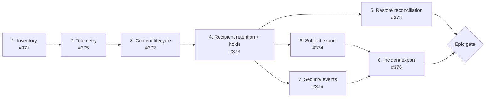

# RFC: GDPR engineering readiness implementation

**Status:** accepted for staged implementation; policy values remain gated

**Date:** 2026-09-13

**Epic:** [#377](https://github.com/vaam-apps/vsms/issues/377)

**Decision record:**
[`gdpr-engineering-readiness-adr.md`](gdpr-engineering-readiness-adr.md)

## Summary

This RFC turns issues #371 through #376 into eight reviewable changes. It defines ordering, expected
file impact, data shapes, state-machine constraints, test evidence, and scope cuts. It deliberately
does not select legal or organisational answers reserved for the maintainer and counsel.

The sequence is:



## Goals

- Maintain a complete, code-grounded personal-data inventory.
- Give message content a shorter, independent lifecycle where policy requires it.
- Keep plaintext and direct identifiers out of telemetry by default.
- Enforce declared retention and legal holds automatically and idempotently.
- Prevent restore from silently extending a row's allowed lifecycle.
- Produce app-bounded, allowlisted subject and incident exports without ad-hoc SQL.
- Retain enough safe authentication and change evidence to investigate a suspected incident.
- Produce repeatable tests and runbooks that demonstrate each technical control.

## Non-goals

- Controller or processor determinations.
- Lawful bases, consent validity, disclosure approval, or identity-verification decisions.
- Automated breach-notification decisions.
- Contracts, DPAs, SCCs, notices, DPIAs, RoPA ownership, or certification engagement.
- A self-service privacy portal or PDF report generator.
- A general SIEM, encryption-at-rest, or key-management redesign.
- Per-app human membership.
- Jurisdictional rules inferred from operator prefixes.

## Current-state findings

### Content can outlive retry eligibility

`backends/crates/sms-worker/src/claim.rs` excludes a message once `expiresAt <= now`, while
`backends/crates/sms-worker/src/jobs/expire_stale.rs` does not expire every state that the claim loop
can abandon. `backends/crates/sms-worker/src/jobs/purge_retention.rs` only pseudonymises terminal
messages. An expired `accepted`, `queued`, or `routed` row can therefore retain content and a direct
identifier indefinitely. The content-lifecycle change must close this existing hole, not merely add
another deadline.

### Provider responses cross the persistence boundary

`backends/crates/sms-provider-http/src/submit_status.rs` includes response bodies in error messages.
`backends/crates/sms-worker/src/dispatch.rs` can persist those messages in `Message.stateReason`, and
the message model is audited. A provider can therefore cause echoed content, identifiers, tokens, or
arbitrary payloads to become durable application and audit data.

### Declared retention is not consistently enforced

`Job` and `WebhookAttempt` declare 14-day and 30-day retention respectively, but the existing purge
job only processes `Message` and `DeliveryReceipt`. Poison event-outbox rows intentionally remain for
diagnosis and need a declared evidence policy rather than accidental indefinite retention.

### Deletion does not imply removal from audit history

`cratestack_audit` contains model snapshots. In particular, deleting a `DeliveryReceipt` does not by
itself remove an unredacted provider payload already copied into an audit snapshot. Audit redaction
and retention must be considered independently from source-row deletion. Rewriting covered audit
rows also affects the audit-anchor chain and cannot be a drive-by cleanup.

### Restore reintroduces an earlier snapshot

`deploy/backup-tool/src/restore.rs` restores the database and validates the pepper condition, but does
not apply current retention before reporting success. Time-based deadlines can be recomputed after
restore; erasures performed only after the backup cannot be inferred from the old snapshot.

### Existing audit filters are not an export boundary

`backends/crates/sms-api/src/audit_log.rs` supports broad audit queries but has no mandatory app,
message, or subject boundary. Raw `before` and `after` snapshots are unsuitable as subject exports.
Read-only procedures are not automatically audit events, so an export needs its own audited write.

### Authentication evidence is incomplete

Model audit records cannot reconstruct token issuance, login refusal, assertion replay refusal, or
similar authentication outcomes. An incident export needs a deliberately bounded security-event
source rather than guessing those events from later mutations.

### Subject hashing has a key-lifecycle constraint

`backends/crates/sms-api/src/pepper.md` documents that rotating the hash pepper makes new hashes
different from old ones and that purged rows cannot be rehashed. This is especially consequential for
opt-out enforcement and recipient search. No implementation in this program may describe a keyed
hash as anonymous or retire a lookup key while live enforcement records still require it.

## Policy gates

The inventory work may begin immediately. A later change must not merge until the relevant decision
is recorded:

| Decision | Blocks |
|---|---|
| Authentication and ordinary-content durations | Change 3 |
| Metadata duration and clock origin | Changes 3 and 4 |
| Retention of keyed recipient hashes | Changes 4 and 6; body hashes always follow content |
| Consent and opt-out evidence lifecycle | Change 4 |
| Hold authority, duration, review, and content coverage | Change 4 and destructive activation of Change 3 |
| Webhook replay and dead-attempt retention | Changes 2 and 4 |
| Whether subject export may include still-retained content | Change 6 |
| Authentication-event and source-network retention | Change 7 |
| Audit and backup-object retention | Changes 5 and 8 |
| Maximum deletion lag and backlog alert threshold | Changes 3 and 4 |

## Change 1: inventory and drift gate (#371)

### Design

Add a machine-readable inventory and a short guide. Every schema field is classified, including
non-personal fields, because a gate derived only from fields already labelled privacy-relevant cannot
detect that a new field was never reviewed. Known non-schema surfaces live in an explicit registry.
The check also scans for known telemetry, file, cache, raw-table, and external-I/O patterns and asks
for registration, but does not claim it can mechanically discover every side effect arbitrary code
may introduce.

Each entry records:

- model/field or non-schema surface identifier;
- category and data-subject category;
- source and product purpose;
- persistence location and external recipient;
- whether it is needed after delivery;
- retention expectation or `decision-required`; and
- masking, redaction, pseudonymisation, or deletion behavior.

Non-schema surfaces include `cratestack_audit`, `cratestack_event_outbox`, idempotency records, logs,
metrics, alerts, in-memory caches, admin sessions, provider exchanges, webhook requests, exports, and
backup objects. External recipients are derived from real adapter/configuration paths and must label
the MTN aggregator contract as unverified rather than presenting its placeholder protocol as fact.

### Expected files

| File | Change |
|---|---|
| New machine-readable privacy inventory | Classification data under the documentation tree |
| New privacy inventory guide | Definitions, ownership, review procedure, and legal-decision boundary |
| `.xtask/src/privacy_inventory.rs` | New completeness and stale-entry check |
| `.xtask/src/main.rs` | Register `privacy-inventory-check` |
| `.xtask/Cargo.toml` | Add only the parser dependency the implementation actually needs |
| `justfile` | Include the check in repository gates |
| `.github/workflows/ci.yml` | Run the same xtask command in CI |
| `docs/roadmap.md` | Record the new production-readiness dependency and current status |

### Acceptance evidence

- The check enumerates every `model` and field in `schemas/vsms.cstack`.
- Every parsed field appears exactly once; stale entries fail too.
- Every currently registered non-schema surface has an owner and retention status.
- A temporary schema field without an inventory entry fails by name, then passes after restoration.

## Change 2: telemetry and webhook-journal minimisation (#375)

### Design

Introduce a small, pure privacy/diagnostic boundary. It accepts typed facts and produces an approved
summary. It must not accept an arbitrary debug string and promise to recover secrets from it later.

Provider errors retain provider key, status, coarse consequence, retry delay, and an allowlisted
provider correlation identifier where one is available. They do not retain response bodies or URL
query strings. The sanitized error is the only value permitted to reach logs or
`Message.stateReason`.

Successful webhook attempts clear duplicated payload data once delivery is proven. Retryable and dead
attempts keep only the data required for the approved replay/evidence window. Correlation uses message,
event, attempt, request, and provider-reference IDs.

### Expected files

| File | Change |
|---|---|
| `backends/crates/sms-privacy/Cargo.toml` | New pure crate manifest |
| `backends/crates/sms-privacy/src/lib.rs` | Safe diagnostic types and formatting |
| `backends/crates/sms-privacy/src/lib.md` | Boundary, threat model, and approved fields |
| `Cargo.toml` | Register the crate and workspace dependency |
| `backends/crates/sms-provider-http/src/submit_status.rs` | Stop retaining provider bodies |
| `backends/crates/sms-provider-http/Cargo.toml` | Depend on the privacy boundary if needed |
| `backends/crates/sms-worker/src/dispatch.rs` | Persist and log only sanitized provider failures |
| `backends/crates/sms-worker/src/hooks.rs` | Sanitize endpoint and response failures |
| `backends/crates/sms-api/src/procedures.rs` | Remove plaintext/client-reference telemetry fields |
| `backends/crates/sms-api/src/dlr.rs` | Ensure callback diagnostics use IDs and safe status fields |
| `schemas/vsms.cstack` | Prevent `DeliveryReceipt.rawPayload` and equivalent values from entering audit snapshots |
| `backends/crates/sms-api/tests/errors_live_postgres.rs` | Prove stored and audited error summaries exclude provider bodies |
| `backends/crates/sms-api/tests/dlr_ingestion_live_postgres.rs` | Prove raw callback payload is prospectively redacted from audit snapshots |
| `.xtask/src/privacy_logging.rs` | Narrow static checks for unsafe log fields and response bodies |
| `.xtask/src/main.rs` | Register the logging check |
| `justfile` and `.github/workflows/ci.yml` | Run the same check locally and in CI |

Exact crate placement must preserve the provider abstraction's current purity and must not introduce
a CrateStack dependency into provider adapters.

For a deployment that already contains unredacted audit snapshots, this change inventories and
reports them but does not silently rewrite a covered chain. Remediation requires an explicit
chain-transition record and a new genesis, or expiry under the separately approved audit-retention
policy. The implementation must confirm whether any such deployment exists before choosing the
path. New snapshots are redacted prospectively from this change onward.

### Acceptance evidence

Leakage tests inject unique canaries shaped as an E.164 MSISDN, OTP, message body, client reference,
bearer token, provider response, and secret-bearing endpoint URL. Success, retry, 429, 5xx, rejection,
DLR, and webhook-failure paths assert those canaries are absent from tracing output,
`Message.stateReason`, `WebhookAttempt.lastError`, metrics, alerts, and audit snapshots.

Sabotage: restore raw provider-body persistence in the shared classifier and prove a canary assertion
fails before restoring the implementation.

## Change 3: independent message-content lifecycle (#372)

### Data shape

Names are illustrative until checked against CrateStack generation and the existing schema vocabulary:

```text
enum ContentRetentionClass {
  authentication
  standard
}

Message {
  contentRetentionClass ContentRetentionClass
  contentUseUntil DateTime
  contentRetentionUntil DateTime
  contentPurgedAt DateTime?
  metadataRetentionUntil DateTime
}
```

`bodyHash` becomes nullable or otherwise erasable and is cleared with the body. It is keyed and lower
risk than plaintext, but it is content-derived, write-only in the current system, and not anonymous.
It is also prospectively excluded from audit snapshots so clearing the source row does not leave a
durable copy behind.

The server derives the class: `otp` maps to `authentication`; every other current class maps to the
approved standard policy. Storing the deadlines preserves the policy that applied at acceptance time
when configuration changes later.

### Delivery invariant

The body must exist whenever a provider submission can still legitimately occur, and must be deleted
within the approved enforcement lag after it can no longer be used. `contentUseUntil` is the final
instant at which dispatch may start external I/O. `contentRetentionUntil` follows it by at least the
maximum provider-call timeout plus lease/scheduling safety interval. The API validates that scheduling,
validity, retry horizons, provider timeout, and that safety interval fit inside the lifecycle. It must
not extend content retention silently to accommodate an arbitrarily delayed request.

Dispatch checks `contentUseUntil` both when claiming and immediately before calling the provider.
Purge does not clear a routed row with a live dispatch lease. Once no new submission can start, it
waits through the bounded in-flight interval before deletion. A delayed fake provider test must
straddle the cutoff and prove that no purge/submission race creates an externally accepted message
whose local state was already erased.

At expiry:

1. A still-actionable `accepted`, `queued`, `routed`, or `undelivered` message is transitioned to
   `expired` through the database state machine.
2. Content and its hash are cleared through a CAS write.
3. `submitted`, `uncertain`, and already-terminal messages clear content without inventing a new
   delivery outcome.
4. Maintenance-only updates are prevented from creating duplicate customer webhooks.

Runtime enforcement processes bounded batches within a fixed row/time budget, records oldest overdue
age and backlog size, and immediately schedules another run while overdue work remains. This avoids
one handler monopolising the serial jobs worker. Restore reconciliation uses the same rules but drains
fully before cutover. One bounded batch per day, the current 90-day purge shape, is not sufficient
evidence of timely enforcement.

If policy decides a legal hold may preserve message content, destructive mode for this change is
blocked until Change 4's hold lookup exists. The code may land in report-only mode first, but #372 is
not complete and the mode must not be enabled destructively until that dependency is satisfied.

Any missing legal edge to `expired` must be added to the design doc's transition table and diagram,
then regenerated into `0002_bootstrap`; it must never be patched directly into generated SQL.

### Expected files

| File | Change |
|---|---|
| `schemas/vsms.cstack` | Retention class, deadlines, markers, and erasable hash shape |
| `docs/architecture.md` | Data lifecycle, state edges, configuration, and bootstrap source |
| `backends/migrations/postgres/0001_init/*` | Pin-matched full schema regeneration |
| `backends/migrations/postgres/0002_bootstrap/up.sql` | Regenerated transition/default/index SQL |
| `sdks/rust/vsms-sdk-rust/schema.cstack` | Re-vendored schema |
| `backends/crates/sms-api/src/procedures.rs` | Derive deadlines and reject incompatible scheduling |
| `backends/crates/sms-api/src/webhooks.rs` | Ignore retention-only maintenance updates |
| `backends/crates/sms-worker/src/jobs/purge_content.rs` | Frequent idempotent content enforcement |
| `backends/crates/sms-worker/src/jobs/purge_content.md` | State-by-state rationale and retained fields |
| `backends/crates/sms-worker/src/jobs.rs` | Register the handler |
| `backends/crates/sms-worker/src/scheduler.rs` | Schedule it at the approved cadence |
| `backends/crates/sms-worker/src/jobs/expire_stale.rs` | Close the existing non-terminal expiry gap |
| `backends/crates/sms-worker/tests/purge_content_live_postgres.rs` | Boundary and state coverage |
| `backends/crates/sms-api/tests/send_message_live_postgres.rs` | Scheduling/validity rejection and stored deadlines |
| `backends/crates/sms-metrics/src/lib.rs` | Oldest-overdue and backlog metrics |
| `deploy/prometheus/alerts.yml` | Maximum content-deletion-lag alert |
| New retention runbook | Operator-visible lifecycle and surviving metadata |

### Acceptance evidence

Real-Postgres tests cover pending/accepted, queued, routed, undelivered, submitted, uncertain,
delivered, failed, exact-boundary, just-before-boundary, repeated execution, lost CAS, webhook
suppression, a provider call straddling the cutoff, scheduler run-to-drain behavior, backlog alerting,
and no provider call started after the use cutoff.

Sabotage: disable the pre-purge transition for a routed message. The test must show retained plaintext
or remaining dispatch eligibility, not merely a changed helper return value.

## Change 4: recipient retention and legal holds (#373)

### Shared enforcement

Extract a reusable retention service or policy boundary consumed by scheduled enforcement and restore
reconciliation. Its final crate placement must avoid a dependency cycle: `sms-api` owns generated
schema types, while `sms-worker` already depends on `sms-api`. The implementation PR must prove that
the restore path invokes the same rule definitions rather than maintaining a second list.

Rules cover:

| Record or field | Required treatment |
|---|---|
| Message content | Change 3 lifecycle |
| Message direct identifier | Replace or clear at metadata expiry unless held |
| Recipient/body hashes | Clear or retain according to the explicit pseudonymisation decision |
| Country/operator and provider references | Keep only for the justified metadata period |
| Delivery receipts | Delete at expiry |
| Terminal jobs | Enforce the declared 14-day period |
| Terminal webhook attempts | Enforce the approved 30-day/replay period |
| Successful webhook payload | Clear on the earlier Change 2 schedule |
| Consent records | Apply the approved evidence period |
| Opt-outs | Preserve suppression while minimising unnecessary plaintext |
| Delivered event outbox | Keep bounded cleanup |
| Poison event outbox | Preserve or quarantine under an explicit evidence policy |
| Framework audit rows and anchors | Retire contiguous anchored ranges under the approved audit period |

### Hold shape

```text
enum RetentionHoldScope {
  message
  subject
  dataCategory
}

RetentionHold {
  id
  appId
  scope
  messageId?
  subjectHash?
  dataCategory?
  reason
  createdBy
  startsAt
  expiresAt
  releasedAt?
  version
  createdAt
  updatedAt
}
```

Exactly one selector appropriate to the scope is required. A subject hold uses a keyed canonical-E.164
identifier and records the hash/key version, never plaintext. `expiresAt` is required unless a later
policy decision explicitly permits an indefinite hold and changes this shape. A global hold is not
supported by default. Hold writes are audited and permission-gated. The backend exposes create,
release, and list commands so the console remains optional under R4.

### Hold consistency and control journal

The external append-only retention-control journal is authoritative and the Postgres hold model is a
projection. A create or release operation:

1. Acquires a target-scoped Postgres advisory lock also required by destructive enforcement.
2. Appends an idempotent, ordered control event to the authoritative journal.
3. Applies the event to the Postgres projection and advances its journal watermark.
4. Returns the authoritative event ID and projection state.

If step 3 fails, the event is still authoritative. The operation reports the projection lag, replay
repairs it, and destructive enforcement fails closed while its relevant projection watermark trails
the journal. Journal unavailability prevents hold mutation and destructive purge, but does not stop
ordinary message delivery. This deliberately chooses one source of truth instead of claiming an
atomic transaction across Postgres and object storage.

The shared advisory lock closes the race in which purge observes no hold while a matching hold is
being created. Release takes the same lock. Tests race create and release against the target row's
deletion, not only against a hold lookup helper. The new raw advisory-lock use requires a named R1
exception and the matching allowlist/documentation change.

The journal contains pseudonymous personal data. It is encrypted and access-controlled, and is
compacted only after every restorable backup predating the events has expired and a verified
checkpoint represents current hold state. Compaction and subject-key retirement are therefore linked.

An app-scoped hold does not control `OptOut`, whose suppression effect is deliberately deployment-wide
and has no `appId`. Active suppression evidence follows its own approved lifecycle. Subject export may
report whether that global suppression applies to the selected recipient, but an app hold cannot
extend or release it.

### Subject-key lifecycle

Replace a single undifferentiated hash pepper at the subject-lookup boundary with a versioned keyring.
Every subject-linked model used by suppression, holds, or export records `subjectHashVersion` beside
its hash. Lookup computes candidates under every retained version. Rotation creates a new active
version but does not retire an old one while `OptOut`, `ConsentRecord`, `Message`, hold, or other live
records reference it. Restore validates the complete referenced key set before destructive work.
`bodyHash` is a separate content-integrity value and always clears with content.

The current `SMS_HASH_PEPPER` is imported as subject-key version `v1`. Existing rows are backfilled to
`v1` before the version column becomes required. Configuration supplies a non-empty map of version to
secret plus one active version to gateway, worker, migration/reconciliation, examples, tests, Compose,
and Helm. Startup fails if the active version is absent; restore fails if any retained row or journal
event references an unavailable version. `sms-gateway rotate-subject-key` adds/selects a version only
after dependency checks and never deletes historical key material still in use.

### Audit lifecycle

`cratestack_audit` is a framework table with no delegate and therefore needs a named, bounded R1
exception. Audit retirement proceeds only over a contiguous range older than the approved period
whose content is already covered by a verified `AuditAnchor`. Before deletion, enforcement writes an
external retention checkpoint containing the retired range boundary and terminal chain hash. The
first retained or new anchor links to that checkpoint, making the intentional chain transition
distinct from unnoticed deletion. If checkpoint publication, verification, or range deletion fails,
no later range is retired and the oldest-overdue metric remains unhealthy.

The audit rows and anchors in the retired range are deleted after checkpoint verification; their
contents can no longer be recomputed locally. Every chain verifier, including the operator chain
status procedure, therefore starts the oldest retained anchor from the trusted external checkpoint
instead of assuming the all-zero genesis. It verifies retained period content normally from that
boundary onward. The `AuditAnchor` model receives the system-delete policy needed by the retirement
job; no general human delete route is added.

Prospective field redaction prevents message content and raw provider payloads from entering new audit
snapshots. Audit retention still applies to actor identity, recipient pseudonyms, and other retained
metadata. Tests verify the retained chain from the external checkpoint, detect an omitted or tampered
checkpoint, and prove a deletion query cannot skip an unretired middle range.

### Expected files

| File | Change |
|---|---|
| `schemas/vsms.cstack` | Hold model/enums, erasable fields, timestamps, policies, and procedures |
| `docs/architecture.md` | Retention map, hold semantics, state/index source |
| `backends/migrations/postgres/0001_init/*` | Pin-matched full regeneration |
| `backends/migrations/postgres/0002_bootstrap/up.sql` | Regenerated defaults, checks, and indexes |
| `sdks/rust/vsms-sdk-rust/schema.cstack` | Re-vendored schema |
| `backends/crates/sms-retention/**` | Shared rule definitions and delegate-backed enforcement, if dependency review confirms this placement |
| `backends/crates/sms-retention/src/control_journal.rs` | Authoritative journal protocol, projection watermark, and replay |
| `backends/crates/sms-worker/src/jobs/purge_retention.rs` | Use the shared rules and enforce every class |
| `backends/crates/sms-worker/src/jobs/reap_audit.rs` | Checkpoint and retire contiguous anchored audit ranges |
| `backends/crates/sms-worker/src/jobs/reap_audit.md` | Anchor transition, R1 reasoning, and failure policy |
| `backends/crates/sms-api/src/audit_log.rs` | Verify retained history from an external checkpoint instead of zero genesis |
| `backends/crates/sms-api/src/procedures.rs` | Preserve checkpoint-aware operator chain status |
| `backends/crates/sms-worker/src/jobs/purge_retention.md` | Updated rationale and scope |
| `backends/crates/sms-worker/src/jobs.rs` | Registry updates if handlers split |
| `backends/crates/sms-api/src/procedures.rs` | Hold procedures and permission checks |
| `backends/crates/sms-api/src/pepper.rs` and `pepper.md` | Versioned subject-keyring and retirement rules |
| `backends/apps/sms-gateway/src/commands/retention_hold.rs` | R4 operator command |
| `backends/apps/sms-gateway/src/commands/rotate_subject_key.rs` | Explicit key rotation and dependency checks |
| `backends/apps/sms-gateway/src/main.rs` | Register the command only |
| `backends/apps/sms-gateway/Cargo.toml` | Journal/keyring adapter dependencies if required |
| `deploy/docker-compose.yml` | Journal endpoint/credentials and versioned keyring configuration |
| `deploy/charts/vsms/**` | Equivalent journal/keyring configuration and secret references |
| `deploy/backup-tool/src/manifest.rs` | Record key versions and journal checkpoint required by a backup |
| `docs/runbooks/backup-restore.adoc` | Provisioning, rotation, recovery, and key-retirement order |
| `CONTRIBUTING.md` and `.xtask/src/raw_sqlx.rs` | Named target-lock R1 exception if advisory locking is selected |
| `CONTRIBUTING.md` and `.xtask/src/raw_sqlx.rs` | Named framework-audit R1 exception for bounded retirement |
| `backends/crates/sms-worker/tests/reap_audit_live_postgres.rs` | Chain checkpoint, contiguous deletion, and tamper tests |
| `backends/crates/sms-api/tests/retention_hold_live_postgres.rs` | Scope, release, audit, and isolation tests |
| `backends/crates/sms-worker/tests/purge_retention_live_postgres.rs` | Every class, boundary, and idempotency |
| `.xtask/src/retention_coverage.rs` | Ensure every `@@retain` declaration has enforcement |
| New retention runbook | Hold operation and evidence |

### Acceptance evidence

Tests cover just-before/at/after boundaries, repeated and concurrent execution, overlapping holds,
release followed by immediate eligibility, same-recipient records in two apps, projection failure
after authoritative append, stale projection refusal, and hold create/release racing actual deletion.
Audit tests additionally prove checkpoint publication precedes deletion, chain verification crosses
the intentional boundary, and failed publication or deletion remains visible and retryable.

Sabotage: remove the app predicate from hold matching. The isolation test must fail because another
app's expired record is incorrectly preserved.

## Change 5: restore reconciliation (#373)

### Design

Restore builds an isolated candidate database that no gateway or worker can reach. The sequence is:

1. Restore the snapshot into the isolated candidate.
2. Load and verify the append-only retention-control journal stored independently from the snapshot.
3. Replay hold creations/releases and any supported out-of-cycle erasure tombstones through the
   current snapshot boundary.
4. Verify every subject-key version referenced by restored or replayed records is available.
5. Apply current content and metadata retention using the shared rules and current time.
6. Preserve only holds active according to the replayed control state.
7. Verify reconciliation completed.
8. Enter a deployment maintenance fence: stop gateway/worker/admin traffic and verify there are no
   application sessions connected to the live database.
9. Cut over the reconciled candidate under the expected database name.
10. Start services only after the controlled cutover succeeds.

A replay or reconciliation failure is a restore failure. The journal has its own integrity,
availability, access-control, and backup requirements; storing a copy only inside the same database
backup does not satisfy the design. Documentation must distinguish the live restored database from
old backup objects: this change prevents restored expired rows from becoming live, but the object
remains a personal-data store until backup retention deletes it.

The backup tool refuses an in-place restore to a database with application sessions. Compose must
stop dependent services before cutover; Helm must scale or suspend every controller and gate its
restore job equivalently. A runbook instruction without an executable session check is not the
service fence. The old database is retained under a quarantine name only for the bounded rollback
window, remains inaccessible to application credentials, and is then deleted under the same policy.

The backup scheduler owns backup-object retention and control-journal compaction. Pruning is a
required enforcement result: an rclone deletion failure marks the run failed or unhealthy, records
the oldest overdue object and retry state, and is retried independently of whether a new backup is
due. Journal compaction writes and verifies a checkpoint before deleting old events, and only compacts
events older than the oldest restorable backup. Key retirement checks live rows, journal checkpoints,
and every retained backup manifest before reporting a version removable.

### Expected files

| File | Change |
|---|---|
| `deploy/backup-tool/Cargo.toml` | Depend on the chosen shared retention boundary |
| `deploy/backup-tool/src/restore.rs` | Invoke reconciliation before success |
| `deploy/backup-tool/src/drill.rs` | Seed and assert expired, recent, and held data |
| `deploy/backup-tool/src/retention_control.rs` | Verify and replay the independent control journal |
| `deploy/backup-tool/src/backup.rs` | Treat retention enforcement failure as unhealthy, not best-effort success |
| `deploy/backup-tool/src/rclone.rs` | Return and classify persistent object-deletion failures |
| `deploy/backup-tool/src/health.rs` | Report backup and journal retention lag |
| `deploy/backup-tool/src/main.rs` | Register explicit enforce/compact commands if the scheduler cannot reuse one path |
| `deploy/backup-tool/src/*.md` | Describe ordering and failure behavior where module docs require it |
| `deploy/docker-compose.yml` | Stop application services, restore in isolation, and order cutover/restart |
| `deploy/charts/vsms/**` | Enforce equivalent controller suspension and restore fencing |
| `docs/runbooks/backup-restore.adoc` | Explain reconciliation and backup-object limits |

### Acceptance evidence

The drill seeds an expired OTP/body canary, expired direct identifier, expired receipt, terminal job,
terminal webhook attempt, recent data, and held expired data. It also creates one hold after the
snapshot and releases another hold after the snapshot. After restore, expired unheld data is
redacted/deleted, the post-snapshot hold is applied, the post-snapshot release is not resurrected,
recent and held data survives, and a second replay/reconciliation changes nothing.

External-store tests inject persistent deletion failure and require an unhealthy nonzero result,
verify journal events remain until the oldest backup that needs them expires, verify checkpointed
compaction, and prove a subject key remains non-retirable while any retained manifest or checkpoint
references it.

Sabotage: skip reconciliation. The drill must fail because the expired content canary is readable.

## Change 6: subject search and export (#374)

### Request and authorization

The workflow requires:

- a human principal with `privacy:export`;
- a mandatory app ID or slug;
- a canonical E.164 recipient;
- a mandatory bounded time range no wider than the configured export maximum;
- fixed page and byte limits with an opaque cursor; and
- an explicit content-inclusion mode if policy permits retained plaintext at all.

Human privacy operators are deployment-global. The app supplied in the request is nevertheless a
mandatory data boundary applied independently to every source. The query uses keyed recipient hashes,
not substring searches through webhook or audit JSON.

### Export shape

Use a versioned JSON or NDJSON envelope containing allowlisted projections of:

- messages and retention/redaction state;
- delivery receipts;
- webhook attempts linked through message/event IDs;
- consent records;
- applicable opt-out evidence; and
- other subject-linked retained records identified by the inventory.

Exclude provider configuration, webhook secrets, OAuth keys, password hashes, assertions, access and
refresh tokens, private keys, raw provider payloads, and unrelated audit snapshots. Plaintext body is
excluded by default and can be included only if the policy gate explicitly allows it and a separate
permission/reason is supplied.

An audited `ExportInvocation`-shaped record stores requester, app, selector digest, time range,
content mode, result counts, outcome, and timestamps. It never stores the plaintext MSISDN or export
body. `started`, `completed`, and `failed` are independently committed lifecycle writes: projection
or serialization failure must not roll back the only evidence that an export was attempted. The
export core serializes one bounded page before recording that page and eventually the invocation as
complete. The CLI creates its destination exclusively with restrictive permissions before invoking
the export, follows opaque cursors without holding the full result in memory, removes a partial file
on failure, and follows existing one-time credential output discipline. A broader history is exported
as multiple bounded, independently audited windows rather than one unbounded request.

### Expected files

| File | Change |
|---|---|
| `schemas/vsms.cstack` | Export invocation model, permissioned procedure, and policies |
| `docs/architecture.md` | Export boundary and audit behavior |
| `backends/migrations/postgres/0001_init/*` | Pin-matched full regeneration |
| `backends/migrations/postgres/0002_bootstrap/up.sql` | Regenerated defaults/indexes if required |
| `sdks/rust/vsms-sdk-rust/schema.cstack` | Re-vendored schema |
| `backends/crates/sms-api/src/privacy_export.rs` | Shared allowlisted query/projection core |
| `backends/crates/sms-api/src/privacy_export.md` | Exclusions, app boundary, and content policy |
| `backends/crates/sms-api/src/procedures.rs` | Authorized procedure entry point |
| `backends/apps/sms-gateway/src/commands/export_subject_data.rs` | R4 operator command and secure output |
| `backends/apps/sms-gateway/src/main.rs` | Register the command only |
| `backends/crates/sms-api/tests/privacy_export_live_postgres.rs` | Isolation, exclusion, and audit tests |
| New data-subject export runbook | Product evidence versus organisational decisions |

### Acceptance evidence

Seed the same recipient in apps A and B plus an unrelated recipient. The app-A export contains every
approved app-A record, contains no app-B or unrelated canary, contains no secret, applies the content
mode, and records an audited invocation. A forced projection/serialization error leaves a `failed`
invocation record. Record and byte limits are tested with a recipient whose history exceeds one page.
A missing permission fails before data retrieval.

Sabotage: remove an app predicate while retaining the recipient predicate. The test must fail on the
app-B canary.

## Change 7: durable security events (#376)

### Data shape

Add an append-only model with a fixed event-kind enum and fields such as:

```text
SecurityEvent {
  id
  occurredAt
  kind
  outcome
  appId?
  clientId?
  userId?
  requestId?
  safeReasonCode?
  keyId?
  assertionJtiDigest?
  sourceFingerprint?
}
```

Source-network metadata is omitted until its policy gate is resolved. Unknown-user and wrong-password
paths use the same non-enumerating outcome. No free-form detail field is included by default. Event
kind, outcome, and reason are fixed enums; attacker-selected values never become labels or unbounded
indexed dimensions.

Events are explicitly either app-associated or deployment-global. Machine-client token and assertion
events carry their resolved `appId`; a human login before any app action is deployment-global because
human RBAC has no app membership. An app-bounded incident export includes only app-associated events.
Deployment-global authentication evidence requires a distinct `privacy:incident:global` permission
and export mode and is never silently mixed into an app artifact.

At minimum, instrument admitted human login, token issuance/refusal, assertion replay refusal, client
provisioning/retirement, signing/client-key rotation, privacy exports, incident exports, and selected
sensitive authorization denials.

`/login` gains source and account-bucket rate limiting before a refusal can write an event; `/token`
uses its existing limiters. Malformed requests rejected before an identifiable authentication attempt
do not create one row each. The event writer has a documented bounded failure policy and metric so a
database outage or attack cannot turn evidence recording into unbounded memory use or hide the
availability tradeoff. This issue records investigatively useful outcomes, not every byte received on
an unauthenticated endpoint.

Security events register with the shared retention service, run-to-drain enforcement, oldest-overdue
metric, and retention coverage gate from Change 4. Change 7 therefore depends on Change 4 even though
its event vocabulary can be designed earlier.

### Expected files

| File | Change |
|---|---|
| `schemas/vsms.cstack` | Append-only security-event model and read policy |
| `docs/architecture.md` | Safe event vocabulary and retention |
| `backends/migrations/postgres/0001_init/*` | Pin-matched full regeneration |
| `backends/migrations/postgres/0002_bootstrap/up.sql` | Defaults and indexes |
| `sdks/rust/vsms-sdk-rust/schema.cstack` | Re-vendored schema |
| `backends/crates/sms-auth/src/security_events.rs` | Typed auth-event recording boundary |
| `backends/crates/sms-api/src/auth.rs` | Resource-server outcomes where appropriate |
| `backends/apps/sms-gateway/src/login.rs` | Human login outcomes |
| `backends/apps/sms-gateway/src/op.rs` | Token and assertion outcomes |
| `backends/apps/sms-gateway/src/login_rate_limit.rs` | Bound unauthenticated login attempts before event writes |
| `backends/apps/sms-gateway/src/commands/**` | Provisioning and rotation outcomes |
| `backends/crates/sms-worker/src/jobs/purge_retention.rs` | Enforce security-event retention |
| `.xtask/src/retention_coverage.rs` | Require security-event enforcement registration |
| `backends/crates/sms-auth/tests/security_events_live_postgres.rs` | Real login/token evidence and leakage tests |

The final placement must avoid duplicating event construction between `sms-auth` and the gateway.
Both use one typed constructor vocabulary even if the persistence adapter lives at the application
boundary.

### Acceptance evidence

Real human-login and `private_key_jwt` flows produce expected success and refusal events. Canaries for
passwords, assertions, tokens, emails, message bodies, and MSISDNs never appear. App/client/time
queries remain bounded. Retention boundary, run-to-drain behavior, and overload policy are exercised
too.

Sabotage: store the raw client assertion in an event. The leakage test must fail.

## Change 8: incident evidence export and tabletop (#376)

### Request and export

Reuse the subject-export projections and security-event queries. The ordinary incident export requires
a mandatory app, bounded time window, and at least one narrowing selector: client ID, message ID,
canonical recipient, or provider reference. It includes only app-associated security events.

A separate deployment-level security export may include global human-login events. It requires
`privacy:incident:global`, a bounded time window, and an explicit reason. It does not weaken the app
boundary of the ordinary export and is not used for subject-access responses.

The allowlisted result includes:

- app and client identity;
- message lifecycle and retained data categories;
- provider submission references and delivery receipts;
- webhook attempts;
- authentication/security events;
- relevant, bounded audit changes;
- audit-anchor verification references; and
- retention/redaction status with timestamps.

It excludes secrets, expired plaintext, unrelated apps, and raw audit snapshots. The invocation is
recorded through the same independently committed started/completed/failed lifecycle as a subject
export.

### Expected files

| File | Change |
|---|---|
| `schemas/vsms.cstack` | Incident-export procedure and permission vocabulary if distinct |
| `backends/crates/sms-api/src/privacy_export.rs` | Reuse safe projections and mandatory app scoping |
| `backends/crates/sms-api/src/incident_export.rs` | Incident selectors and evidence assembly |
| `backends/crates/sms-api/src/incident_export.md` | Evidence limits and Art. 33 boundary |
| `backends/crates/sms-api/src/audit_log.rs` | Add purpose-built bounded lookup, not a global dump |
| `backends/crates/sms-api/src/procedures.rs` | Authorized entry point |
| `backends/apps/sms-gateway/src/commands/export_incident.rs` | R4 operator command and secure output |
| `backends/apps/sms-gateway/src/main.rs` | Register the command only |
| `backends/crates/sms-api/tests/incident_export_live_postgres.rs` | Cross-app and selector-bound tests |
| New privacy-incident runbook | Product evidence mapped to organisational response |

### Tabletop

The automated scenario provisions apps A and B, authenticates app A, sends identifiable canary
messages, records provider/DLR/webhook activity, exercises a refused action, and exports an app-A time
window. It verifies expected evidence, excludes app-B and secret canaries, and confirms the export's
own audit record. The runbook explains how an operator hands that artifact to the organisation's
incident process without deciding whether notification is required.

Sabotage: remove the app predicate from one evidence source. The tabletop must fail on an app-B
canary.

## Cross-cutting implementation constraints

### R1: delegates remain the data boundary

All model access uses CrateStack delegates. `cratestack_audit`, `cratestack_event_outbox`, and similar
framework tables without models require an explicit R1 exception with reasoning, bounded queries, and
matching allowlist/documentation changes.

### R2: Postgres decides transitions

Content expiry may propose new transitions but cannot bypass the transition tables or trigger. Any
state edge changes first in `docs/architecture.md`, then regenerates `0002_bootstrap`, and is verified
against real Postgres with `ci/test-state-machine.sql`.

### R4: the console is optional

Every hold, subject-export, incident-export, and reconciliation operation has an `sms-gateway` or
other backend command. A future console screen may call the same procedure but is not required for
operation.

### Multi-country

Recipient input is normalized through `sms-msisdn`; current bare national input retains Cameroon's
default behavior. Stored and exported subject identity uses canonical E.164. Once multi-country stage
2 (#356) adds app/default and destination-country columns, the inventory and exports include those
explicit fields, but this program does not duplicate or block on that schema work. Unknown operator
is valid outside markets with reliable routing data. No privacy rule derives jurisdiction from
`OperatorCode`.

### Schema and migration workflow

Before every schema regeneration, the installed CrateStack CLI must equal the root pin. Regenerate
`0001_init` wholesale, edit the bootstrap source in `docs/architecture.md`, regenerate
`0002_bootstrap`, delete the temporary snapshot, re-vendor the Rust SDK schema, and apply the result to
real Postgres. Policy-only `@@allow` changes do not regenerate DDL.

### Audit integrity

Do not rewrite or delete existing audit rows without a design for anchor-chain continuity. New
sensitive fields must be redacted before audit snapshot construction where the framework supports it,
or excluded from the audited model in favor of a purpose-built short-retention store.

## Review and verification

Every persistence or privacy change follows this sequence:

1. Focused unit and live-Postgres tests.
2. One correctness/privacy adversarial review.
3. One conventions/blast-radius review covering R1, R2, R4, migration generation, and multi-country.
4. Remediation of confirmed findings.
5. Review of the remediation.
6. The named sabotage proof for the acceptance property.
7. The repository's complete gate, `just ci`, on the final head.

A skipped live suite is not a pass. A build-only check is not evidence for runtime deletion,
authorization, restore, or cross-app isolation.

## Issue traceability

| Issue | Delivered by |
|---|---|
| #371 | Change 1 |
| #375 | Change 2, with webhook-attempt deletion completed by Change 4 |
| #372 | Change 3, relying on Change 2 for the telemetry criterion |
| #373 | Changes 4 and 5 |
| #374 | Change 6 |
| #376 | Changes 7 and 8 |
| #377 | All changes plus final test/runbook evidence |

This ADR/RFC PR references these issues but closes none of them. Each issue closes only when its
runtime control and acceptance evidence land.

## Rollout and rollback

Retention changes first deploy in report-only mode against a disposable or staging copy so operators
can inspect counts by rule without exposing row contents. Destructive enforcement is enabled only
after those counts and policy values are approved. Report-only mode is not a permanent bypass and
must have an expiry.

Database migrations are additive until enforcement is proven. Rolling application binaries back does
not repopulate cleared content. A rollback must never restore an older backup merely to recover
deleted plaintext; ordinary backup recovery still runs the reconciliation gate.

## Documentation impact

The first change updates `docs/roadmap.md` because this program adds a production-readiness dependency.
Later changes update `docs/architecture.md` and the named runbooks when behavior actually lands. This
RFC is not a claim that any runtime control already exists.
