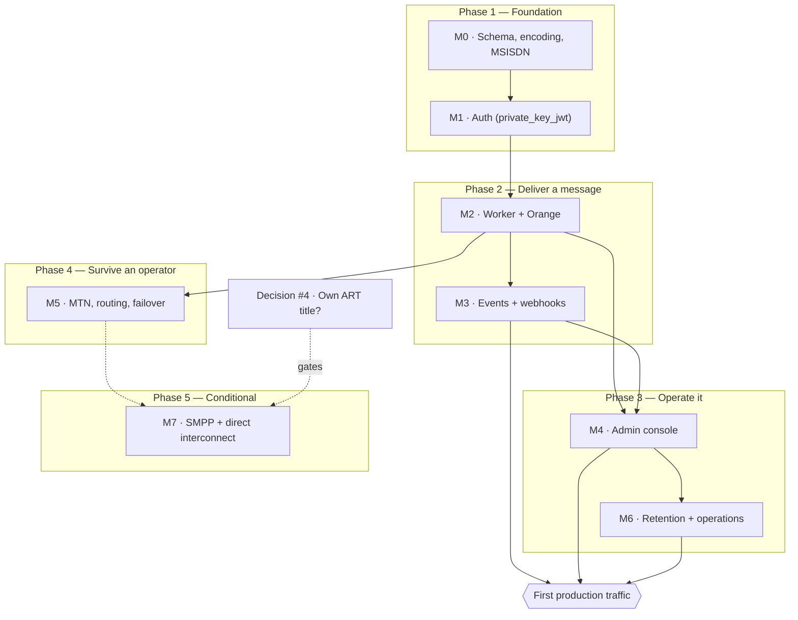

# Roadmap

What order the work happens in, what genuinely blocks what, and what has to be true before real traffic.

**This file is about sequencing.** It deliberately does *not* restate two things that live elsewhere and would drift here:

- **Per-milestone acceptance gates** — [`architecture.md` §12](architecture.md#12-milestones) is the spec. If this file and §12 disagree about what a milestone *means*, §12 wins.
- **Live status** — GitHub Issues and Milestones are the tracker. `gh issue list --milestone "M3 — Events and webhooks"` is always more current than any prose here.

The status column below is a **dated snapshot**, not a source of truth. This repo has been bitten four separate times by documentation asserting something the code did not do (see `AGENTS.md`'s corrections on the M1 `/token` claim, `rust-version`, the `/token` rate-limiting table row, and OTP body storage), so treat any status claim older than its date with suspicion and check the tracker.

---

## The shape of it

Milestone numbering is a dependency order, not a schedule, and the work has legitimately run out of order: parts of the admin console (M4) and the backup/restore drill (M6) landed while M3 was still open, because neither was blocked. The phases below group milestones by *what capability they unlock*, which is the more useful question when deciding what to pick up next.

---

## Phases

| Phase | Milestones | Question it answers | Status *(2026-08-13)* |
|---|---|---|---|
| **1 — Foundation** | M0, M1 | Can we represent a message, and prove who is asking? | **Done** — 14/14 and 9/9 closed |
| **2 — Deliver a message** | M2, M3 | Can one SMS reach a real handset, and can the caller find out what happened? | **Done** — M2 12/12, M3 8/8, both gates passing |
| **3 — Operate it** | M4, M6 | Can a human run this without a database console, and does it satisfy Cameroonian law? | M6 **done** (9/9, gate passed). M4 **done** — all twenty stories closed by 2026-08-13 (#53/#55 and #52/#58 last, both on the day #211 unblocked them), and §12's gate passed 2026-08-12 (see item 2 below). One issue remains open on the milestone, #221 — a finding filed rather than folded into the PR that surfaced it, per this file's own convention, not an unbuilt screen |
| **4 — Survive an operator** | M5 | Does traffic keep flowing when Orange breaks? | **Started** (4/6) — `sms-provider-mtn` (#61), the routing rules engine (#62), failover/circuit breakers (#63) and grey-route detection (#64) all landed, leaving the epic (#60) and #65. **#65's automated half landed and the issue stays open on purpose**: §12's M5 gate is not passed until a human runs `docs/runbooks/65-kill-orange-gate.md` against a real staging Orange account — the same "automated proof is not the gate" distinction M2's own gate established. #64's two proxies (delivery-rate divergence, handset-validation staleness) are likewise not a substitute for the real-handset evidence `OPEN_QUESTIONS.md` §2.2/§2.4 records as still missing |
| **5 — Conditional** | M7 | Direct MNO interconnect over SMPP | Not started, and **may never exist** — see decision #4 |

---

## What actually blocks first production traffic

This is the part milestone numbering hides. **Phase 4 is not a prerequisite.** A single-operator gateway that only reaches Orange subscribers is a smaller product, not an unsafe one — losing MTN traffic is a commercial limitation, and #63's failover is a resilience upgrade over a system that already delivers.

What does block it:

1. ~~**M3 finishing** (#43, #44).~~ **Resolved 2026-08-11.** Both landed; all three clauses of §12's M3 gate are automated against a real Postgres — signature verified by a real Node receiver subprocess (`hooks_node_receiver_live.rs`), no loss on a mid-drain `SIGKILL` (`kill9_reclaim_live.rs`), exactly one attempt per event across two workers (`hooks_two_workers_live.rs`). One caveat worth stating rather than burying: the Node-receiver clause only began *executing in CI* with the fix in #198 — the `live` job had no Node toolchain, so that test had failed at spawn on every run since it landed, and passed locally only because a human had run `pnpm install` by hand. "No event is lost" is now a demonstrated property; it was a belief for slightly longer than the story list suggested.
2. ~~**Enough of M4 to diagnose a failure.**~~ **Resolved 2026-08-12.** §12's gate for M4 is *"an operator can diagnose a failed message without touching SQL"* — never all twenty stories, just the diagnostic core: the messages detail view and state timeline (#50), and the jobs and workers screens (#56, #57). All three are closed. #50's timeline is deliberately explicit about what it cannot prove, and was verified against a real `Indeterminate` submit (`routed -> uncertain`, zero receipts) rather than a clean `accepted -> delivered`.
3. ~~**M6's compliance items.**~~ **Resolved 2026-08-12 — M6 is complete (9/9) and its gate passed.** Retention purge (#67, 90-day minimisation per decision #5), audit anchoring (#68), backup and a real restore drill (#69), alerting (#70), observability (#71), and consent records with the classification exemption and marketing quiet hours (#72). Law No. 2024/017's sanctions run to 100,000,000 FCFA and criminal penalties, so this was the phase where "after launch" would have been the expensive answer.

   Three limits are worth carrying rather than losing in the closed issues: `msisdnHash` survives the purge and a pepper rotation can never be undone for an already-purged row; the anchor chain cannot detect deletion of the newest anchor before anything references it; and the classification audit trail *records* a caller's declared `Message.class` without *verifying* it. All three are in `OPEN_QUESTIONS.md` §3.
4. **No message from this system has ever reached a real handset.** `docs/runbooks/36-handset-gate.md` is M2's own acceptance gate and still requires a human with a real Orange account and a real phone: a message reaching `delivered` within 15 seconds, and a human-timed `kill -9` against a real — not mocked — provider. Everything automated around it (the chaos suite, `sms-fake-orange`'s fault injection, the kill-9 reclaim gate) proves how *this system* behaves under faults. None of it proves Orange behaves the way this code assumes. `OPEN_QUESTIONS.md` §2.2.

   This is the item most likely to be mistaken for done, because every milestone gate that *can* be automated has been. It cannot, and nothing in CI will ever turn it green.

5. **Decision #4 below** — though note it gates M7 only, not first traffic.

Deliberately *not* on that list: **#187** (webhook secrets readable by every human role) is latent, because no human-login flow exists yet to hold such a token. It becomes live exactly when M4 ships real logins, which is why it sits on M4 rather than M3.

**#194 (human login flow) resolves the dependency #187/#193/#50/#52/#58 all shared — "no principal in this system can carry a human role."** `sms-auth`'s OP now issues real `authorization_code` + PKCE tokens against a local, Argon2id-backed `User`/`UserCredential`/`Role` model (a deliberate, flagged departure from an external-IdP federation design that was considered and set aside — see `sms_auth::login`'s own module doc), `sms_api::auth::GatewayAuth` projects one into a real `hasRole(...)`-meaningful `CoolContext`, and `admin/`'s Basic-auth gate (#48) is gone — a hard cutover to real sessions, not a parallel path. This is the *mechanism* those five stories needed, not the stories themselves: #52/#58's own screens and #50's per-app message scoping are still open, now buildable rather than blocked on a decision nobody could make. #187/#193's own latency (closed already, `e36efcb`) meant their fix shipped ahead of having a live token to prove the *allow* case with — #194 is the first PR that can actually mint one.

**#211 (resolved 2026-08-13) closed the gap #194's own paragraph above left open: #194 built the mechanism, but the console never used it.** `GatewayAuth` could resolve a real human principal from #194 onward, but `packages/gateway` kept authenticating every upstream call as its own machine credential regardless of who was signed in — found live, signing in as a freshly provisioned `owner` and watching a `Provider` edit fail with `missing required permission "provider:update"`. That made #52/#58's own write screens buildable-but-pointless (any edit would 403 on the correctly-implemented Layer 2 check) and left the audit trail unable to say *who* did a console write. `packages/gateway/src/request-credential.ts` (`AsyncLocalStorage`, scoped once at the tRPC route handler) now forwards the signed-in human's own session token for every screen except the two documented exceptions — the composer (`sendMessage` structurally requires a machine caller, `crates/sms-api/src/procedures.rs::caller_client_id`) and the messages list's own live-update poll (a process-wide singleton with no one human to act as). Also found and fixed in the same PR: the seeded role `permissions` (`0002_bootstrap`) used `message:read`/`message:send` where `require_permission` actually checks `sms:read`/`sms:send`, and no role carried `dashboard:read` at all — both silent until a human token was ever forwarded to hit them, which #211 is the first PR to do. #52/#58's own screens (closed the same day, see the paragraph below) and #50's per-app message scoping are unblocked for real now, not just "buildable" — a signed-in human's writes are enforced by the human role's own permissions, not silently denied by a machine-only credential underneath the UI.

**#52/#58 (closed together, 2026-08-13) are the first screens built on top of #211's real per-human writes.** #52: Apps and their service-account clients — provisioning shows `privateKeyPem` exactly once (never persisted, never toasted, cleared from the mutation hook's own state on dialog close); retiring a client is the documented coarse fallback (`AppClient.active`/`retiredAt`, no per-client key-history model — the same limitation #23's own PR named, still true, now visible in the UI's own copy rather than only in a comment). #58: opt-out search/record went through two new procedures (`searchOptOutByMsisdn`/`recordOptOut`) because the console has no access to `SMS_HASH_PEPPER` and cannot compute `msisdnHash` itself; users/roles reused #194's `provisionUser` (also a show-once password); the audit log reads `cratestack_audit` through a new `crates/sms-api/src/audit_log.rs` module — moved there from `sms-worker`'s `anchor_audit` job rather than duplicated, so the console's own "does this period's chain verify" check and the job that writes the chain share one hashing implementation. One real, pre-existing gap found and fixed in the same PR: `OptOut.create`'s own `@@allow` never admitted `hasRole('support')`, even though §5.2 grants `support` the `optout:manage` permission specifically for this — `recordOptOut` closes it by writing under a `sys()` context, the same pattern `provisionAppClient` already established, rather than widening the model's own policy. No password-rotation/reset procedure exists for either an app client's key or a user's password — both are documented, accepted gaps (`OPEN_QUESTIONS.md`), not oversights.

**#53/#55 (resolved 2026-08-13) close two of the four screens #211 unblocked, largely by exposing procedures that already existed rather than inventing new ones** — Sender IDs (per-`(senderId, provider)` registration status, rejection reasons surfaced and actionable via a "Resubmit" flow that resets a rejected registration to `pending`) and Webhooks (endpoint CRUD, attempt history, one-click replay, secret rotation with the overlap window — `secret`/`prevSecret`/`secretRotatedAt` — genuinely visible rather than hidden). Two real findings, not assumed: `SenderId`/`SenderIdRegistration`/`WebhookEndpoint` writes needed the identical `PROVIDER_WRITE_ROUTES`-shaped Layer 2 defense-in-depth gate (`router::SENDER_AND_WEBHOOK_WRITE_ROUTES`, `sender:manage`/`webhook:manage`) — and, unlike that constant's own original doc, this one is provably load-bearing today, not hypothetical, since #194/#211 both landed first; a real signed-in `owner` editing a rejected registration and rotating a webhook secret were both proven live against a real gateway. Second, and unrelated to either screen's own scope: sending JSON `null` to clear a nullable column over a generated `PATCH` route is a **verified no-op**, not the `Some(None)`-clears semantics AGENTS.md's own "Verified toolchain API" section describes for the Rust delegate builder — `cratestack-macros-0.7.10` applies no `deserialize_with` to disambiguate serde's well-known "double Option" ambiguity on the generated `Update{Model}Input`, confirmed both by reading the vendored source and by a live `PATCH` that left `rejectionReason` unchanged while `status` updated normally in the same request. No existing screen (`providers.ts`/`routes.ts`) had ever attempted to clear a nullable field over REST before this, so nothing had surfaced it. Worked around locally (an explicit empty string, which the same route genuinely writes); filed upstream as [cratestack#567](https://github.com/cratestack/cratestack/issues/567) and added to `OPEN_QUESTIONS.md` §4's own table.

**#46 is resolved, and it doesn't shrink this list: `cratestack studio` (evaluated live at `0.7.10`, matching the pin) covers none of M4's ten open stories.** It's model-CRUD only — no procedure surface, so #52/#54/#55's actual workflows (`provisionAppClient`, `previewMessage`, `replayWebhookAttempt`, `rotateWebhookSecret`) stay unreachable through it — and, checked live rather than assumed, it bypasses `@@allow`, `@version`/CAS, and `@@emit` outbox writes entirely (an unauthenticated read returned `OauthSigningKey.privateKeyPem` in the clear; a write left `version` unbumped and wrote zero outbox rows despite `Message.@@emit`). That's disqualifying for any deployed surface, not a gap to patch. It also can't ever cover #57 — lock ownership lives in Postgres session advisory locks with no schema model, so there's nothing for a schema-driven tool to show. #56/#57 (the diagnostic core this section already named) stay exactly as much hand-written work as before; see the issue comment on #46 for the full per-story split.

---

## Where the unknowns live

`OPEN_QUESTIONS.md` at the repo root collects what this system does not know
the answer to — human decisions, unverified claims, accepted limitations, and
filed upstream questions. This file owns *sequencing*; that one owns
*unknowns*. A question whose only obstacle is someone doing the work belongs
in neither: it is a GitHub issue.

## Decisions that gate phases

Belongs to the maintainer, not to engineering. Not answerable by reading more code.

| Decision | Blocks | State |
|---|---|---|
| [#4 — own ART title?](https://github.com/vymalo/vsms/issues/4) | **Whether M7 exists at all.** Direct MNO interconnect or a short code unambiguously requires an ART title; whether a pure API consumer buying capacity from a licensed aggregator needs one is unverified. Settle before committing to SMPP, not during. | Open |

Three earlier decisions are settled and recorded: [#3](https://github.com/vymalo/vsms/issues/3) (hosting), [#6](https://github.com/vymalo/vsms/issues/6) (`authkestra-op` stays, pinned exactly), and [#5](https://github.com/vymalo/vsms/issues/5) (**2026-08-11**: 90-day minimisation, no split ledger — Law 2010/012 art. 25's ten-year traffic-data requirement is left to infrastructure-level retention outside vsms's own schema, not a parallel table inside it; see `architecture.md` §10 and #67's own PR). `docs/legal/retention-briefing.md` reflected the still-open question and is now stale on this point — the maintainer decided ahead of counsel's answer, not after it.

---

## Already built, ahead of its milestone

Worth knowing so it isn't rebuilt. None of this appears complete in the milestone counts, because it was infrastructure rather than a numbered story:

- **Deployment** — `deploy/` carries a Caddy-edge compose stack, a Helm chart, musl/distroless images for both binaries, an advisory-lock-guarded migrate job (`app/sms-migrate`), and a GHCR release workflow.
- **Backup and restore** — `deploy/backup.sh`, `restore.sh`, and a real `restore-drill.sh` (#69, the one M6 story already closed).
- **A working demo** — `just demo` brings up Postgres, a signing key, a provisioned client, a fake Orange, the gateway, the worker and the console, and a message reaches `delivered`.
- **A GHCR-only showcase** — `compose.demo.yaml` runs the same shape of demo from published images alone (no `cargo build`, no host binaries), with a `console` Compose profile keeping the admin console optional per R4. See that file's own header for how it differs from `compose.yml` and `deploy/docker-compose.yml`.
- **Integration surface** — `sdks/rust/vsms-sdk-rust`, a generated TypeScript client, and runnable Rust/Node examples including a webhook receiver.
- **CI that actually gates** — the live-Postgres suites run on every PR (they were silently skipped until #118), plus `cargo deny`, R1/R2 rule checks, three-machine state-machine parity, and browserless mermaid parsing.

---

## Conventions this roadmap assumes

- **A milestone is done when its §12 gate passes**, not when its stories are closed. M2's gate needed a real handset and a human-timed `kill -9`; no amount of green CI substituted for it.
- **Findings get their own issue** rather than being folded into whichever story happened to surface them — that is why #87, #95, #102, #116, #165 and #187 exist.
- **Out-of-order work is fine when nothing blocks it.** The dependency arrows above are real constraints; everything else is preference.

---

## Keeping this current

`AGENTS.md`'s Conventions section makes the check mandatory on **every** PR. The edit usually is not — most PRs change nothing here, and saying so in the PR is a complete answer.

Update this file when a PR **completes a milestone or passes its §12 gate**, **resolves or reframes a blocker or decision**, **changes a dependency** (the graph's arrows are claims about what genuinely blocks what), or **lands infrastructure ahead of its milestone**.

Do **not** update it merely because a story closed — GitHub owns live status and is always more current. When you do touch the status column, move its date to the day you verified it, and verify against `gh` rather than memory. The point of the snapshot being dated is that a reader can tell when to stop trusting it.
