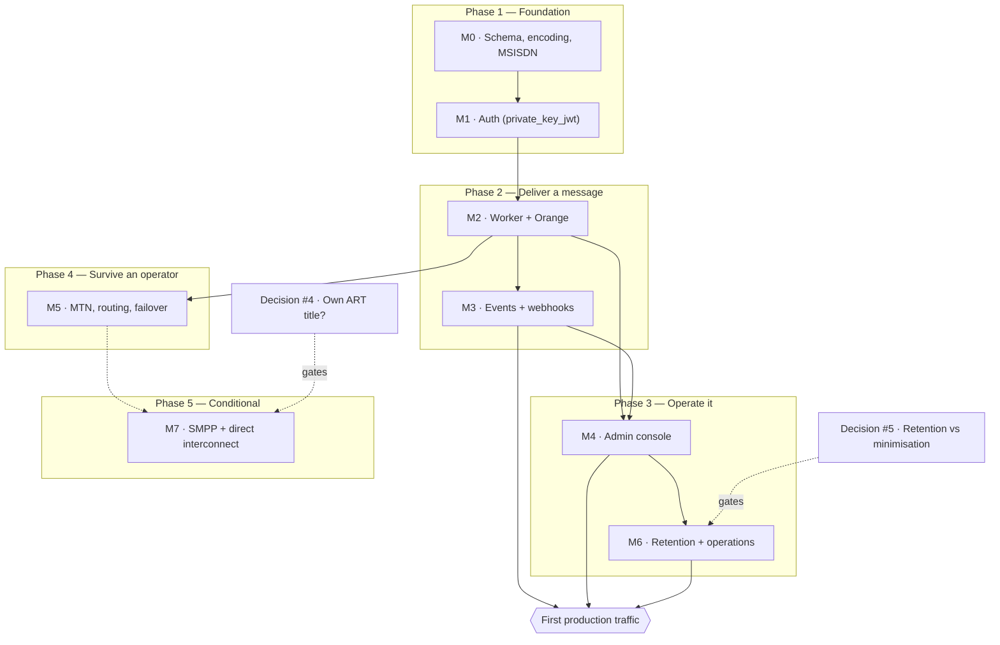

# Roadmap

What order the work happens in, what genuinely blocks what, and what has to be true before real traffic.

**This file is about sequencing.** It deliberately does *not* restate two things that live elsewhere and would drift here:

- **Per-milestone acceptance gates** — [`architecture.md` §12](architecture.md#12-milestones) is the spec. If this file and §12 disagree about what a milestone *means*, §12 wins.
- **Live status** — GitHub Issues and Milestones are the tracker. `gh issue list --milestone "M3 — Events and webhooks"` is always more current than any prose here.

The status column below is a **dated snapshot**, not a source of truth. This repo has been bitten four separate times by documentation asserting something the code did not do (see `AGENTS.md`'s corrections on the M1 `/token` claim, `rust-version`, the `/token` rate-limiting table row, and OTP body storage), so treat any status claim older than its date with suspicion and check the tracker.

---

## The shape of it

Milestone numbering is a dependency order, not a schedule, and the work has legitimately run out of order: parts of the admin console (M4) and the backup/restore drill (M6) landed while M3 was still open, because neither was blocked. The phases below group milestones by *what capability they unlock*, which is the more useful question when deciding what to pick up next.

---

## Phases

| Phase | Milestones | Question it answers | Status *(2026-08-11)* |
|---|---|---|---|
| **1 — Foundation** | M0, M1 | Can we represent a message, and prove who is asking? | **Done** — 14/14 and 9/9 closed |
| **2 — Deliver a message** | M2, M3 | Can one SMS reach a real handset, and can the caller find out what happened? | M2 **done** (12/12). M3 **5/7** — replay (#43) and the gate (#44) remain |
| **3 — Operate it** | M4, M6 | Can a human run this without a database console, and does it satisfy Cameroonian law? | M4 **4/17**, M6 **1/8** — the largest remaining block |
| **4 — Survive an operator** | M5 | Does traffic keep flowing when Orange breaks? | **Started** (1/6) — `sms-provider-mtn` (#61) landed; routing rules (#62), failover/circuit breakers (#63), grey-route detection (#64), and the kill-Orange-in-staging gate (#65) remain |
| **5 — Conditional** | M7 | Direct MNO interconnect over SMPP | Not started, and **may never exist** — see decision #4 |

---

## What actually blocks first production traffic

This is the part milestone numbering hides. **Phase 4 is not a prerequisite.** A single-operator gateway that only reaches Orange subscribers is a smaller product, not an unsafe one — losing MTN traffic is a commercial limitation, and #63's failover is a resilience upgrade over a system that already delivers.

What does block it:

1. **M3 finishing** (#43, #44). Until the gate passes, "no event is lost" is a belief rather than a demonstrated property — and webhooks are how customers learn a message failed.
2. **Enough of M4 to diagnose a failure.** §12's own gate for M4 is *"an operator can diagnose a failed message without touching SQL."* Not all 17 stories — the messages detail view (#50) and the jobs/workers screens (#56, #57) are the diagnostic core.
3. **M6's compliance items** — and these are legal, not technical: retention purge (#67), consent records (#72), audit anchoring (#68). Law No. 2024/017 sanctions run to 100,000,000 FCFA and criminal penalties; this is the phase where "we'll do it after launch" is the expensive answer.
4. **The two open decisions below.**

Deliberately *not* on that list: **#187** (webhook secrets readable by every human role) is latent, because no human-login flow exists yet to hold such a token. It becomes live exactly when M4 ships real logins, which is why it sits on M4 rather than M3.

---

## Decisions that gate phases

Both belong to the maintainer, not to engineering. Neither is answerable by reading more code.

| Decision | Blocks | State |
|---|---|---|
| [#4 — own ART title?](https://github.com/vymalo/vsms/issues/4) | **Whether M7 exists at all.** Direct MNO interconnect or a short code unambiguously requires an ART title; whether a pure API consumer buying capacity from a licensed aggregator needs one is unverified. Settle before committing to SMPP, not during. | Open |
| [#5 — 10-year retention vs 90-day minimisation](https://github.com/vymalo/vsms/issues/5) | **M6's purge (#67).** Law 2010/012 art. 25 requires ten years of traffic data; Law 2024/017 requires minimisation. §10's split-ledger proposal is the recommendation, and `docs/legal/retention-briefing.md` is already with counsel. | Open — awaiting counsel |

Two earlier decisions are settled and recorded: [#3](https://github.com/vymalo/vsms/issues/3) (hosting) and [#6](https://github.com/vymalo/vsms/issues/6) (`authkestra-op` stays, pinned exactly).

---

## Already built, ahead of its milestone

Worth knowing so it isn't rebuilt. None of this appears complete in the milestone counts, because it was infrastructure rather than a numbered story:

- **Deployment** — `deploy/` carries a Caddy-edge compose stack, a Helm chart, musl/distroless images for both binaries, an advisory-lock-guarded migrate job (`app/sms-migrate`), and a GHCR release workflow.
- **Backup and restore** — `deploy/backup.sh`, `restore.sh`, and a real `restore-drill.sh` (#69, the one M6 story already closed).
- **A working demo** — `just demo` brings up Postgres, a signing key, a provisioned client, a fake Orange, the gateway, the worker and the console, and a message reaches `delivered`.
- **Integration surface** — `sdks/rust/vsms-sdk-rust`, a generated TypeScript client, and runnable Rust/Node examples including a webhook receiver.
- **CI that actually gates** — the live-Postgres suites run on every PR (they were silently skipped until #118), plus `cargo deny`, R1/R2 rule checks, three-machine state-machine parity, and browserless mermaid parsing.

---

## Conventions this roadmap assumes

- **A milestone is done when its §12 gate passes**, not when its stories are closed. M2's gate needed a real handset and a human-timed `kill -9`; no amount of green CI substituted for it.
- **Findings get their own issue** rather than being folded into whichever story happened to surface them — that is why #87, #95, #102, #116, #165 and #187 exist.
- **Out-of-order work is fine when nothing blocks it.** The dependency arrows above are real constraints; everything else is preference.

---

## Keeping this current

`AGENTS.md`'s Conventions section makes the check mandatory on **every** PR. The edit usually is not — most PRs change nothing here, and saying so in the PR is a complete answer.

Update this file when a PR **completes a milestone or passes its §12 gate**, **resolves or reframes a blocker or decision**, **changes a dependency** (the graph's arrows are claims about what genuinely blocks what), or **lands infrastructure ahead of its milestone**.

Do **not** update it merely because a story closed — GitHub owns live status and is always more current. When you do touch the status column, move its date to the day you verified it, and verify against `gh` rather than memory. The point of the snapshot being dated is that a reader can tell when to stop trusting it.
