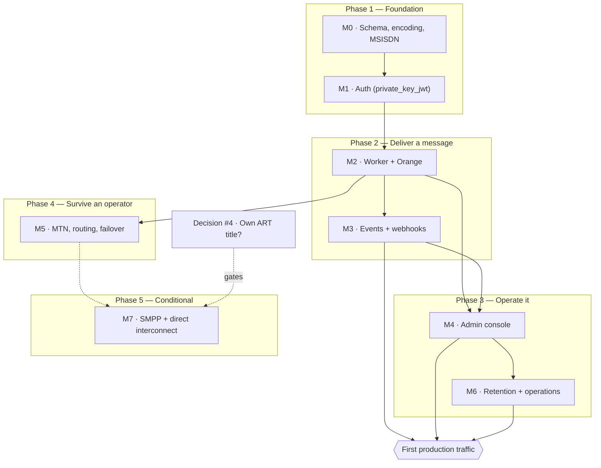

# Roadmap

What order the work happens in, what genuinely blocks what, and what has to be true before real traffic.

**This file is about sequencing.** It deliberately does *not* restate two things that live elsewhere and would drift here:

- **Per-milestone acceptance gates** — [`architecture.md` §12](architecture.md#12-milestones) is the spec. If this file and §12 disagree about what a milestone *means*, §12 wins.
- **Live status** — GitHub Issues and Milestones are the tracker. `gh issue list --milestone "M3 — Events and webhooks"` is always more current than any prose here.

The status column below is a **dated snapshot**, not a source of truth. This repo has been bitten four separate times by documentation asserting something the code did not do (see `AGENTS.md`'s corrections on the M1 `/token` claim, `rust-version`, the `/token` rate-limiting table row, and OTP body storage), so treat any status claim older than its date with suspicion and check the tracker.

---

## The shape of it

Milestone numbering is a dependency order, not a schedule, and the work has legitimately run out of order: parts of the admin console (M4) and the backup/restore drill (M6) landed while M3 was still open, because neither was blocked. The phases below group milestones by *what capability they unlock*, which is the more useful question when deciding what to pick up next.

---

## Phases

| Phase | Milestones | Question it answers | Status *(2026-08-12)* |
|---|---|---|---|
| **1 — Foundation** | M0, M1 | Can we represent a message, and prove who is asking? | **Done** — 14/14 and 9/9 closed |
| **2 — Deliver a message** | M2, M3 | Can one SMS reach a real handset, and can the caller find out what happened? | **Done** — M2 12/12, M3 8/8, both gates passing |
| **3 — Operate it** | M4, M6 | Can a human run this without a database console, and does it satisfy Cameroonian law? | M4 **7/19**, M6 **2/8** — the largest remaining block |
| **4 — Survive an operator** | M5 | Does traffic keep flowing when Orange breaks? | **Started** (3/6) — `sms-provider-mtn` (#61), the routing rules engine (#62), and failover/circuit breakers (#63) landed; grey-route detection (#64) and the kill-Orange-in-staging gate (#65) remain |
| **3 — Operate it** | M4, M6 | Can a human run this without a database console, and does it satisfy Cameroonian law? | M4 **11/19** (#50 closes the diagnostic-core gate below), M6 **2/8** — the largest remaining block |
| **4 — Survive an operator** | M5 | Does traffic keep flowing when Orange breaks? | **Started** (2/6) — `sms-provider-mtn` (#61) and the routing rules engine (#62) landed; failover/circuit breakers (#63), grey-route detection (#64), and the kill-Orange-in-staging gate (#65) remain |
| **5 — Conditional** | M7 | Direct MNO interconnect over SMPP | Not started, and **may never exist** — see decision #4 |

---

## What actually blocks first production traffic

This is the part milestone numbering hides. **Phase 4 is not a prerequisite.** A single-operator gateway that only reaches Orange subscribers is a smaller product, not an unsafe one — losing MTN traffic is a commercial limitation, and #63's failover is a resilience upgrade over a system that already delivers.

What does block it:

1. ~~**M3 finishing** (#43, #44).~~ **Resolved 2026-08-11.** Both landed; all three clauses of §12's M3 gate are automated against a real Postgres — signature verified by a real Node receiver subprocess (`hooks_node_receiver_live.rs`), no loss on a mid-drain `SIGKILL` (`kill9_reclaim_live.rs`), exactly one attempt per event across two workers (`hooks_two_workers_live.rs`). One caveat worth stating rather than burying: the Node-receiver clause only began *executing in CI* with the fix in #198 — the `live` job had no Node toolchain, so that test had failed at spawn on every run since it landed, and passed locally only because a human had run `pnpm install` by hand. "No event is lost" is now a demonstrated property; it was a belief for slightly longer than the story list suggested.
2. ~~**Enough of M4 to diagnose a failure.**~~ **Resolved 2026-08-12.** §12's own gate for M4 is *"an operator can diagnose a failed message without touching SQL."* Not all 19 stories — the jobs/workers screens (#56, #57) and the messages detail view + state timeline (#50) were the diagnostic core, and all three are now closed. #50's own timeline chose to reconstruct from `DeliveryReceipt` rows rather than the audit log or a new transition-row model (schema/schema.cstack's own comment on `listMessageReceipts`), and is explicit about what it can't prove — verified live against a real `Indeterminate`-submit message (`routed -> uncertain`, zero receipts) driven through `just demo`, not just a clean `accepted -> delivered`.
3. **M6's remaining compliance items** — and these are legal, not technical: consent records (#72). Audit anchoring (#68) is **resolved 2026-08-12**: `anchor_audit` (`crates/sms-worker/src/jobs/anchor_audit.rs`) folds `cratestack_audit` into a daily SHA-256 hash chain, a new `AuditAnchor` model — write-once, `hasRole('system')`-only create, no update/delete clause at all. Read that module's own doc before assuming more than it delivers: it is honest that a same-database chain cannot defend against an attacker with sustained write access to this same Postgres instance indefinitely — it raises the bar from "trust the database" to "trust the database, or verify the chain," not to "cannot be defeated by whoever already has the credentials this deployment itself has." Retention purge (#67) is done — decision #5 resolved 2026-08-11 (90-day minimisation, no split ledger) and `purge_retention` shipped in the same PR that recorded the resolution. Law No. 2024/017 sanctions run to 100,000,000 FCFA and criminal penalties; this is the phase where "we'll do it after launch" is the expensive answer.
4. **The one open decision below.**

Deliberately *not* on that list: **#187** (webhook secrets readable by every human role) is latent, because no human-login flow exists yet to hold such a token. It becomes live exactly when M4 ships real logins, which is why it sits on M4 rather than M3.

**#194 (human login flow) resolves the dependency #187/#193/#50/#52/#58 all shared — "no principal in this system can carry a human role."** `sms-auth`'s OP now issues real `authorization_code` + PKCE tokens against a local, Argon2id-backed `User`/`UserCredential`/`Role` model (a deliberate, flagged departure from an external-IdP federation design that was considered and set aside — see `sms_auth::login`'s own module doc), `sms_api::auth::GatewayAuth` projects one into a real `hasRole(...)`-meaningful `CoolContext`, and `admin/`'s Basic-auth gate (#48) is gone — a hard cutover to real sessions, not a parallel path. This is the *mechanism* those five stories needed, not the stories themselves: #52/#58's own screens and #50's per-app message scoping are still open, now buildable rather than blocked on a decision nobody could make. #187/#193's own latency (closed already, `e36efcb`) meant their fix shipped ahead of having a live token to prove the *allow* case with — #194 is the first PR that can actually mint one.

**#46 is resolved, and it doesn't shrink this list: `cratestack studio` (evaluated live at `0.7.10`, matching the pin) covers none of M4's ten open stories.** It's model-CRUD only — no procedure surface, so #52/#54/#55's actual workflows (`provisionAppClient`, `previewMessage`, `replayWebhookAttempt`, `rotateWebhookSecret`) stay unreachable through it — and, checked live rather than assumed, it bypasses `@@allow`, `@version`/CAS, and `@@emit` outbox writes entirely (an unauthenticated read returned `OauthSigningKey.privateKeyPem` in the clear; a write left `version` unbumped and wrote zero outbox rows despite `Message.@@emit`). That's disqualifying for any deployed surface, not a gap to patch. It also can't ever cover #57 — lock ownership lives in Postgres session advisory locks with no schema model, so there's nothing for a schema-driven tool to show. #56/#57 (the diagnostic core this section already named) stay exactly as much hand-written work as before; see the issue comment on #46 for the full per-story split.

---

## Decisions that gate phases

Belongs to the maintainer, not to engineering. Not answerable by reading more code.

| Decision | Blocks | State |
|---|---|---|
| [#4 — own ART title?](https://github.com/vymalo/vsms/issues/4) | **Whether M7 exists at all.** Direct MNO interconnect or a short code unambiguously requires an ART title; whether a pure API consumer buying capacity from a licensed aggregator needs one is unverified. Settle before committing to SMPP, not during. | Open |

Three earlier decisions are settled and recorded: [#3](https://github.com/vymalo/vsms/issues/3) (hosting), [#6](https://github.com/vymalo/vsms/issues/6) (`authkestra-op` stays, pinned exactly), and [#5](https://github.com/vymalo/vsms/issues/5) (**2026-08-11**: 90-day minimisation, no split ledger — Law 2010/012 art. 25's ten-year traffic-data requirement is left to infrastructure-level retention outside vsms's own schema, not a parallel table inside it; see `architecture.md` §10 and #67's own PR). `docs/legal/retention-briefing.md` reflected the still-open question and is now stale on this point — the maintainer decided ahead of counsel's answer, not after it.

---

## Already built, ahead of its milestone

Worth knowing so it isn't rebuilt. None of this appears complete in the milestone counts, because it was infrastructure rather than a numbered story:

- **Deployment** — `deploy/` carries a Caddy-edge compose stack, a Helm chart, musl/distroless images for both binaries, an advisory-lock-guarded migrate job (`app/sms-migrate`), and a GHCR release workflow.
- **Backup and restore** — `deploy/backup.sh`, `restore.sh`, and a real `restore-drill.sh` (#69, the one M6 story already closed).
- **A working demo** — `just demo` brings up Postgres, a signing key, a provisioned client, a fake Orange, the gateway, the worker and the console, and a message reaches `delivered`.
- **Integration surface** — `sdks/rust/vsms-sdk-rust`, a generated TypeScript client, and runnable Rust/Node examples including a webhook receiver.
- **CI that actually gates** — the live-Postgres suites run on every PR (they were silently skipped until #118), plus `cargo deny`, R1/R2 rule checks, three-machine state-machine parity, and browserless mermaid parsing.

---

## Conventions this roadmap assumes

- **A milestone is done when its §12 gate passes**, not when its stories are closed. M2's gate needed a real handset and a human-timed `kill -9`; no amount of green CI substituted for it.
- **Findings get their own issue** rather than being folded into whichever story happened to surface them — that is why #87, #95, #102, #116, #165 and #187 exist.
- **Out-of-order work is fine when nothing blocks it.** The dependency arrows above are real constraints; everything else is preference.

---

## Keeping this current

`AGENTS.md`'s Conventions section makes the check mandatory on **every** PR. The edit usually is not — most PRs change nothing here, and saying so in the PR is a complete answer.

Update this file when a PR **completes a milestone or passes its §12 gate**, **resolves or reframes a blocker or decision**, **changes a dependency** (the graph's arrows are claims about what genuinely blocks what), or **lands infrastructure ahead of its milestone**.

Do **not** update it merely because a story closed — GitHub owns live status and is always more current. When you do touch the status column, move its date to the day you verified it, and verify against `gh` rather than memory. The point of the snapshot being dated is that a reader can tell when to stop trusting it.
